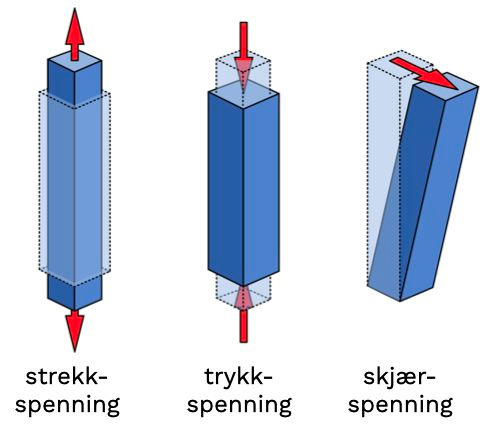
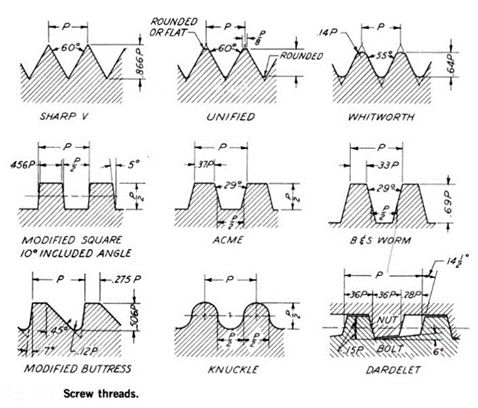
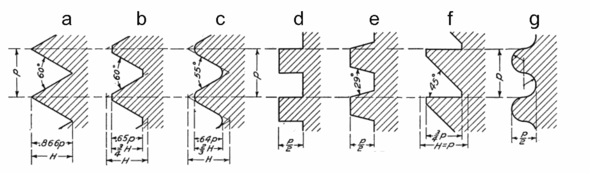

  
- Resources:
  id:: 645aac81-45d5-4ad9-80d5-42242fe697bb
	-
	  id:: 6438771b-bb96-402a-ad63-487f70ff959c
	  book:: **LTT:** 
	  collapsed:: true
	-
	  book:: **Materiallære 1:** _1683808189884_0.pdf)
	  id:: 64770c2a-220c-4e56-bebd-06041c155c35
	-
	  book:: **Materiallære 2:** _1683811354503_0.pdf)
	-
	  book:: **FAA:** 
	-
	  word:: [m6 hefte (online)](https://vikenfk-my.sharepoint.com/:w:/r/personal/fredrickwa_viken_no/Documents/Skedsmo%20VGS/M6%20MATERIALL%C3%86RE/Arbeidsbok%20Modul%206%20rev%200_%20(002)%20(1).docx?d=wc0f2c7ec4ab24cd195eec7b339020757&csf=1&web=1&e=mD1U2O)
	-
	  word:: [m6 hefte  (local)](../assets/m6_hefte_1683810787209_0.docx)
	- https://quizlet.com/Chloe_Elliott63/folders/module-6-materials-and-hardware/sets
	-
	-
	-
	- src: https://tools.pdf24.org/en/ocr-pdf#s=1683672121620
	- [Materialteknologi – Henning Johansen – Materials Technology – Materials Science and Engineering – Design Calculations – Lightweight Design (wordpress.com)](https://materialteknologi.wordpress.com/)
	-
	-
	-
-
- kar.. review
  id:: 648236b8-4ca8-4c3d-9dcf-4c5ed486af0c
  collapsed:: true
	- {:height 447, :width 329}
	- {:height 427, :width 314}
	- {:height 216, :width 324}
	- {:height 524, :width 317}
-
  id:: 648236b8-4fde-4727-8e75-f033bc10958b
-
- # INNLEDNING
  id:: 648236b8-d76b-4993-a718-33053fea1eff
  collapsed:: true
  Modul 6 (Materiallære) er et stort fag med mange undermoduler. Dette arbeidsheftet skal hjelpe deg til bedre forståelse av temaene vi gjennomgår i timene. Dersom du gjør oppgavene i heftet, leser bøkene og er aktiv i timene har du alle forutsetninger for å kunne få et godt eksamensresultat.   
  
  Arbeidsheftet bygger på materiallærebøkene, samt LTT. Noen eksempler er hentet fra internett. Formålet med heftet er å supplere undervisningen. Bruk gjerne heftet i etterkant av at stoff er gjennomgått for repetisjon og fordypning.  
  
  Under hver modul er et sett med øvingsoppgaver. For å svare på disse vil du ha behov for lærebøkene ved siden av den innledende teksten i heftet. Det kan lønne seg å lese relevante kapitler i pensum før du begynner med oppgavene.  
    
	-
	- # 6.5 FASTENERS.
	  id:: 6438771b-4ce0-4a89-b68b-d1e33cd1cda2
	  Undermodul 6.5 tar for seg gjenger, bolter, skruer, låsemekanismer og nagler. Når vi er ferdige med temaet skal du kunne:  
	  Most common fasteneres i aviation are the bolt and the screw  
		1. Utrede/utforsk og måle ulike gjengetyper, dimensjoner og toleranser
		2. Identifisere og spesifisere bolter og skruer med internasjonal standard, merking og teknisk dokumentasjon.
		3. Identifisere og bruke standard muttere, selvlåsende muttere og ankermuttere.
		4. Identifisere og bruke standardtyper av maskinskruer, selvgjengede, pinnebolter og låsepinner.
		5. Kunne låse ved hjelp av aktuell metode ut fra gitt spesifikasjon.
		6. Kunne identifisere og spesifisere typer massive nagler, blindnagler og forklare grunnen til at en del typer må varmebehandles.

		- {:height 177, :width 120}  #M6-EX-06 #card
		- {:height 160, :width 111}  #M6-EX-06 #card
		- {:height 204, :width 121}  #M6-EX-06 #card
		- {:height 184, :width 112}   #M6-EX-06 #card
		- ## 6.5.1 GJENGER.
			- **Figur 1 Gjengetyper**
			  /Aspose.Words.2bdabf0a-b913-45ce-82ae-39fbed62d3ad.001.png){:height 380, :width 398}  
			    
			  I Figur 1 ser vi noen eksempler på gjenger og deres bruksområder. Dette bildet viser ganske enkelt hvordan en gjenge ser ut. Materiallære 2 fra side 15 viser mer detaljert hvordan gjengestrukturen er delt inn med benevninger.  
			    
			  **Figur 2 Ulike gjenger og navnene deres**  
			  {:height 265, :width 294}   
			  I Figur 2 ser vi forskjellige gjengetyper og navnene deres. Dette er amerikanske gjenger. Vi kommer stort sett bare i kontakt med unified og withworth til bolter og muttere i fly.  
			- Hva kan du om gjengeprofilar? #M6-EX-06 #card
			  card-last-interval:: 4
			  card-repeats:: 1
			  card-ease-factor:: 2.36
			  card-next-schedule:: 2023-05-23T05:43:41.550Z
			  card-last-reviewed:: 2023-05-19T05:43:41.551Z
			  card-last-score:: 3
			  {:height 111, :width 350}  
				- Det finnes mange ulike typer gjengeformer og man kan bruke en hvilken som helst form på gjenger så lenge de korresponderer i delene som skal sammenføyes.
				- De vanligste gjengeprofilene er som følger:
				    
				    
				  **a)** Standard utrimmet 60° V-gjenger  
				  **b)** ISO metriske 60° V-gjenger, den vanligste gjengformen. Gir stor friksjon og sitter godt.  
				  **c)** Withworth 55° gjenger, mye brukt der man bruker tommer.  
				  **d)** Firkantgjenger, gir veldig lav friksjon og tåler høy last, men vanskelig å produsere. Ofte brukt i ledeskruer i industrimaskiner.  
				  **e)** Trapesgjenger (også kjent som Acme-gjenger). Gir lav friksjon og tåler høy last. Lett å produsere. Brukes også i ledeskruer.  
				  **f)** Buttress-gjenger, brukes som ledeskruer, låseskruer eller tetningskruer i hydraulikk.  
				  **g)** Runde gjenger, gir relativt lav friksjon og brukes mye i ting som skal være lette å skru ut og inn, som lyspærer eller på rørtenger osv.  
				-
			- Hvilke standarder for gjenge finnes det?  #M6-EX-06 #card
				- NAS = National Aircraft Standard (den nasjonale luftfartsstandarden)
				- MS = Military Standard (amerikansk militær standard)
				- LN= Normenstelle Luftfahrt (tysk luftfartsstandarden)
				- NAS = National Aircraft Standard (den nasjonale luftfartsstandarden)
				-
				-
			- Hvor bruker vi trekantgjenger? #M6-EX-06 #card
			  card-last-interval:: 4
			  card-repeats:: 1
			  card-ease-factor:: 2.6
			  card-next-schedule:: 2023-05-27T13:43:56.227Z
			  card-last-reviewed:: 2023-05-23T13:43:56.229Z
			  card-last-score:: 5
				- blir brukt på vanlege skruar. Dei vanlegaste trekantgjenga, både tommar og metriske, har ein flankevinkel på 60", sjå figur1.6. Som vi alt har nemnt, skil Whitworth-gjenga seg ut med ein flankevinkel på 55%.
				- dette betyr kanskje de er ikke så sterke
				- [:span]
				- 
			- Hvor bruker vi trapesgjenger? #M6-EX-06 #card
				- blir brukt på rørsleskruar for å overføre store krefter utanå gi for stor glidemotstand, sjå figur 1.7. Matingsskruar er døme på dette. Trapesgjenga har ein flankevinkel på 30".
				- [:span]
				- 
				-
			- Hvor bruker vi firkantgjenger? #M6-EX-06 #card
			  id:: 645ce423-eaf6-4433-a157-ec8287f8ff01
				- er like breie som dei er djupe, sjå figur 1.8. Dei blir stort sett brukte til det same formålet som trapesgjenga. Skruejekkar for flapsar, slats og haleflater er typiske bruksområde.
				- [:span]
				- 
				- samme formålet som trapesgjenga til å overføre store krefter. For skruejekkar for flapsar, slats og haleflater
				    
				  s.16  
			- Sett inn benevningene på gjengen under. #M6-EX-06 #card
			  id:: 645ce42b-bd30-4016-9b03-eb6d9770e442
			    
				- [:span]
				- 
				- 
			- Forklar oppbygningen av gjenger, hva betyr de forskjellige benevningene. #M6-EX-06 #card
			  id:: 64524ed2-c17a-4a59-94e6-448d9a0ea74f
			  card-last-interval:: 4
			  card-repeats:: 1
			  card-ease-factor:: 2.36
			  card-next-schedule:: 2023-05-23T05:47:36.406Z
			  card-last-reviewed:: 2023-05-19T05:47:36.407Z
			  card-last-score:: 3
				- 
				-
				  <iframe width="185" height="554" src=" http://www.tsbfengineering.com/jorgen/2017/3/8/hvordan-dreie-gjenger" title="Ritom Pumped-Storage Plant Project – Tunneling under extreme conditions" frameborder="0" allow="accelerometer; autoplay; clipboard-write; encrypted-media; gyroscope; picture-in-picture; web-share" allowfullscreen></iframe>
				- 1.	Helix angle 
					2. Pitch/ stigning
					3. thread angle
					4. depth
					5. minor diameter/ kjernediameter for mutter (skrue)
					7. pitch diameter/midtdiameter for mutter
					8. major diameter / / stordiameter for mutter (skrue)
					9. crest
					10. root  
ressurs:  [Gjenger og hvordan å dreie dem — TSBF (tsbfengineering.com)](http://www.tsbfengineering.com/jorgen/2017/3/8/hvordan-dreie-gjenger)

			- Skriv om forskjellen mellom unified og Whitworth gjenge. #M6-EX-06 #card
			  id:: 64524edb-7d5e-435e-a6c7-fada73b76d99
				- [Unified inch screw thread profile - YouTube](https://www.youtube.com/watch?v=IIztAPwfu80&list=PLSMXlvM0REugBHxtC2KUVP15W7yjp3OcC&index=15)
				- [British Standard Whitworth Screw Thread - British Standard Fine Series - YouTube](https://www.youtube.com/watch?v=a4Qkt7N7R3g&list=PLSMXlvM0REugBHxtC2KUVP15W7yjp3OcC&index=16)
				- 
				  Whitworth-gjenger var verdens første nasjonale gjengestandard, og ble oppfunnet av Joseph Whitworth i år 1841. En av forskjellene til moderne gjenger er at flankevinkelen er på Whitworth-gjenger er **55 grader** og avrundede topper og bunner, mens metriske og unified-gjenger er rette med vinkel på **60 grader**³. Unified-gjenger har diameter og stigning basert på tommemål, og passer derfor ikke sammen med metriske gjenger som er basert på millimeter¹.  
				  Source:  15/05/2023  
				  (1) Gjenge – Wikipedia. https://no.wikipedia.org/wiki/Gjenge.  
				  (2) Unified-gjenger – Wikipedia. https://no.wikipedia.org/wiki/Unified-gjenger.  
				  (3) Pipegjenger – Wikipedia. https://no.wikipedia.org/wiki/Pipegjenger.  
			- Forklar forskjellen mellom en M-gjenge og unified gjenge. #M6-EX-06 #card
			  id:: 64524edc-66e3-4f94-b934-1486dc781558
				- 
				-
				- Alle mål i metrisk gjengestandard oppgis i millimeter. Metriske grovgjenger uttrykkes ved å sløyfe stigningen, f.eks. M14. Dersom det står M14 x 1.5 betyr det at det er metriske fingjenger.
				    
				- Mål i UTS er en skikkelig godtepose full av rariteter. Noen ganger oppgis det i brøkdeler av en tomme, noen ganger desimale fraksjoner (0.1120), noen ganger kun som et nummer, f.eks. #4.
				    
			- Hva er spesielt med MJ gjengeprofil, og hva skiller den fra M gjengene?#M6-EX-06 #card
			  id:: 64524eec-2c03-46c8-b6aa-1c44848b169b
			  card-last-interval:: 4
			  card-repeats:: 1
			  card-ease-factor:: 2.6
			  card-next-schedule:: 2023-05-23T05:41:40.220Z
			  card-last-reviewed:: 2023-05-19T05:41:40.221Z
			  card-last-score:: 5
				- MJ-gjengeprofilen
				- MJ-gjenger er en gjengeprofil som brukes spesielt i flyindustrien og har en flat topp og en avrundet rot¹. M-gjenger er en metrisk gjengeprofil som har en rett topp og en rett rot².
				  Source: 15/05/2023  
				  (1) Marijuana Anatomy | Different Parts of a Cannabis Plant | Leafly. https://www.leafly.com/learn/growing/marijuana-plant-anatomy.  
				  (2) Energy density - Wikipedia. https://en.wikipedia.org/wiki/Energy_density.  
				  (3) NC-Bolt M33 HRB500E, Kombinasjonsbolt/Sikringsbolt - Pretec AS. https://pretec.no/wp-content/uploads/2016/05/Produktdatablad-NC-bolt-M33.pdf.  
				-
			- Hva er forskjellen på M fin og M grov gjenge?#M6-EX-06 #card
			  id:: 64524eee-23fd-4477-ab63-b6928ab90927
				- {:height 237, :width 270}
				- Mye på samme måte som tannhjul måles stigningen i det Metriske system med avstanden mellom et punkt på en gjenge og det samme punktet på neste gjenge parallelt med aksen.
				- {:height 289, :width 302}
				- Metrisk standard deles i to grupper, metrisk grovgjenger, enkelt kalt M, og metrisk fingjenger, noen ganger kalt MF for Metric Fine.
			- Hva er forskjellen på UNF og UNC gjenger?#M6-EX-06 #card
			  id:: 64524ef0-9d50-4757-8324-ab0c4335a054
			  card-last-interval:: 4
			  card-repeats:: 1
			  card-ease-factor:: 2.36
			  card-next-schedule:: 2023-05-28T05:26:45.516Z
			  card-last-reviewed:: 2023-05-24T05:26:45.516Z
			  card-last-score:: 3
				- 
				- UTS (unified thread standard) deles i tre grupper, UNC (Unified Coarse), UNF (Unified Fine) og UNEF (Unified Extra Fine).
				  {:height 246, :width 216}  
				- UTS deles i tre grupper, UNC (Unified Coarse), UNF (Unified Fine) og UNEF (Unified Extra Fine).
			- For å tilvirke/make gjenger trenger du gjengeverktøy. Forklar hvordan du tilvirker innvendig og utvendig gjenger.#M6-EX-06 #card
			  id:: 64524ef3-ceac-4c5c-8094-5073bcd8aafd
				- **innvendig:** Når vi skal lage innvendige gjenge, må vi først bore hol og deretter lage gjenge med ein gjengetapp. Problemet er ofte å finne ut kor stort boret skal vere. Boret kallar vi gjengebor, men det er eit heilt vanleg bor. Holet som skal borast før vi gjengar, må borast med eit bor 
				    
				  *gjengebor: (⬇️)*  
				  {:height 85, :width 139}  
				  *gjengetapp: (⬇️)*  
				  {:height 129, :width 159}  
				  *gjengetapp.holder:*  
				  {:height 181, :width 113}  
				- **utvendig:** 
				  *Gjengesnitt.holder og gjengesnitt(die):*  
				    
				  snitt holdere, og selve snittet er den som skrue sitter i  
				  {:height 199, :width 248}  
				  snittet:  
				  {:height 114, :width 144}  
				  holderen:  
				    
			- Hva vil det si at en mutter eller bolt er venstre (links) gjenget? #M6-EX-06 #card
			  id:: 6438771b-1335-44e3-8d39-c530b453985d
				- En bolt eller mutter som er venstre (links) gjenget har en gjengeprofil som går motsatt vei av en vanlig bolt eller mutter. Dette betyr at man må skru motsatt vei for å stramme eller løsne boltene eller mutterne. Venstre gjengete bolter og muttere brukes ofte i spesielle situasjoner, for eksempel på sykler og motorsykler.
				- Vanlige gjenger har en høyre gjengete profil, som betyr at du må skru mot klokken for å løsne og med klokken for å stramme.
				-
				- 116-18 UNC - 2  B - LH
				    
				  **forklaring:**  
				  LH - venstregjenge RH - høgregjenge  
				  Å = utvendige gjenge B = innvendige gjeng  
		- ## STANDARDER 
		  Side 286 i LTT forteller om de forskjellige gjengestandardene brukt gjennom tidene. informasjonen nedenfor er hentet derfra.   
		    
		  Til å begynne med hadde alle fabrikanter av skruer og muttere sin egen standard for sin gjenge. Åpenbart kunne man ikke ta en mutter og sette på hvilken som helst skrue da det eksisterte mange forskjellige produsenter. I dag kan vi heller ikke gjøre det, en M gjenge vil ikke passe på en UNF/UNC, men standardiseringen av gjengene har gjort det enklere for oss.   
		    
		  I mange år var de Britiske BS (British Standard) og BA (British Association) ledende «standarder». I USA og Canada var det AN (American National) som ble foretrukket. Disse er nå i all hovedsak byttet ut med gjengetypen vi kaller UNIFIED. International Standard Organization (ISO) laget en gjengetype basert på UNIFIED, men med metriske mål.   
		    
		  Det finnes tre Britiske standarder som generelt sett brukes i dag: British standard Whitworth (BSW), British standard fine (BSF) og British standard pipe (BSP).   
		    
		  BSW er grovgjengen; en “general purpose” gjenge som har et bredt bruksområde både i metall og plast. Den har symmetriske gjenger med en flankevinkel på 55° og er avrundet likt ved roten og på toppen av triangelprofilen.  
		    
		  BSF er en finere versjon av Whitworth gjengen. Den er mer resistent mot vibrasjoner og brukes en del i britiske fly og utstyr.  
		    
		  BSP er en annen utforming av Whitworth. Den brukes til rørkoblinger hvor den fine stigningen garanterer en sterk sammenføyning.  
		    
		  BA er en «fin pitch» gjenge som brukes kun på størrelser mindre en ¼ diameter. Den er derfor egnet i mindre mekaniske, og elektriske deler. Denne gjengen skiller seg fra BSF og BSW ved at flankevinkelen er 47,5° og at den er metrisk.  
		    
		  Bruksområdet for de amerikanske ANC og ANF (American National Coarse og Fine) sammenfaller i stor grad med de tilsvarende britiske BSW og BSF. Utformingen av gjengene er imidlertid annerledes, og ligner mer på den metriske gjengen.   
		    
		  UNIFIED gjengene er basert på de amerikanske og britiske gjengene og deles inn i tre kategorier, grov, fin og ekstra fin: UNC – grov – coarse. UNF – fin – fine. UNEF – ekstra fin – extra fine. Deler som har UNIFIED gjenger er identifisert med et symbol eller maskinmerke; merket kan variere mellom ulike deler og mellom produksjonsmetoder. Ofte tre sirkler etter hverandre OOO.  
		    
		  I praktisk arbeid vil vi tilnærmet alltid være kjent med hvilke gjenger vi har med å gjøre. Det er likevel nødvendig å kjenne til metoder for å identifisere og kontrollere gjengene. Til denne oppgaven bruker vi noe vi kaller lærer eller tolk; videre benevnt med faguttrykket: gauge.   
		    
		  Det finnes forskjellige typer gauges for kontroll av utvendig og innvendig gjenger. For å oppnå rett resultat er det viktig at både verktøy og testobjekt har referansetemperatur 20°C.  Om testobjekt og verktøy er av forskjellig materiale, f.eks. messingobjekt og en stålgauge har vi en toleranse på +-2°C. Det er viktig at vi tar hensyn til den termiske utvidingen både av kontrollobjekt og verktøyet vi bruker, dette gjelder ikke bare verktøy til mål av gjenger, men også jiger, maler og alt måleutstyr vi bruker.  
			- **???** Forklar hvordan du måler ytterdiameter (diameter!!!!) på en gjenge.#M6-EX-06 #card
			  id:: 6438771b-6b2d-45e0-b310-75e868c67055
				- referansetemperaturen 20 *C, 
				- Stordiameteren kontrollerer vi med GÅ- og IKKJE-GÅ-gaplærer eller med ringlærer.
			- Hvilket verktøy vil du bruke for å identifiserer du innvendig og utvendig gjenger?#M6-EX-06 #card
			  card-last-interval:: -1
			  card-repeats:: 1
			  card-ease-factor:: 2.5
			  card-next-schedule:: 2023-05-03T22:00:00.000Z
			  card-last-reviewed:: 2023-05-03T14:00:09.709Z
			  card-last-score:: 1
			  id:: 645b726e-72ee-47bd-bbdb-67c280c35f97
				- Vi bruker et gjengelære, men Dersom vi ikkje har ei gjengelære, må vi bruke ei skyvelære.
				  [:span]  
				- 
			- Er et gjengebor like stort som selve gjengen? Hvorfor/hvorfor ikke?#M6-EX-06 #card
			  id:: 6438771b-2ea7-4bf2-8e02-81a3e527bd45
				- Nei, et gjengebor er ikke like stort som selve gjengen. Gjengeboret er mindre enn gjengen fordi det er ment å lage en gjengehull som er litt mindre enn gjengen selv. [Dette gir gjengene en tettere passform og sikrer at skruen eller bolten sitter godt](https://snl.no/gjenge)
				- [:span]
				- 
		- # 6.5.2 BOLTER,SKRUER OG STUDS  6.5.3 LÅSING OG  6.5.4 NAGLER 
		    
		  Modul 6.5.2 tar for seg hvor vi bruker festeanordningene bolter, skruer og studs; hvordan de identifiseres, festes og sikres. Informasjon om temaet leses om i materiallære 2 s 50- 150, og i LTT 292-387.   
		    
		  Om ikke annet er spesifisert skal vi tilstrebe å feste bolter med hodet montert på topp eller fremst i forhold til fartsretningen. Dette sikrer bolten fra å falle ut om den skulle løsne. En bolt kan være ment til forskjellige formål, så vær sikker på at du velger korrekt bolt til korrekt jobb.   
		    
		  Som en regel (om ikke annet er sagt i gjellende underlag) Skal minst 1/32¨ stikke gjennom mutteren. Hvis bolten er faset, det vil si at den er «spiss» skal hele den fasete delen være gjennom mutteren. Man skal aldri la bolten «bunne» i mutteren, dette vil i praksis si at bolten ikke trekker sammen strukturen og du oppnår ingen binding mellom delene.  Man skal alltid torque med rett torque, her er det gjeldene revidert underlag som gjelder.   
		    
		  Nagler brukes der hvor vi skal ta opp skjærkrefter, de klinkes på plass med motholdsjern og klinkehammer. På steder vi ikke kommer til kan vi bruke blindnagler.  
			-
			  book:: 
			- Tegn en forsenket og en bolt med hode. Sett inn benevningene på bolten. Hva er klemlengde, hva er brukslengde osv. #M6-EX-06 #card
			  id:: 644769d0-1163-4c16-b8ab-fe3d0245197b
			  card-last-interval:: 4
			  card-repeats:: 1
			  card-ease-factor:: 2.36
			  card-next-schedule:: 2023-05-23T05:51:03.088Z
			  card-last-reviewed:: 2023-05-19T05:51:03.090Z
			  card-last-score:: 3
			  {:height 244, :width 351}  
				- [:span]
				- [:span]
				    
				  **forkalring:**  
					1. Klemlengde (grip length)
					2. brukslengde
					3. totallengde

			- Hva er forskejll på en bolt og en skrue?
				- skrue har gjenger hele veien: {:height 230, :width 103}
				- bolt har gjenger delvis: {:height 193, :width 147}
			- Hva er en clevisbolt, og hvor bruker vi de? Hva betyr det lile stjerne ? #M6-EX-06 #card
			  id:: 64524f6d-1d27-4a92-9ae0-3b8afc98c8ba
				-  {:height 138, :width 178} 
				  Denne har en Linsehovud.   
				  Klemlengd i 1/16  
				- Clevis er en bolt med en flat sirkulær plate på den ene enden og en hul sylinder på den andre enden. Den flate platen har et hull i midten som gjør at boltene kan festes til et objekt eller en overflate ved hjelp av en splittbolt/splittpin eller en annen type låsepinne
				- Clevisbolter brukes i flyindustrien for å koble sammen styringsstenger og andre bevegelige deler. De er spesielt nyttige i applikasjoner der det er nødvendig å koble sammen to deler som beveger seg i forhold til hverandre¹. Clevisbolter har en slisset brazier-type hode og er spesiallaget for bruk der det oppstår store skjerbelastningar (aldri i spenning)¹.
				- For eksempel vil en bolt med en stjerne ha en høyere styrke enn en bolt uten stjerne. Jeg håper dette hjelper! Gi meg beskjed hvis du har flere spørsmål.
				-
			- Hva er et torx spor? Hvordan ser det ut?#M6-EX-06 #card
			  id:: 64524f6e-6958-4a70-a03d-46a732ed00a3
				- [:span]
				- 
				- bedre enn philps til å motstå slipping/metal chipping (bilde ned), og securityt siden alle har en phillips bits:
				  {:height 248, :width 302}  
			- Hva er et  hi-torque spor? Hvordan ser det ut? Hva må vi huske på for bruken? #M6-EX-06 #card
				- brukt i automatisk skruing maksiner. trenger mye torque for å sette disse på, man må ikke bruke skruetrekker, men en spesial verktøy
				- 
					- [:span]
				- {:height 253, :width 278}
			- Hva er forskjellen mellom philips og pozidrive ? Tegn gjerne#M6-EX-06 #card
			  id:: 64524f6f-0834-4ed2-9e4f-b095e247bcd2
				- {:height 188, :width 241}
				- **Pozi screws have a unique cross-like design that is similar to Phillips screws, but with `four additional points`**. This design reduces cam-out and makes them more resistant to stripping than Phillips screws. Another difference is their torque capacity.
				- Et ulempe med pozi er at folk kan mistenke at pozi er phillips (fordi den er mer populær) og derfor bruke feil bits
			- NAS 6204 U 6 X Sier deg hva?#M6-EX-06 #card
			  id:: 64524f70-67c3-46d5-a9a9-a05d6ecdf446
				- Dette er en US-standard
				- BAC - er Boeing Aircraft Corporation ( **BAC  B30  N E 5**)
				- {:height 334, :width 299}
					- [:span]
			- Hva er en øyebolt?#M6-EX-06 #card
			  id:: 64524f71-ab55-446b-a575-5e247986cb79
			  card-last-interval:: 4
			  card-repeats:: 1
			  card-ease-factor:: 2.36
			  card-next-schedule:: 2023-05-23T05:44:47.751Z
			  card-last-reviewed:: 2023-05-19T05:44:47.752Z
			  card-last-score:: 3
				- augehovud
				- klemlengd i 1/8
				- [:span]
				- 
				- Øyebolter brukes ofte til å feste tunge gjenstander eller til å henge opp ting. De kan også brukes til å feste tau eller kjettinger til en gjenstand.
				    
				  {:height 180, :width 241}  
			- Hvorfor en noen bolter kadmierte?#M6-EX-06 #card
			  id:: 64524f72-1ddc-4f4b-8a8d-5c821f3fe5e4
				- Kadmiering er belegging med et korrosjonsbeskyttende sjikt av kadmium. Som regel utføres kadmiering ved elektroplettering i basisk kadmiumcyanidbad med anode av rent kadmium. Av prishensyn legges tynne sjikt på artikler for innendørs bruk; tykkere belegg brukes på utstyr for fly og skip og på våpen. I likhet med sink er kadmium et uedelt metall, som lettere går i oppløsning enn det edlere grunnmateriale (vanligvis stål), og som derfor gir beskyttelse mot korrosjon selv om belegget er skadd lokalt.
				- Kadmium er et giftig metall, og kan derfor ikke brukes i sammenhenger hvor det kommer i kontakt med matvarer. Kadmium er også en uønsket miljøgift, og prosessen søkes erstattet av andre metoder.
			- **??** Hva er oversize, og hvorfor har vi det?#M6-EX-06 #card
			  card-last-score:: 1
			  card-repeats:: 1
			  card-next-schedule:: 2023-05-03T22:00:00.000Z
			  card-last-interval:: -1
			  id:: 645b726e-904c-431b-b1b2-c9722cae2476
			  card-ease-factor:: 2.5
			  card-last-reviewed:: 2023-05-03T13:54:45.165Z
				- Overdimensjonsboltar er identiske med standardboltar bortsett frå den ikkje-gjenga delen av boltskaftet, 
				- [:span]
				- 
				- **notice:** the thick klemlengde part, and not the threads/gjengene
				- alltid referer til AMM før du bruker disse
				- Tenk på: Kva for boltserie bolten som skal skiftast, høyrer  , Boltdiameteren, Boltlengda (klemlengda og gjengehøgda)
			- Hva er en pinneskrue, og hvor brukes de?#M6-EX-06 #card
			  id:: 64524f73-0e69-4dcb-b6d1-d60e23775bc0
				- Pinneskruar har gjenge i begge endane. Pinneskruar ér mykje brukte i samband med motorinstallasjonar, til dømes til å feste sylindrar, luftleieplater, pumper, generatorar og liknande.
				- [:span]
				- 
			- Hvor mange skiver kan vi bruke for å justere gripelengden?#M6-EX-06 #card
			  id:: 64524f74-adde-4c7b-ba14-feedcd2ef045
			  card-last-interval:: -1
			  card-repeats:: 1
			  card-ease-factor:: 2.5
			  card-next-schedule:: 2023-05-16T22:00:00.000Z
			  card-last-reviewed:: 2023-05-16T06:19:18.211Z
			  card-last-score:: 1
				- **oppgaver:** hindre at strukturen blir skadd når vi trekkjer til boltane., verne mjuke materiale, , hindre galvanisk korrosjon,  å tette og låse (fjørskiver).
				- Dersom vi må auke boltlengda med meir enn1/16", kan vi tillate tre skiver dersom underlaget ikkje spesifiserer at det skal vere enda fleire.
				- [:span] [:span]
				- {:height 225, :width 136} {:height 234, :width 204}
			- Kan alle skivene monteres under hodet på bolten?#M6-EX-06 #card
			  id:: 64524f76-9f69-415b-bd0f-6f667ad7aeb7
			  card-last-interval:: 4
			  card-repeats:: 1
			  card-ease-factor:: 2.36
			  card-next-schedule:: 2023-05-23T05:55:18.507Z
			  card-last-reviewed:: 2023-05-19T05:55:18.508Z
			  card-last-score:: 3
				- Generelt monterer vi skiver under mutteren eller bolthovudet,
				- Fjørskiver skal vi ikkje bruke direkte mot aluminiumslegeringar utan å montere ei kadmiert skive under fjørskiva.
				- Maks 3 skiver
			- Er det tillatt at noen gjenger befinner seg i hullet om godstykkelsen er mindre en 2,4mm?#M6-EX-06 #card
			  id:: 64524f77-cb03-4d91-81a9-3707835f9427
				- Vi må alltid kontrollere at bruken av skiver under bolthovudet eller bruken av ein kortare bolt ikkje gjer at gjenga kjem inne i godset
			- **???**Finn ut hvordan du identifiserer bolter ut fra part number. Lær deg forskjellen på klemlengde og diameter i nummeret.#M6-EX-06 #card
			  id:: 64524f77-b1a1-4399-badd-8fdd2d429e60
			  card-last-interval:: 4
			  card-repeats:: 1
			  card-ease-factor:: 2.36
			  card-next-schedule:: 2023-05-23T05:40:39.456Z
			  card-last-reviewed:: 2023-05-19T05:40:39.456Z
			  card-last-score:: 3
				- når det gjeld døme på identifikasjon av skruar og boltar. Dette er berre nokre få døme. Vi må alltid bruke standardblada for AN, NAS og MS 
				- blir identifiserte med delnummer lengd og diameter. Delnummeret gir opplysningar om materiale, hovudform og gjengetype.
				- [:span]   [:span]
				- {:height 139, :width 250} {:height 206, :width 242}
				-
				-
			- En ankermutter bruker vi der det ikke er mulig å komme til på baksiden for å montere en konvensjonell mutter. For eksempel fueltanker og serviceluker. Hver ankermutter festes med to nagler er enten fast eller flytenede.
			  id:: 64524f79-4022-4399-8e26-f02f826da03e
			    
			  Hva vil det si at en ankermutter er flytrende, og hvorfor er de det?#M6-EX-06 #card  
				- Mutteren kan vere heilt fast eller rørleg i festet for å lette tilpassinga..
				- innebygd mutter som kan bevege seg litt rundt eller “flyte” litt. Dette kan være nyttig for å justere deler som ikke er helt sentrerte.
				- floating ankermutrar nutplate (se bildet har en bevegelig del, som kan justere det for å passe hulet): {:height 143, :width 202}
				  fixed nutplate: {:height 180, :width 238}  
			- Hva er en kornmutter?#M6-EX-06 #card
			  id:: 64524f7b-9e63-480a-8a97-b9c7bc0b1175
			- Hva er en kronmutter?#M6-EX-06 #card
			  id:: 64524f7b-8c9f-4e93-8066-5dc16919b77c
				-
				- [:span] [:span]
				- {:height 356, :width 225} {:height 94, :width 124} {:height 96, :width 106}
				-
			- Kan vi montere en kronmutter der det er store strekkrefterm hvorfor/ hvorfor ikke#M6-EX-06 #card
			  card-last-interval:: -1
			  card-repeats:: 1
			  card-ease-factor:: 2.5
			  card-next-schedule:: 2023-05-03T22:00:00.000Z
			  card-last-reviewed:: 2023-05-03T13:53:48.955Z
			  card-last-score:: 1
			  id:: 645b726e-6912-4e28-8d4f-6a1a20ade029
				- . [Crown-nut solves the issue of how to securely fix to the end of round or square section, guaranteeing superior torque-out and pull-out performance](http://npfasteners.com/crown-nuts/)[1](http://npfasteners.com/crown-nuts/). fordi av splinten når du strekker det tåler det litt mer
			- **??** Hvordan fungerer en låsemutter og hvilke typer finnes?#M6-EX-06 #card
			  card-last-score:: 1
			  card-repeats:: 1
			  card-next-schedule:: 2023-05-03T22:00:00.000Z
			  card-last-interval:: -1
			  id:: 645b726e-d579-4a10-a9fe-cfe979a657ae
			  card-ease-factor:: 2.5
			  card-last-reviewed:: 2023-05-03T14:00:19.737Z
				- En låsemutter er en mutter med plastforing på innsiden som holder skruen eller gjengestangen når den strammes.
				- {:height 226, :width 158}
				-
			- Hvor kan vi ikke bruke en låsemutter med nylonlåsing?#M6-EX-06 #card
			  id:: 64524f7f-e17b-4fef-8859-69ff1115c1b1
				- Sjølvlåsande mutrar med fiber- eller Nyloninnlegg må ikkje brukast i område med høg temperatur.  De må heller ikkje bytast ut med kronemutrar som blir låste med splint eller låsetråd. 
				- Mutrane skal monterast reine og utan smørjemiddel med mindre det vedlikehaldsunderlaget som gjeld, 
				- Det er ikkje lov å skru mutteren tilbake  from the prescribed momentverdien for å gjere det mogeleg å montere ein splint eller ein låsetråd.
			- Hvor er bruksområdet til en sølvplettert mutter?#M6-EX-06 #card
			  id:: 64524f7f-975b-40fe-9c8a-6195996e5ea8
				- Varmefaste mutrar av rustfritt stål er pletterte med sølv.
				- Rustfritt stål som er forsølva kan vanlegvis brukast opptil 460 *C. 
				- Silver-plated nuts are used on stainless steel bolts in the aerospace industry¹. The silver serves both as a corrosion deterrent and a dry lubricant¹. They are used in situations where the nut is installed in tension (versus in shear)³. I couldn't find any information on whether they are made to handle compression. Is there anything else I can help you with?
			- Forklar prinsippet til en heli-coil.#M6-EX-06 #card
			  card-last-interval:: -1
			  card-repeats:: 1
			  card-ease-factor:: 2.5
			  card-next-schedule:: 2023-05-03T22:00:00.000Z
			  card-last-reviewed:: 2023-05-03T13:53:51.652Z
			  card-last-score:: 1
			  id:: 645b726e-0e2b-4a09-ba97-df326dce5043
				- Gjengeinnsatsar (heli-coils) er presisjonsframstilte spiralforma skruegjenge av 18/8 stål. leverte både som grove og fine gjenge og i ulike gjengesystem. 
				- Gjengeinnsatsen har ein tange med hakk som vi fester monteringsverktøyet til. Han bryt vi normalt av når spiralen er montert. 
				  {:height 344, :width 278}  
					- [:span]
				- Vi monterer gjengeinnsatsar originalt som forsterkingar av gjenga hol i flymotorar og komponentar. 
				  id:: 6464d194-f1aa-407d-9c06-58f571ede56b
				- vi gjengeinnsatsar når vi skal reparere gjenga hol der gjenga er skadde.
				-
				-
			- Hva menes med inngreplengde?.#M6-EX-06 #card
			  card-last-interval:: 4
			  card-repeats:: 1
			  card-ease-factor:: 2.6
			  card-next-schedule:: 2023-05-28T05:22:10.250Z
			  card-last-reviewed:: 2023-05-24T05:22:10.251Z
			  card-last-score:: 5
				- Inngrepslengda er den lengda som viser det totale effektive inngrepet målt parallelt med senterlinja på skruesambandet,
				- 
					- [:span]
			- ## NAGLER
			  Nagler brukes på steder hvor vi trenger å overføre skjærkrefter. De er i all hovedsak fremstilt av aluminium, men det finnes stål og titan typer. Nagler klinkes sammen ved hjelp av en klinkhammer og motholdsjern. Aluminiumsnagler som er fremstilt av 2017, 2117 og 7050 aluminium er varmebehandlet fra fabrikant og kan klinkes som de er. De brukes til å sammenføye aluminiumsdeler som hudplater på fly som krever medium styrke.   
			    
			  Aluminiumsdeler som krever en sammenføyning med høy styrke kan klinkes sammen med en 2024 legert aluminiumsnagle. Denne kommer i T4 tilstand fra fabrikat og krever varmebehandling før den monteres. Man varmer da opp naglen i en herdeovn på 495°C i en gitt tid ut fra spesifikasjon for så  å bråkjøle den. Vi skal gå nærmere inn på varmebehandling av aluminium senere, men i korte trekk vil det si at vi løser spenningene i materialet slik at det blir mer formbart. Etter bråkjøling er naglene «klinkbare» i om lag 30min (ved romtemperatur). Om vi varmebehandler naglene og lagrer de i en -18°C fryser kan de lagres der inntil 7 dager, senker vi temperaturen ytterligere til -20°C kan de lagres inntil 20 dager.  
			    
			  2017 nagler kan også varmebehandles, men det er da spesifisert i SRM på hvilket grunnlag dette skal gjøres.  
			    
			  Monelnagler brukes i stål og titansammenføyninger, de kan klinkes som de er, krever ingen varmebehandling før bruk.  
				- Hva er viktig med tanke på valg av nagle?#M6-EX-06 #card
				  id:: 644769d0-7543-46fe-8999-04260a200351
					- Naglar bruker vi vanlegvis på stader som sjeldan eller aldri treng å skiftast ut eller demonterast, til dømes skrog, venger og liknande.
					- naglar hovudsakleg blir brukte for å overføre skjerbelastningar.
					-
				- Hvordan kan du skille mellom en AD og en DD nagle?#M6-EX-06 #card
				  id:: 64524fdd-f7b1-456b-8756-d6a7df6cd392
					- PÅ hodet av selvet naglen står det forskjellige symboler
					- [:span]
					  [:span]  
					- 
					    
				- Må vi varmebehandle DD nagler?#M6-EX-06 #card
				  id:: 64524fdf-24f4-4147-8b95-bc1d5d73759c
				  card-last-interval:: -1
				  card-repeats:: 1
				  card-ease-factor:: 2.5
				  card-next-schedule:: 2023-05-16T22:00:00.000Z
				  card-last-reviewed:: 2023-05-16T06:17:22.055Z
				  card-last-score:: 1
					- Vi skal som eit døme ta med korleis vi varmebehandlar DD-naglar, og den vidare behandlinga av dei. Det er vanskelegå klinke DD-naglar i utherda tilstand. Naglen har lett for å bøye seg eller sprekke. Vi må derfor klinke naglen når ho er i innherda tilstand(AQ). Naglane blir deretter utherda (elda) i romtemperatur. 
				- Hva sier MS 20470  AD 3-4 #M6-EX-06 #card
				  id:: 64524fdf-2166-48ad-a5a6-16c483611ed9
				  card-last-interval:: 4
				  card-repeats:: 1
				  card-ease-factor:: 2.36
				  card-next-schedule:: 2023-05-23T06:17:17.087Z
				  card-last-reviewed:: 2023-05-19T06:17:17.088Z
				  card-last-score:: 3
					- 
						- [:span]
					-
				- Du tar en varmebehandlet nagle opp fra fryseren for å bruke den. Hva skjer med naglen når den kommer fra fryser til romtemperatur?#M6-EX-06 #card
				  id:: 64524fe1-4099-4c3b-ab3e-6c7ff04b0540
					- Vi har sett at somme nagletypar må klinkast i mjuk tilstand etter at dei er varmebehandla. 
					- Vi skal som eit døme ta med korleis vi varmebehandlar DD-naglar, og den vidare behandlinga av dei. Det er vanskelegå klinke DD-naglar i utherda tilstand. Naglen har lett for å bøye seg eller sprekke. Vi må derfor klinke naglen når ho er i innherda tilstand(AQ). Naglane blir deretter utherda (elda) i romtemperatur. 
					- Dersom naglane blir lagra kaldt, blir utherdingstida lengre.
					-
				- **Figur 3 Forskjellig merking av nagler**
				  id:: 645b726e-f7bd-46ed-8bac-a67928ffac63
				    
				  /Aspose.Words.2bdabf0a-b913-45ce-82ae-39fbed62d3ad.016.jpeg)  
				    
				  Figur 3 Forskjellig merking av nagler. Fyll inn manglende informasjon om naglene i tekstboksen.#M6-EX-06 #card  
					- Vi skal som eit døme ta med korleis vi varmebehandlar DD-naglar, og den vidare behandlinga av dei. Det er vanskelegå klinke DD-naglar i utherda tilstand. Naglen har lett for å bøye seg eller sprekke. Vi må derfor klinke naglen når ho er i innherda tilstand(AQ). Naglane blir deretter utherda (elda) i romtemperatur. 
					     
					    
				- Forklar prinsippet med en blindnagle.#M6-EX-06 #card
				  id:: 64524fea-2d4e-4fa5-9fbe-f0fb3ec3d450
				  card-last-interval:: 4
				  card-repeats:: 1
				  card-ease-factor:: 2.36
				  card-next-schedule:: 2023-05-20T05:58:17.164Z
				  card-last-reviewed:: 2023-05-16T05:58:17.165Z
				  card-last-score:: 3
					- Blindnaglar kan vi montere frå ei side der vi ikkje kjem til med mothald
					- Blindnaglar kan vi montere frå ei side der vi ikkje kjem til med mothald
					- I prinsippet blir naglane klinka med eit trekkverktøy (manuelt, pneumatisk eller hydraulisk operert) som ved hjelp av ei trekkstamme som er plassert i midten av det hole nagleskaftet, og som utvidar nagleskaftet og formar stukhovudet.
					- Vi skal vanlegvis ikkje bruke blindnaglar der dei blir utsette for strekk.
					- 
						- [:span]
				-
				- Forklar hvordan man måler gripelengder, og i hvilken stigning de måles på bolter og nagler.#M6-EX-06 #card
				  id:: 64524ff2-32c1-4171-8fff-57012abf2ea3
					- DET SOMKREMMER IN HVOR TINGEN SITTER ER klemlengden
					- 
						- [:span]
					-
				- **Figur 4 Forskjellig utforming av nagler** 
				  id:: 645b726e-0e82-46b0-812b-be318f2c22df
				    
				  /Aspose.Words.2bdabf0a-b913-45ce-82ae-39fbed62d3ad.017.jpeg)  
				    
				  I Figur 4 ser vi hvordan det vi kaller solid rivets ser ut. Sett inn benevningen på de forskjellige typene ved siden av naglene. #M6-EX-06 #card  
					- 1. 
					  2.  
					  3.  
					  4.  
						5. 100*  forsenka

					  6.  
					  7.  
					  8.  
					  9.  
					  10.  
					  11.  
					    
					  koppa  
					- 
				-
				- ## LÅSING.
				  Det finnes flere metoder for å sikre bolter og muttere på fly. Det finnes, som vi har vært inne på låsemuttere som holder bolter på plass med forskjellige metoder. Vi kan låse muttere med splint og hoder og muttere med låsetråd. I tillegg til dette finnes sikringblekk, låseplate, fjærskiver og låsing med væske.  
				  book:: 
					- Dette kan du lese mer om på side 89-99 i materallære 2 og 322-329 i LTT.
					- **Figur 5 Låsing med splint**
					  id:: 645b726e-6809-47af-b5ec-6d849d265a6b
					  card-last-interval:: -1
					  card-repeats:: 1
					  card-ease-factor:: 2.5
					  card-next-schedule:: 2023-05-15T22:00:00.000Z
					  card-last-reviewed:: 2023-05-15T14:52:28.970Z
					  card-last-score:: 1
					    
					  /Aspose.Words.2bdabf0a-b913-45ce-82ae-39fbed62d3ad.018.jpeg)  
					    
					  Figur 5 viser låsing av bolt med splint hvilken av disse metodene ville du brukt og hvorfor. Kan du bruke begge metodene?#M6-EX-06 #card  
						- Andre metoden er Standard montering
						- men første metoden på bilder er også korrekt ved     montering sammen med låsepinnar:
						  {:height 244, :width 216}[:span]  
					- Sikringsblekk er tynne metallskiver med to eller flere tunger.
					  id:: 645b726e-c389-444a-b61b-1465f5cd366b
					  card-last-interval:: 4
					  card-repeats:: 1
					  card-ease-factor:: 2.6
					  card-next-schedule:: 2023-05-23T05:33:25.473Z
					  card-last-reviewed:: 2023-05-19T05:33:25.473Z
					  card-last-score:: 5
					    
					  Hvordan fungerer et sikringsblekk? #M6-EX-06 #card  
						- Den eine tunga bøyer vi over kanten på delen eller ned i eit hol. Den andre tunga bøyer vi opp mot sida på mutteren eller boltehovudet.
						- Sikringsblekk må ikkje brukast om igjen.
						- {:height 259, :width 258}
							- [:span]
					- Låseplater er tynne skiver som vi setter over mutteren etter at den er torquet. Den er vanligvis tolvkantet, slik at den lettere kan orienteres til rett plass. ein festeskrue hindrar vi låseplata frå å flytte seg.
					  id:: 645b726e-36df-4642-bf79-361cdd5cfa8b
					    
					  Hva fester en låseplate?#M6-EX-06 #card  
						- ein festeskrue hindrar vi låseplata frå å flytte seg. Låseplater kan brukast om igjen  . Locking plates can be used again if they still fit well on the nut.
						- 
							- [:span]
						-
					- Kan en låseplate brukes om igjen?#M6-EX-06 #card
					  id:: 64525046-97d7-4b96-9709-6050f17869b6
						- Locking plates can be used again if they still fit well on the nut.
						- 
							- [:span]
						-
					- Fjærskiver monteres mellom hodet og godset eller mutteren og godset til å hindre at bolten eller mutteren losnar.. Det finnes flere typer fjærskiver, tannede fjærskiver kan kun brukes en gang, men fjærtypen kan brukes om igjen så lenge den fjærer. 
					  id:: 645b726e-d539-4122-9481-762b2dbc12c8
					    
					  Hva må vi passe på når vi monterer fjærskiver, og hvorfor?#M6-EX-06 #card  
						- tanna typen fjørskiver må vi berre bruke ein gong.
						    
							- [:span]
						- Enkel Fjørtypen kan vi bruke om igjen så framt han framleis fjørar og har skarpe kantar.
						    
							- [:span]
					- **Låsing med væske** kan brukes isteden for fjærskiver, selvlåsende muttere o.l når det er påkrevd. **Låsing med lakk** fungerer som plombering i forbindelse med elektriske og elektroniske installasjoner.’ 
					  id:: 6452504b-b4b2-4e02-a178-b91be2222a6e
					  card-last-interval:: 4
					  card-repeats:: 1
					  card-ease-factor:: 2.6
					  card-next-schedule:: 2023-05-28T14:24:47.544Z
					  card-last-reviewed:: 2023-05-24T14:24:47.545Z
					  card-last-score:: 5
					    
					  **Låsing med låsetråd.** Dette er et tema dere skal innom i praksis og krever en del øving for å få til. Når vi låser med låsetråd sikrer vi en eller flere detaljer med tråd. Låsingen skal være slik at den hindrer detaljene i å løsne, i prinsippet låser vi slik at tråden strammes om detaljene løsnes. Alle detaljene skal være korrekt torqet og vi bruker kun ny, ubrukt låsetråd av rett kvalitet og dimensjon. Det er viktig å være klar over hvilken låsemetode som gjelder for den låsingen du skal gjøre og hvor tykk tråden skal være.   
					    
					  Når vi låser sørger vi alltid for at avklippet ikke havner i fly, men tar vare på og kastes på en forsvarlig måte. #M6-EX-06 #card  
						-
					- Forklar hvordan man låser med låsetråd. Tegn gjerne i tillegg. #M6-EX-06 #card
					  id:: 6452501c-4db9-415b-8acc-df7879d3dce3
					  card-last-interval:: -1
					  card-repeats:: 1
					  card-ease-factor:: 2.5
					  card-next-schedule:: 2023-05-15T22:00:00.000Z
					  card-last-reviewed:: 2023-05-15T14:59:08.438Z
					  card-last-score:: 1
						- Låsing med dobbel tråd - Tråden skal vere stram mellom innfestingspunkta for å hindre skadar på grunn av vibrasjonar. 
						    
						    
							- [:span]
							- [:span]
						- Låsing med enkel låsetråd
						    
							- [:span]
						-
					- Forklar låsing av strekkfisk.#M6-EX-06 #card
					  id:: 6452501a-1458-4a0f-9366-ad05e172d7e3
					  card-last-interval:: -1
					  card-repeats:: 1
					  card-ease-factor:: 2.5
					  card-next-schedule:: 2023-05-15T22:00:00.000Z
					  card-last-reviewed:: 2023-05-15T14:50:48.914Z
					  card-last-score:: 1
						- Låsing av strekkfisk med enkel låsetråd - 
						    
							- [:span]
						- Låsing av strekkfisk med dobbel låsetråd - begge desse døma er det brukt dobbel låsetråd.
						  {:height 170, :width 543}  
							- [:span]
						- Enkel låsetråd med dobbel vikling  - strekkfisktype der tønna er delt i to og kopla saman med ein bolt. brukt v anlegvis når vi går over frå ein kabeltype til ein annan.
						- Låsing av strekkfisk med klips
						    
							- [:span]
		- # 6.6 RØR OG KOBLINGER.
		  Når det kommer til rør og koblinger kommer vi innom en del typer.  S.151-187 tar for seg rør, koblinger og slanger. 388 – 407 i LTT utdyper temaet.   
		    
		  Rør brukes til å transportere væsker , luft og vakuum. Rør kommer i forskjellig dimensjon og materialer, de er alle fremstilt heltrukne som vil si at de er sømløse/seemless. De har ingen sveiseskjøt. Vi deler arbeidstrykket til rørene inn i tre kategorier, lav ,medium og høytrykk.  
		    
		  Lavtrykksrør vil si returrør og «suction» rør.  
		    
		  Medium vil si trykk under 1500 psi arbeidstrykk.  
		    
		  Høytrykk er da over 1500 psi arbeidstrykk.  
		    
		  Rørene må klamres opp og monteres slik at de ikke gnisser mot hverandre. Rørene skal alltid blendes når de demonteres, slik at smuss og skitt ikke kommer inn i rørene.   
		    
		  For å montere rør sammen eller til komponenter trengs det koblinger (fittings). I rør som transporterer væsker og gasser bruker vi AN-kobling (Army-Navy) , MS-kobling og senkekrympede koblinger.  Til transport av bleed air fra motoren bruker muffer og klamre av forskjellig type. Koblingene kan være fremstilt av stål eller aluminium.  
		  **Flens/flange:**  
		  {:height 192, :width 260}  
			- Hva er fordelen med en AN-kobling? #M6-EX-06 #card
			  id:: 645b726e-6a17-4ca8-988e-689d4f3757d9
				- Aluminiumlegeringer identifiserer vi ved at de er anodeoksidert blå.
				- Rørkoplinger av stål er farget svarte,
				- rustfritt stål har naturell farge.
				- **Fordeler:**
					1. Koplingen kan ettertrekkes ved en eventuell lekkasje
					2. Det er lettere å demontere rørsystemene på grunn av kort rørinngrep i koplingen

				- {:height 199, :width 314}
					- [:span]
				-
				- **Lett å monterer**
				    
				  **hvis det er en søl(leak) er det så lett som å strammen  muttere**   
				    
				  **blue = aluminium, black = steel, silve = stainless steel**  
				    
				  **lett å få ut rørendene ut av koplingen.**  
				-
			- Hva er ulempen med en AN- Kobling?#M6-EX-06 #card
			  id:: 645b726e-4d36-43ed-94ad-b94ab268e672
				- **Ulemper:**
					1. En må bruke spesialverktøy for flensing av rør
					2. Det er vanskelig å flense stålrør og tykkveggede rør
					3. Dårligere utmattingsfasthet

				- {:height 199, :width 314}
					- [:span]
				-
				- **fungerer ikke med tykk stål eller tykk aluminium pips. Disse er thin wall pipes installasjoner. Vanskelig å flesene stårrør og tykkveggede rør**
				    
				  **dårlig utmattingsfasthet****(** **highest stress that a material can withstand without breaking)**  
				    
				  **en må bruke spesialverktøy for flesning av rør**  
			- Hva er fordelen med en MS- kobling?.#M6-EX-06 #card
			  card-last-interval:: -1
			  card-repeats:: 1
			  card-ease-factor:: 2.5
			  card-next-schedule:: 2023-05-03T22:00:00.000Z
			  card-last-reviewed:: 2023-05-03T13:58:56.125Z
			  card-last-score:: 1
			  id:: 645b726e-fb34-4bda-a244-2b396746f7ef
				- MS-rørkopling (snittringkopling) eller Ermeto flensløs rørkopling(Ermeto flareless fitting), som den også kalles, er konstruert spesielt for bruk i hydrauliske systemer med trykk på opptil 207 bar (3000 psi).
				- spesielt anvendelig på tykkveggede rør som er vanskelige å flense. 
				- **Fordeler:**
					1. Vi trenger ikke spesialverktøy, fordi en vanlig standardkopling kan brukes for presetting av koplingen
					2. Koplingen kan monteres på tykkveggede rør
					3. Den har bedre utmatningsfasthet enn AN-koplinger fordi rørendene går langt inn i koplingen

				- {:height 220, :width 280}
					- [:span]
				-
				- **fungerer bra med tykke tubber og lar for mer trykk.** 
				    
				  **ingen spesial verktøy er bødventig for å montere den**  
				    
				  **bedre utmattingspunk enn fordi de går langt inn i koplingen**  
				    
				   **grønn = alum, gold = steel**  
			- Hva er ulempen med en MS-kobling?#M6-EX-06 #card
			  id:: 645b726e-b8be-469d-998f-215b2fd7d011
			  card-last-interval:: 4
			  card-repeats:: 1
			  card-ease-factor:: 2.36
			  card-next-schedule:: 2023-05-23T05:57:18.209Z
			  card-last-reviewed:: 2023-05-19T05:57:18.211Z
			  card-last-score:: 3
				- **Ulemper:**
					1. V i kan ikke stoppe en lekkasje ved bare å trekke til mutterne enda mer
					2. i må demontere mer av røropplegget for å få rørendene ut av koplingen

				- {:height 220, :width 280}
					- [:span]
				-
				- **kan ikke stoppe lekasje ved å bare trekke til mutter som AN**
				    
				  **Vi må demontere mer av røropplegget for å få rørenden ut av koplingen**  
			- Forklar senkekrympelodding.#M6-EX-06 #card
			  id:: 6438771b-af5c-440d-991d-f40f418d2da5
				- I hydraulsystemer med høye trykk kan vi med fordel bruke hardloddede rørkoplinger. 
				- I hydraulsystemer med permanente rørsystemer bruker vi rørkoplinger som er hardloddet i den ene enden og senkekrympet i den andre enden. Senkekrympingen utfører vi ved installasjonen i selve luftfartøyet,
				- **senkekrymping/heat shrink** 
				- {:height 217, :width 368}
					- [:span]
				- 
					- [:span]
				-
			- Hvilke koblinger bruker vi i brennstoffrør og hvordan fungerer de? #M6-EX-06 #card
			  id:: 6438771b-5ea2-45e5-a185-cd5260925dac
			  card-last-interval:: -1
			  card-repeats:: 1
			  card-ease-factor:: 2.5
			  card-next-schedule:: 2023-05-30T22:00:00.000Z
			  card-last-reviewed:: 2023-05-30T06:58:12.446Z
			  card-last-score:: 1
				- Gamah fleksibel-kopling
				- Wiggo Flex-koplinger
			- Hvilke koblinger har vi til bruk i pneumatiske systemer? Og hvordan fungerer de?#M6-EX-06 #card
			  card-last-score:: 3
			  card-repeats:: 1
			  card-next-schedule:: 2023-05-23T05:35:08.942Z
			  card-last-interval:: 4
			  id:: 645b726e-d18b-47c7-8669-a187818038c0
			  card-ease-factor:: 2.36
			  card-last-reviewed:: 2023-05-19T05:35:08.945Z
				- ** Janitrol duble-lock-klammer – fungerer ved**
				  {:height 353, :width 269}  
					- [:span]
				-
				- ** Snap ring duct-koplinger ** - benytter tetningsringer og har derfor muligheten for noe bevegelse under termisk ekspansjon av rørene,
				  id:: 6464eb17-5792-438b-a9aa-4345791b4199
				    
					- [:span]
				- ** Peri-seal-koplinger **
				    
					- [:span]
				- Slangekoplinger (hoses)
				  {:height 216, :width 326}  
					- [:span]
			- Hva skal klaringen mellom rør og struktur være?#M6-EX-06 #card
			  id:: 6438771b-fe63-4b58-9e6b-443c2100251e
				- Rørinstallasjoner må ikke gnisse mot hverandre. Vanlig minimum klaring til struktur, andre rør eller koplinger er 2,5 mm (3/32"). Klaringen til kontrollkabler og elektriske ledninger er kritisk.
			- Hva er fordelene ved bruk av slanger?#M6-EX-06 #card
			  id:: 645b726e-b874-4ce9-8348-bdceec58cad1
				-
				- **Akumulatoreffekt – reduserer vrikningen av sjokk- og spisstrykk i system ved**
				    
				  /Aspose.Words.2bdabf0a-b913-45ce-82ae-39fbed62d3ad.019.png)  
				- **Vibrasjon- og støydemping** – tar ikke støyet fra en komponent til en annen
				- **Fleksibilitet** – lett installasjon, mindre arbeid og koplinger
				- lang levetid 8-16 å r
				- strømningshastighet
				- arbeidstrykk
				- temperatur
				- motstandsdyktig - mot oljer, væsker og gasser som brukes
			- Hva menes med akkumulatoreffekt?#M6-EX-06 #card
			  id:: 645b726e-b86c-4c7f-82b7-feb8d3a8bea2
				- Hvis det er luft i systemet blir tatt ut med å bruke --||-- 
				  /Aspose.Words.2bdabf0a-b913-45ce-82ae-39fbed62d3ad.019.png)  
			- Hvilke lag kan en høytrykkslange bestå av?#M6-EX-06 #card
			  id:: 645b726e-b9dc-4187-bbb1-01f867982a32
				- innvendig armert med dobbelt ståltrådfletting. - øker styrken
				- 
					- [:span]
			- Hva er viktig ved montering av slanger ?#M6-EX-06 #card
			  id:: 6438771b-4eea-44c5-9244-4b4577585540
			  card-last-interval:: 4
			  card-repeats:: 1
			  card-ease-factor:: 2.36
			  card-next-schedule:: 2023-05-23T05:44:26.397Z
			  card-last-reviewed:: 2023-05-19T05:44:26.398Z
			  card-last-score:: 3
				- bøyningsradiene ikke kommer under de verdiene som slangefabrikanten har fastsatt.
				- Må ha lokk i endene ved installasjon, sånn at urennheter kommer i slangen
				- Koplingene må ikke ha bruddanvisninger eller skader etter monteringen.
				- Før montering skal vi kontrollere om slangene er rene.
				- 
					- [:span]
				-
			- Nevn de forskjellige materialene som brukes til rørfremstilling. #M6-EX-06 #card
			  card-last-interval:: -1
			  card-repeats:: 1
			  card-ease-factor:: 2.5
			  card-next-schedule:: 2023-05-03T22:00:00.000Z
			  card-last-reviewed:: 2023-05-03T13:57:12.375Z
			  card-last-score:: 1
			  id:: 645b726e-6cf8-4bad-b2d6-3a38e0f9453f
				- syntetisk gummi, dukforsterket silikongummi 
				- Etylenpropylengummi
				- sømløs butylgummi 
				- Teflon
				- belg (convoluted),
				- Beskyttelsen kan være framstilt av lær, vinyl, Teflon, Nylon 
				-
			- Hvor bruker vi gamah flex og wiggo flex koblingene?#M6-EX-06 #card
			  id:: 6438771b-c18a-471d-aa84-238e7b16d7c9
			  card-last-interval:: 4
			  card-repeats:: 1
			  card-ease-factor:: 2.6
			  card-next-schedule:: 2023-05-23T05:55:47.639Z
			  card-last-reviewed:: 2023-05-19T05:55:47.640Z
			  card-last-score:: 5
				- Gamah fleksibel-kopling - Brennstoffrør
				  id:: 6464f302-ca5f-4029-8004-b5a761b4ac5e
				- Wiggo Flex-koplinger  - brennstoff
	- # 6.7 FJÆRER
	    
	  Fjærer kan ha mange bruksområder, og de kommer i mange utforminger. Informasjon om fjærer finner du i materiallære 2 S 188- 192 og i LTT S 407-411-  
		- http://www.tsbfengineering.com/jorgen/tag/Fj%C3%A6rer
		- Nevn oppgavene en fjær kan ha. #M6-EX-06 #card
		  id:: 644769d0-3b0d-4422-aeca-9308bcaaa430
			- Mindre stålfjærer blir viklet kaldt av kaldtrukket stål (pianostål), mens grove fjærer blir formet i varm tilstand.
			- støtdemping
			- kraftfordeling
			- kraftbegrensning
			- kraftmåling
			- magasinering av arbeid i fjærdrivverk i svingende systemer
			- styring av ventiler
			- tilbakeføring av kontrollorganer
			- motkraft i styresystemer
			-
		- Hvilke hovedgrupper deler vi fjærene inn i?#M6-EX-06 #card
		  id:: 64525195-65d0-427e-b50a-a70070177623
			- Trykkfjærer
			    
				- [:span]
			- Strekkfjærer
			    
				- [:span]
			- Vridningsfjærer
			    
				- [:span]
			- Bøyefjærer
			    
				- [:span]
			-
		- Hva bruker vi skruefjærer vanligvis til?#M6-EX-06 #card
		  id:: 64525196-04b1-49b2-be97-30ce3f8cad9e
		  card-last-interval:: -1
		  card-repeats:: 1
		  card-ease-factor:: 2.5
		  card-next-schedule:: 2023-05-15T22:00:00.000Z
		  card-last-reviewed:: 2023-05-15T14:53:02.713Z
		  card-last-score:: 1
			- skruefjår er spiralt tvunne fjærer
			- 
			- De brukes som:
			- Som trykkfjærer bruker vi vanligvis grovt viklede fjærer (skruefjærer) og koniske fjærer
			-
		- Hva bruker vi torsjonstaver til, og hva er det?#M6-EX-06 #card
		  id:: 64525196-244e-421d-a60d-95b0c66fb6ae
			- blir utsatt for vridning,
			    
			- spoilere på oversiden av vingen til fly k an ha torsjonsstaver forå bringe platene ned etter hydraulisk utfelling.
			    
			-
			-
		- Hva bruker vi strekkfjærer  til?#M6-EX-06 #card
		  id:: 64525197-af04-401e-acea-9c6a6fd20d66
			- [Strekkfjærer er fjærer som er utformet for å gi en bestemt trekkraft når de strekkes til en bestemt lengde. De  har et krok som gjør det lettere å henge på ting](https://www.lesjoforsab.com/no/produkt/strekkfjaer/)
			- 
				- [:span]
			- **Konisk shape:**
			  {:height 114, :width 73}  
		- Hva er tallerekenfjærer/ spesialfjær? #M6-EX-06 #card
		  card-last-interval:: 4
		  card-repeats:: 1
		  card-ease-factor:: 2.36
		  card-next-schedule:: 2023-05-28T05:22:57.992Z
		  card-last-reviewed:: 2023-05-24T05:22:57.993Z
		  card-last-score:: 3
			- brukt på kjøretøyer for spesielt tung last,
			- 
			    
				- [:span]
	- # 6.8 LAGERE. (Bearing)
	  Informasjon om lagere finner du i materiallære 2 s 193 -22LTT s 411-423.  
	    
	  Et lager er et maskinelement som støtter opp aksler og sørger for at de kan bevege seg med minst mulig friksjon.   
	    
	  Alle lagre skal.  
		1. Gi så liten friksjon som mulig
		2. Tåle de belastningene det blir utsatt for.
		3. Være montert slik at de enkelt kan skiftes.
		4. Være fri for forurensninger
		5. Friksjonsvarmen ledes bort og arbeidstemperaturen må ikke overskrides.
		6. Smøres med rett smøremiddel.  
  
identifing lagere made fpr differents loads:  
*look at the picture closely and see all the bearings for radial are the samish*  
radial - rotasjon  
aksial -  
{:height 207, :width 259}

		- Full oversikt av lagere: 
		  id:: 64680f86-536d-4f46-8ab2-0010dbfb113e
		  https://koyo.jtekt.co.jp/en/2019/08/column01-03.html  
		    
		   #M6-EX-06 #card  
			- tappen - er tingen kulen roterer i eller tingen som greier som  rotererr, roterer på i glidelagre
			- Glidelagre (friction bearings) plain bearing (plain/nothing) - glir akselen direkte mot lagerflaten (dersom vi ser bort fra smøremidlet).
			- en typer under dette:
				- Radiallagre
				- .
			- Rullingslagre(antifriction barings) - er det et mellomliggende lag av herdede stålkuler, ruller eller nåler, slik at glidefriksjonene blir erstattet med overveiende rullende friksjon. 
			  to typer under dette:  
				- Kulelagre - 
				  to typer under dette:  
					- Radiallager
					  {:height 99, :width 71}  
						- [:span]
					- Aksiallager
					  {:height 116, :width 70}  
						- [:span]
				- Rullelagre - 
				  to typer under dette:  
					- Radiallager
					  {:height 124, :width 78}  
						- [:span]
					- Aksiallager
					  {:height 102, :width 60}  
						- [:span]
		- Hva er oppgaven til et lager? #M6-EX-06 #card
		  id:: 644769d0-d5d9-49d0-90ad-cf8696e3bb35
			- Et lager ér ét maskinelement som støtter opp aksler og sørger for at de kan bevege seg med minst mulig friksjon.
		- Hva deler vi lagrene inn i? Beskriv de retningene på en lager?#M6-EX-06 #card
		  card-last-interval:: 4
		  card-repeats:: 1
		  card-ease-factor:: 2.6
		  card-next-schedule:: 2023-05-23T13:53:50.655Z
		  card-last-reviewed:: 2023-05-19T13:53:50.656Z
		  card-last-score:: 5
			- Vi deler lagrene a lt etter retningen på belastningen 
			- radiallagre
			- aksiallagre
			- Vi har Rullingslagre/rolling bearing (kuler,ruller), glidelagre/Plain bearing og disse har undergrupper som også har radiallager og aksiallager.
			- {:height 120, :width 292}
			- 
			-
		- Hva er et nållager?#M6-EX-06 #card
		  id:: 645251a3-da22-410d-a139-15f57adfc1a5
			- En type rullingslager som inneholder et stort antall lange, tynne ruller kalt nåler,
			- de fort ble varme.  skal ikke brukes ved høye turtall
			- Nålelagre har større bæreevne enn rullelagre fordi de har flere rullelegemer og derved større kontaktflate.
			-
			- A type of of rullingslagre under the group of Rullelager, located in the subgroup of Radiallager
			  {:height 181, :width 152}  
			  . Det finnes også en aksial variant  
				- [:span]
			- Full oversikt av lagere: 
		- Hvilket lager brukes som hjullager?#M6-EX-06 #card
		  id:: 645251a4-899e-42df-99a6-b48f2b9aefce
			- Glidelager (foringer, bøsinger) / plain bearings er fordelaktig når vi trenger lagre som skal tåle svært høye statiske belastninger, men relativt begrenset rotasjon. Gode eksempler på dette er glidelagre i understellsfester, fallstøtter, nedlåser, sakslenker og liknende. 
			- Koniske rullelagre bruker vi til hjullagre. De kan ta opp høye radiale og aksiale belastninger.
			-
		- Hvilken type lager gir minst friksjon?#M6-EX-06 #card
		  id:: 645251a4-72ca-44b2-95f0-a051ab54bcc5
			- rullinglagre gir minst friksjon (kulelager, rulelager)
			- Glidelager gir mest (ligger i navnet)
			- Dette gjelder for begge lagetyper Lagermaterialet som akselen glir mot, skal vanligvis være mykere enn akselen, fordi denne kombinasjon gir liten friksjon. 
			- 
			  **the permanent indentation of a hard surface**  
		- Hva kan skje med et lager om forurensinger kommer inn i lagerbanen?#M6-EX-06 #card
		  id:: 645251a5-480a-41c5-90ef-3b68e45b54a1
			- Vi kan hindre disse forurensninger med å ha Lagertetninger av bl.a gummi
			- {:height 205, :width 179}
				- [:span]
		- Hva er viktig når vi skal smøre et kulelager?#M6-EX-06 #card
		  id:: 645251a5-0863-472b-a8c8-7f5dd72ac805
			- Dersom dette lageret blir smurt med fett og utstyrt med støvdekseltetninger, blir det vedlikeholdsfritt, se figur 2.96. Sporkulelageret krever at akselen og lagerhuset alltid er parallelle.
		- Hva er forskjellen mellom et kulelager og glidelager?#M6-EX-06 #card
		  card-last-interval:: -1
		  card-repeats:: 1
		  card-ease-factor:: 2.5
		  card-next-schedule:: 2023-05-03T22:00:00.000Z
		  card-last-reviewed:: 2023-05-03T13:30:28.294Z
		  card-last-score:: 1
		  id:: 645b726e-cac7-45ed-9ef0-185445eec116
			- glidelager er one of the two types of lagere/bearing. The two types are are Glidelagre (friction bearings) and Rullingslagre(antifriction barings) / plain bearing
			- kulelage is in a sub group of rullingslager sammen med rullelager
			- {:height 228, :width 292}
				- [:span]
		- Hva er fordelene til et rullelager?#M6-EX-06 #card
		  id:: 645251a5-d46f-454b-abcb-9f291e51fed2
			- {:height 183, :width 341}
			  {:height 280, :width 238}  
				- [:span]
				- [:span]
			-
			- har liten motstand ved igangsetting
			- har liten motstand ved alle omdreiningshastigheter
			- gir mindre bruk av kraft
			- har større driftssikkerhet
			- tar mindre plass
			- har minimalt bruk av smøremiddel
			- har lange smøreintervaller
			- erlette å skifte
			- fås over hele verden som standarddel
		- Hva er fordelene til et glidelager?#M6-EX-06 #card
		  id:: 645251a6-c06c-43bd-a3c8-2e976ac56cf9
		  card-last-interval:: 4
		  card-repeats:: 1
		  card-ease-factor:: 2.6
		  card-next-schedule:: 2023-05-28T14:35:33.004Z
		  card-last-reviewed:: 2023-05-24T14:35:33.005Z
		  card-last-score:: 5
			- fordelaktig når vi trenger lagre som skal tåle svært høye statiske belastninger, men relativt begrenset rotasjon. Gode eksempler på dette er glidelagre i understellsfester, fallstøtter, nedlåser, sakslenker og liknende. 
			- trenger mye smøring
			- Koniske glidelagre kan ta opp både aksiale og radiale belastninger,
			-
	- # 6.9 KRAFTOVERFØRING.
	    
	  Side 222- 250 i materiallære 2 og 424-458 i LTT omhandler kraftoverføring. En kort innledning kommer på hvert tema.  
		- ## GLOSSARY
			- {:height 216, :width 531}
			- utveksling/exchange
			-
		- ## TANNHJUL.
		  Ved tannhjulsoverføring er det hjulenes tenner som berører hverandre i tannflanken som overfører kraften. Tannformen skal være konstruert slik at det er minst mulig friksjon mellom hjulene, altså skal tennene gli lett i hverandre.   
		    
		  Tannhjulsoverføring brukes til:  
			1. Overføre en roterende bevegelse fra en aksel til en annen.
			2. Utveksling (opp og ned)
			3. Overføring av en roterende bevegelse til en rettlinjet bevegelse.
			4. Forandring av rotasjonsretning.

			- [Gir og utveksling — TSBF (tsbfengineering.com)](http://www.tsbfengineering.com/jorgen/2017/2/6/gir-og-utveksling)
			- {:height 166, :width 201}
			  {:height 267, :width 153}   
			  **hyperbolisker matcher ikke helt opp i senterlinje **se de strippete linje**  
			- Hva er sylindrisk tannhjulsdrift? #M6-EX-06 #card
			  id:: 644769d0-16de-4343-99dd-9a52b6142690
			  card-last-interval:: 4
			  card-repeats:: 1
			  card-ease-factor:: 2.36
			  card-next-schedule:: 2023-05-23T05:41:45.177Z
			  card-last-reviewed:: 2023-05-19T05:41:45.178Z
			  card-last-score:: 3
				- den vanligste og har parallelle aksler. Disse gir forholdsvis mye støy, særlig ved store perifere hastigheter.
				- Utvendig fortanning er det vanligste, men fortanningen kan også være innvendig når plassen krever det.
				- {:height 196, :width 87} {:height 190, :width 166}
					- [:span]
					- [:span]
					-
				- Tannhjul med skrå fortanning har en roligere drift enn tannhjul med rett fortanning.
				- {:height 187, :width 160}
				  Med skrå fortanning øker inngrepsbredden litt etter litt. Resultatet er derfor et mykere kraftinngrep. Med skrå fortanning er det alltid flere tenner i inngrep. kan tåle opptil 25 % større belastning,  brukes den nesten uten unntak ved høyt belastet tannhjulsdrift.  
					- [:span]
				-
			- Hva er konisk tannhjulsdrift?#M6-EX-06 #card
			  id:: 64525216-5530-4c76-b4ba-e8f467fe69fb
				- Koniske tannhjul overfører kraft i en vinkel. Tennene på koniske tannhjul kan være rette, skrå eller skrueformede(hypoidskårne).
				- {:height 175, :width 208} {:height 170, :width 202}
					- [:span]
				- Hvis akslene  ikke kan være parallelle, er det aktuelt med konisk tannhjulsdrift.
				- 
					- [:span]
				-
			- Hva er hypoid tannhjulsdrift?#M6-EX-06 #card
			  id:: 64525217-5842-414a-a3fb-cfbf8dd56b0a
				- Denne utvekslingen har også koniske tannhjul, men her sitter det lille hjulet høyere eller lavere enn det store hjulets senterlinje.
				- 
					- [:span]
				-
			- Forklar prinsippet med et tannstang.#M6-EX-06 #card
			  card-last-score:: 1
			  card-repeats:: 1
			  card-next-schedule:: 2023-05-15T22:00:00.000Z
			  card-last-interval:: -1
			  id:: 64525218-ff67-47e4-82c1-55eb055ba7b8
			  card-ease-factor:: 2.5
			  card-last-reviewed:: 2023-05-15T14:52:05.549Z
				- den roterende bevegelsen til tannhjulet omformet til en rettlinjet bevegelse eller omvendt,
				- 
					- [:span]
				- Det profilet som brukes mest, kalles evolvent fortanning. Den gir tennene en svak kurve på sidene(flankene). Det profilet som brukes mest, kalles evolvent fortanning. Den gir tennene en svak kurve på sidene(flankene).
				- {:height 233, :width 184}
					- [:span]
			- Hva menes med benevningen delediameter?#M6-EX-06 #card
			  id:: 64525219-00d7-480a-b466-b6dde50092c4
				- viktigste målet på et tannhjul. . Siden på delesirkelen at tennene overfører størstedelen av kraften fra det ene tannhjulet til det andre.  Det ligger omtrent midt mellom toppdiameteren og bunndiameteren,
				- {:height 223, :width 238}
					- [:span]
				- ## Deling (pitch)
				- Delingen er buelengden fra tann til tann målt langs delesirkelen. Så summen av en tannluke og bredden på en tann,
				    
					- [:span]
			- Hva er oppgaven til et mellomhjul, og hva er fordelen med å ha et?#M6-EX-06 #card
			  id:: 64525219-bef7-4ec5-b29f-412596df8278
				- Noen ganger brukt til å få drivende og det drevne hjulet roterer i samme retning og få tannhjulene i inngrep med hverandre,  Størrelsen på mellomhjulet har ingen innvirkning på omdreiningstallet.
				- 
					- [:span]
				- Fordel er begge hjul går samme vei
			- Hva vil det si at vi bruker innvendig overføring?#M6-EX-06 #card
			  id:: 6452521a-ba1a-4359-82f0-21294377a9ae
				- Sylindriske tannhjulsoverføringer  ofter har dette. Overføringen kan være enten utvendig eller innvendig,
				-
				-   {:height 220, :width 165}
					- [:span]
			- I en planethjulsoverføring er hvilket hjul driveren?#M6-EX-06 #card
			  id:: 6452521a-a81c-4604-b4ba-951fb5d3dc87
				- solhjulet (mellomhjulet) drives the other things
				- Denne har har innvendig overføring med mellomhjul,  opptil tre eller fire mellomhjul (planethjul). Solhjulet (drevet i midten) kan være koplet til drivakselen og ringhjulet til den drevne akselen eller omvendt.
				- De brukes ofte som brukes som reduksjonsgir for propellaksler i flymotorer. 
				- {:height 279, :width 307}
				  {:height 199, :width 320}  
					- [:span]
				-
		- ## KJEDEOVERFØRING OG REIMDRIFT.
		  Det finnes mange typer kjeder, men de er i prinsippet like. Kjeder brukes til overføring av bevegelse og de gir en nøyaktig og slurefri overføring.   
		    
		  Reimdrift er en metode for overføring av roterende bevegelse, den er myk og støyfri.  
			- {:height 196, :width 221}   {:height 178, :width 229}
			- Hva er et Koplinger? #M6-EX-06 #card
				- Friksjonskoplinger (lamellkoplinger
					- Når en stillestående og en roterende aksel skal koples sammen, fordi a lamell thing is place on the rod and when you move this to contact the rotating part friction make it also rotate:
					    
						- [:span]
				- Sentrifugalkoplinger(slurekoplinger)
					- Dette gjør det mulig å starte en motor ubelastet. Etter hvert som omdreiningstallet øker, vil små kuler eller friksjonsbelegg(bremsesko) bli slynget utover og presset mot friksjonsbanen.
					- 
						- [:span]
					-
				- Frihjulskopling(sperrekopling)
					- frihjul kobling inneholder vanligvis ruller som ligger mellom to koplingsringer. Koplingene sperrer ved rotasjon i den ene retningen
					  klemrulle: overføre kraften fra inneringen til ytreringen  
					- {:height 200, :width 216} {:height 196, :width 251}
						- [:span]
						- [:span]
			- Hva vil det si at det finnes dupleks, tripleks og kvadrupleks kjeder? #M6-EX-06 #card
			  id:: 644769d0-0220-4fae-9911-2cb8220402e3
			  card-last-interval:: -1
			  card-repeats:: 1
			  card-ease-factor:: 2.5
			  card-next-schedule:: 2023-05-16T22:00:00.000Z
			  card-last-reviewed:: 2023-05-16T05:54:47.680Z
			  card-last-score:: 1
				- Duplex, triplex, and quadruplex chains refer to two-row, three-row, and four-row roller chains, respectively. These types of chains are used for transmitting large forces
				  {:height 219, :width 132}  
					- [:span]
				- {:height 246, :width 260}
					- [:span]
			- Hva er et tannkjede?#M6-EX-06 #card
			  id:: 64525229-845b-4be6-b2d5-d838420654fa
			  card-last-interval:: 4
			  card-repeats:: 1
			  card-ease-factor:: 2.36
			  card-next-schedule:: 2023-05-23T14:34:16.353Z
			  card-last-reviewed:: 2023-05-19T14:34:16.354Z
			  card-last-score:: 3
				- A toothed chain is a type of chain that is very quiet in operation. It consists of several tannformede links that are mounted together so that they engage in the gaps on the sprocket
				- 
					- [:span]
				- ikke bråkete
				-
			- Nevn noen metoder for stramming av kjeder.#M6-EX-06 #card
			  id:: 6452522a-0248-43a8-9c06-e94b3e6a2679
			  card-last-interval:: -1
			  card-repeats:: 1
			  card-ease-factor:: 2.5
			  card-next-schedule:: 2023-05-15T22:00:00.000Z
			  card-last-reviewed:: 2023-05-15T14:58:59.858Z
			  card-last-score:: 1
				- there are several methods for tightening chains in a chain drive. One method is to use tensioning wheels,  oil- or spring-operated tensioners. Another method is to change the distance between the axles
				- 
					- [:span]
				-
				- ## Brytehjul - bruker vi når vi vil forandre retningen på kjedet
				- 
					- [:span]
				-
			- Hvilke tre typer reim er mest brukt?#M6-EX-06 #card
			  id:: 6452522a-e26b-4902-a1a8-0efcb4ab614e
				- De tre mest brukte reimtypene er:
					- Kilereimer - Kilereimer har stort sett erstattet flatreimer og er nå den mest brukte reimtypen. 
						1. tar opp strekk

					  2.overføre store krefter  
					  {:height 145, :width 83}  
						- [:span]
					- Tannreimer
						1. stille og rullingsovergang
						2. kan overføre relativ stor kraft  
{:height 166, :width 241}

						- [:span]
					- Poly-V-reimer
					  {:height 178, :width 224}  
						- [:span]
				- trinnløs hastighet regulering - regulere hastigheten automatisk og justere seg (regulere den drivende og avdrevende)
			- Hva er fordelen med tannhjulsreimer?#M6-EX-06 #card
			  id:: 6452522a-09a3-4c29-b292-d253b4276cb4
				- Fordelen med tannhjulsreimer er at de har stor virkningsgrad i forhold til andre reimer. De har tenner på innsiden og brukes på tannhjul med tilsvarende tenner. Tannhjulsreima får et svært godt grep uten at den må forspennes som de andre reimene. Tannhjulsreimer brukes til motorer og liknende som krever nøyaktig overføring.
				- fordel med reimer er myk og støyfri gange
		- ## FLEKSIBLE OVERFØRINGER.
		  Med fleksibel overføring mener vi en innretning som kan overføre bevegelser fra et håndtak til en kontrollarm. Ved bruk av fleksible overføringer unngår vi opplegg med stangoverføring, vinkelarmer og lagre.  En fleksibel overføring kan være alt fra en vanlig kontrollkabel i en strømpe av tvunnet ståltråd til mer kompliserte konstruksjoner.  
			- Hvilke krefter kan overføres i en Bowden-fleksibel overføring? #M6-EX-06 #card
			  id:: 644769d0-20eb-4bd1-aea3-59d7d551a1ec
				- En Bowden-fleksibel overføring er en enkel type overføring som brukes til å overføre bevegelse eller kraft fra en del av en maskin til en annen. Kontrollkabelen inne i strømpen av tvunnet ståltråd kan bevege seg frem og tilbake, noe som gjør at vi kan overføre både trekkrefter (når kabelen trekkes) og skyvkrefter (når kabelen skyves) gjennom kabelen. Dette er nyttig for å aktivere mekanismer på avstand, for eksempel å åpne og lukke en ventil eller å betjene en bryter.
				- 
				   {:height 130, :width 187}  
					- [:span]
					- [:span]
					-
			- Hvorfor må strømpen til en Bowden- fleksibel overføring festes til strukturen med jevne mellomrom?#M6-EX-06 #card
			  id:: 64525295-8656-4e26-9a0a-425f097ad414
				- Strømpen til en Bowden-fleksibel overføring må festes til strukturen med jevne mellomrom, spesielt ved bøyer, fordi Uten disse festene vil  overføringene bøyer og strekker seg slik at vi ikke får tilfredsstillende operasjon. Dette betyr at hvis strømpen ikke er festet ordentlig, vil bevegelsen eller kraften som overføres gjennom kabelen ikke være nøyaktig eller pålitelig.
			- Forklar funksjonsprinsippet til en Ahrens-fleksibel (Arens control cable) overføring? #M6-EX-06 #card
			  id:: 64525296-87d6-48a8-ac41-877a9dbda22f
				- Samme som en bowden, men har i tillegg tvinnet to lag med ståltråd rundt kabelen.
				- kabelen tar skyv og de ekstra ståltrå tar skyv
				- {:height 226, :width 213}
					- [:span]
			- Hva er Teleflex-fleksibel overføring  og Simmond-fleksibel overføring ? #M6-EX-06 #card
				- Simmond-fleksibel overføring - Flexible transmissions are used to transfer motion from a control handle to a control arm
					- i stedet for en kontrollkabel og trådviklinger, blir det brukt tønneliknende (kurvede) seksjoner med korte rør mellom (olive and tubelet)
					    
						- [:span]
				- Teleflex-fleksibel overføring - en kontrollkabel som det er tvinnet tre lag med ståltråd rundt. ytterste ståltrådviklingen danner en skrue og kan derfor brukes sammen med et tannhjul (as rack and pinion),
				    
				    
					-
						- [:span]
			- Hva må du bruke som overgang fra roterende bevegelse til rettlinjet bevegelse, når det kommer til Ahrens og Simmond overføringer?#M6-EX-06 #card
			  id:: 64525297-e286-49c4-9444-b09c936335c4
			  card-last-interval:: -1
			  card-repeats:: 1
			  card-ease-factor:: 2.5
			  card-next-schedule:: 2023-05-15T22:00:00.000Z
			  card-last-reviewed:: 2023-05-15T14:58:51.193Z
			  card-last-score:: 1
				- Ahrens and Simmond flexible transmissions, a rack and pinion must be used to transition from rotary motion to linear motion.
				- men vi må da bruke en tannstang,
				- **Rack and pinion**
				    
				    
				  you are looking at styrerør is the shell of the control cable  
					- [:span]
			- Hva er fordelen med fleksible overføringer, og hva bruker vi dem til?#M6-EX-06 #card
			  id:: 64525299-2f89-4d66-b719-bc0a56b6cbd8
			  card-last-interval:: -1
			  card-repeats:: 1
			  card-ease-factor:: 2.5
			  card-next-schedule:: 2023-07-22T22:00:00.000Z
			  card-last-reviewed:: 2023-07-22T12:10:23.923Z
			  card-last-score:: 1
				- **Fordeler:**
					- The advantage of using flexible transmissions is that they allow for the transfer of motion through complex paths without the need for additional stangoverføringer (push-pull), vinkelarmer og lagre. (mechanical components such as  (angle arms and bearings.) This can simplify the design and reduce the number of parts required.
			- Hvilken type kontrollhåndtak er vanlig for fleksible overføringer?#M6-EX-06 #card
			  id:: 64525299-600a-4246-80cb-4204d96ba253
			  card-last-interval:: -1
			  card-repeats:: 1
			  card-ease-factor:: 2.5
			  card-next-schedule:: 2023-05-16T22:00:00.000Z
			  card-last-reviewed:: 2023-05-16T06:01:42.981Z
			  card-last-score:: 1
				- 
				- 
				  Kulehåndtaket Å blir brukt til gasspjeldregulering (throttle control).  
					- [:span]
				- 
				  Kulehåndtaket B kaller vi en vernier-kontroll. I tillegg til den hurtige grovinnstillingen ved å trekke eller skyve håndtaket kan vi også gjøre en finjustering ved å vri håndtaket til høyre eller venstre.  
					- [:span]
				-  
				  T-håndtaket € blir operert på vanlig måte, men etter at vi har oppnådd riktig justering, kan håndtaket låses ved at vi vrir det 1/8 omdreining til høyre, og motsatt for frigjøring av håndtaket.   
					- [:span]
				-  
				  Knappehåndtakene D blir hovedsakelig brukt som sekundær kontroll, selv om de noen ganger brukes til kontroll av strupespjeldet (choke), tenningen og blandingskontrollen (mixture control) i småfly, se  
					- [:span]
		- ## KONTROLLKABLER, TRINSER OSV.
		  Kontrollkabler brukes for direkte og indirekte manøvrering av ror, flaps, slats, spoilere, ventiler, låsemekanismer og liknende. Belastningen på kontrollkablene varierer med bruksområdet , og kablene dimensjoneres med hensyn av tenkbar belasting.   
		    
		  Kontrollkablene har behov for å endre retning i flyet, til det brukes trinser. I tillegg brukes trinsene til styring og understøtting. Kabeltrinser er ofte laget av syntetisk harpiks som er forsterket med duk. Trinser av aluminium brukes også.  
			- **Figur 6 Oppbygning av kabler**
			    
			  Figur 6  viser oppbygning av kontrollkabler. Sett inn klassifiseringen på kablene. Tell kordellene og trådene. Sett inn benevningene. /Aspose.Words.2bdabf0a-b913-45ce-82ae-39fbed62d3ad.020.jpeg)  #M6-EX-06 #card  
				- Kabler blir klassifisert som
				  {:height 287, :width 300}  
					- [:span]
			- Hva er en locklad kabel?#M6-EX-06 #card
			  id:: 644769d0-1f53-4f1a-b087-5142114236e3
				- En Lockclad-kabler er en type kabel som brukes i kontrollsystemer for å jevne ut forskjellen i forlengelse og sammentrekning mellom flystruktur og kabel og øke stivheten til kabelen. Den består av en vanlig standard kontrollkabel som er trædd inn i et rør av aluminiumslegeringen 6061. Røret er så senkekrympet rundt kabelen. Styrken til kabelsammenstillingen ligger i stålkabelen.
				- {:height 282, :width 149}
					- [:span]
			- Hva gjør man for å korrosjons beskytte kontrollkabler?#M6-EX-06 #card
			  id:: 645252b0-d8d4-4244-95d4-7d235008e678
			  card-last-interval:: 4
			  card-repeats:: 1
			  card-ease-factor:: 2.36
			  card-next-schedule:: 2023-05-23T05:47:43.574Z
			  card-last-reviewed:: 2023-05-19T05:47:43.574Z
			  card-last-score:: 3
				- For å beskytte kontrollkabler mot korrosjon blir trådene påført et smøremiddel/konserveringsmiddel, under framstillingen av kablene. Dette minsker friksjonen i kabelen og øker korrosjonsfastheten. Det er viktig at denne smørefilmen ikke blir ødelagt, men holdes intakt så lenge kabelen er i bruk. I forbindelse med montering av endestykker og liknende skal kabelen igjen behandles med smøremiddel/konserveringsmiddel. Etter montering i luftfartøyet behandles kabelen for tredje gang med konserveringsmiddel.
				- Skader som kan oppstå på kontrollkabler, er utvendig korrosjon, innvendig korrosjon, utvendig slitasje, innvendig slitasje, trådbrudd og bukt (krøll). Når det gjelder bedømming av skader på kontrollkabeler, må vi følge forskriftene som er gitt i håndbøkene (maintenance manual).
			- Hvordan rengjør man kontrollkabler?#M6-EX-06 #card
			  card-last-score:: 3
			  card-repeats:: 1
			  card-next-schedule:: 2023-05-23T05:38:22.074Z
			  card-last-interval:: 4
			  id:: 645b726e-90eb-452d-bee5-f4780761ca70
			  card-ease-factor:: 2.36
			  card-last-reviewed:: 2023-05-19T05:38:22.076Z
				- Som en allmenn regel skal kontrollkabler ikke rengjøres før inspeksjon. Dersom det er nødvendig med rengjøring for en grundigere inspeksjon, må det utføres etter forskriften i vedlikeholdsbøkene. Normalt kan eventuell rengjøring gjøres med en fille fuktet med et rengjøringsmiddel (white-spirit). Filla legges rundt kabelen og føres fram og tilbake inntil stedet er rent.
				-
			- Hva er oppgaven til en kabelgjennomføring?#M6-EX-06 #card
			  id:: 645252b3-f16d-4d0e-bf9a-eae38b1daafe
			  card-last-interval:: 4
			  card-repeats:: 1
			  card-ease-factor:: 2.36
			  card-next-schedule:: 2023-05-23T05:41:04.024Z
			  card-last-reviewed:: 2023-05-19T05:41:04.024Z
			  card-last-score:: 3
				- Kabelgjennomføringene skal støtte og lede kablene, spesielt på slike steder der det er mange kabler og fare for at kablene kan gnisse mot hverandre eller mot strukturen,  Trykktette kabelgjennomføringer skal hindre at kabintrykket lekker ut der kablene er nødt til å forlate kabintrykkområdet.
				- {:height 308, :width 192}
					- [:span]
				-
			- Hva er swaging?
				- 
				-
			- Hvordan fungerer en kompensasjonsanordning?#M6-EX-06 #card
			  id:: 645252b4-eb6c-4e03-89ea-d04bcf60c49e
				- cable quadrant aircraft
				- 
				- tensionmeter brukes til å måle kabelspenningen
				- En kompensasjonsanordning sørger for at det alltid er riktig kabelspenning. Den består av to kabelkvadranter, en styring, et bevegelig krysshode, en fjær og to trekkstenger. Krysshodet kan bevege seg fritt på styringen når det ikke er noe styresignal og overfører fjærkraften gjennom trekkstengene til begge kvadranter. Så lenge det er lik spenning på begge kablene, vil det bli opprettholdt riktig kabelspenning. Når det blir tilført et styresignal, låser krysshodet seg fast på styringen, og vi får ingen overføring av fjærkraften til kvadrantene gjennom trekkstengene. Riktig kabelspenning kan avleses på en skala på styringen.
			- Fyll inn skaden beskrivelsen om trinser #M6-EX-06 #card
			  {:height 244, :width 301}  
				- Trinsenes oppgave er å styre, understøtte og forandre retningen til kablene. 
				  {:height 382, :width 460}  
					- [:span]
				-
			- Hvorfor brukes det ikke bare kontrollkabler av rustfritt stål?#M6-EX-06 #card
			  id:: 645252b6-349e-4825-8fe2-4ca05fa276f5
			  card-last-interval:: 4
			  card-repeats:: 1
			  card-ease-factor:: 2.36
			  card-next-schedule:: 2023-05-23T05:40:59.780Z
			  card-last-reviewed:: 2023-05-19T05:40:59.780Z
			  card-last-score:: 3
				- Rustfrie kabler har naturligvis god bestandighet mot korrosjon, men de har dårligere utmattingsfasthet og slitasjeegenskaper. Det er grunnen til at disse kablene blir mindre brukt.
				- Kabler kan være lagd av Karbon. Kabler av karbonstål blir beskyttet ved at hver tråd er fortinnet eller forsinket.. sink (bra korrosjon- egenskap,), tinn ( høyere fleksibilitet  ), men dårlig korrosjon- egenskap)
				- eksempler på kabelsystemer slik de kan være i et luftfartøy, er Balanseror og trimkontrollsystem . disse har backup direkte til piloten
				-
			- Nevn to låsemetoder for strekkfisk.#M6-EX-06 #card
			  id:: 645252b7-c068-431a-9cd8-49d9eb90150f
				- **strekkfisk kan låses med:**
					- med låseklips
					  {:height 232, :width 223}  
						- [:span]
					- med låsetråd
					  {:height 192, :width 187}  
						- [:span]
				- Endestykker
				  {:height 91, :width 215} {:height 104, :width 192}  
				  *kuleendestykke m/ enkelt tange* og *gaffelendestykke*  
					- [:span]
					- [:span]
	- # 6.3 KOMPOSITT OG IKKE METALLISKE MATERIALER (UNTATT TRE)
	  Kompositter er vår tids materialer. Deres egenskaper har gitt oss lette og sterke materialer som flyindustrien har hatt nytte av i lengre tid.  Du kan lese mer om dette i LTT på side 109- 179  og i materiallære 1 side 164-260.  
	    
	  Oppsettet videre i heftet følger den av materiallære boken, husk å studer LTT da den inneholder mye god informasjon.  
		- ## GUMMI.
		    
		  Opprinnelig er gummi et naturprodukt, men mennesket har gjennom årene klart å forbedre den originale gummien med syntetiske varianter. Disse variantene er de som er mest brukt i dag.  
			- Hvordan fremstilles naturgummi? #M6-EX-06 #card
			  id:: 645b726e-00ed-4dfb-87e2-00e23d2c0953
			  card-last-interval:: 4
			  card-repeats:: 1
			  card-ease-factor:: 2.6
			  card-next-schedule:: 2023-05-28T14:20:21.032Z
			  card-last-reviewed:: 2023-05-24T14:20:21.032Z
			  card-last-score:: 5
				- gjennom plantesafta lateks fra barken til gummitreet
				- vulkanisering (tilsette andre stoffer og retter fibrene)- charles good year, øker rivfastleik, strekk og slitestyrke til gummi
				    
					- [:span]
				- dårlig fastleik ved høye temperaturer, ozon, brennstoff og olje
				-
			- Hva skiller syntetisk gummi fra naturgummi?#M6-EX-06 #card
			  id:: 645b726e-9a6b-4bae-b43d-7ecc6d16788c
			  card-last-interval:: 4
			  card-repeats:: 1
			  card-ease-factor:: 2.36
			  card-next-schedule:: 2023-05-20T05:57:04.088Z
			  card-last-reviewed:: 2023-05-16T05:57:04.089Z
			  card-last-score:: 3
				- syntetisk gummi: råstoff er olje(petroleum) og bra motstand mot: høye temperatur,olje,brennstoff
				- naturgummi: råstoff er latex fra treet
				-
			- Kan vi bruke naturgummi som pakningsmateriale i brennstoffsystemet?#M6-EX-06 #card
			  id:: 645b726e-9407-4452-a500-b80688eb5d70
				- Nei, Alle brennstoff som blir brukte til luftfartøy, mjukar opp naturgummien. 
				- {:height 296, :width 409}
			- Kva bruker vi butylgummi spesielt til?#M6-EX-06 #card
			  id:: 645b726e-adeb-402f-be35-abeb8b4b9a28
				- toler godt oksygen, vegetabilske oljar, animalsk feitt, uttynna organiske syrer og ozon og står seg godt mot været. tåler varmealdring,ozon og kjemikal som skydrol
				- brukt til: slanger, og lufttette sjikt
			- Hva bruker vi buna-n(Nitrilgummi) spesielt til?#M6-EX-06 #card
			  id:: 645b726e-38ae-4872-8ce3-fc7bce7b5524
				- buna n
				  tåler bra hydrokarbon og andre væsker,  
				- ^^^^^^
			- Hvordan skal vi lagre gummiprodukter?#M6-EX-06 #card
			  id:: 645b726e-cd19-4a23-93f9-d7cf5422f5f7
				- Lagring av gummiprodukt
				  {:height 172, :width 360}  
				-
			- Hvilke pakningsmaterialer egner seg spesielt godt mot skydrol?#M6-EX-06 #card
			  id:: 645b726e-90eb-4087-8b3e-5f452686eb3f
				- neoprengummi pakning - tåler olje,sollys,aldring,ozon
				- butyl - tåler brannsikre hydraulikk (skydrol)
				  **this is a side shot of the types of seals/rings**    
				  **0-ring in real life - protect fuel leaks or whatever** {:height 252, :width 279}  
					- [:span]
		- ## GLASS
		  Vi deler frontrutene og vinduene i tre hovedtyper  
			1. Frontruter og vinduer i cockpit.
			2. Kabinvinduer(oppvarmes).
			3. Vinduer i passasjer og servicedører.  
  
Frontrutene og vinduene må tåle fullt kabintrykk med en gitt sikkerhetsmargin, i tillegg er det krav til støt og bøye belastninger. Vinduene i cockpiten er varmet opp fordi det hindrer is i å legge seg på de, og det gjør de mer solide.

			- {:height 197, :width 212}
				- [:span]
			- Hva kan være grunnen til at vinduene blir mer solide av oppvarmningen?#M6-EX-06 #card
			  id:: 645b726e-4ebb-4591-908f-c6d779cf3b1e
			  card-last-interval:: 4
			  card-repeats:: 1
			  card-ease-factor:: 2.36
			  card-next-schedule:: 2023-05-23T14:32:54.142Z
			  card-last-reviewed:: 2023-05-19T14:32:54.142Z
			  card-last-score:: 3
				- dei skal vere meir solide og hindre at det legg seg is og dogg på dei. fordi is er veldig fragile og frosnet ting knekker lett
				-
			- Hvordan er frontrutene oppbygd?#M6-EX-06 #card
			  id:: 645b726e-d1df-4e02-840d-649f39588733
				- også kalt windshields
				- halvherdaglas og fullharda er glass varmebehandlet til øker styrken
				- oppbygd som laminat, yterst halvherda glas(har oksidfilm m/ strøm varme glasset) -vinyl -fullherda glas -vinyl - halvherde glass
				    
				  halvherd glas  
				  vinyl  
				  fullherda  
				  vinyl  
				  halvherd glas  
				- {:height 273, :width 172}
					- [:span]
				- {:height 234, :width 356}
				-
			- Hva er viktig ved montering av vinduene?#M6-EX-06 #card
			  id:: 645b726e-a6c9-4322-97b0-4c0a860508fd
				- Frontruter blir vanlegvis monterte frå utsida og haldne på plass  av lister og holdt fast med skruer som må trykkast med mommentnøkkel
				-
			- Hva er oppgaven til den elektrisk ledende oksidfilmen i vinduet?#M6-EX-06 #card
			  id:: 645b726e-c035-43a3-ae94-f16debe5510c
			  card-last-interval:: -1
			  card-repeats:: 1
			  card-ease-factor:: 2.5
			  card-next-schedule:: 2023-05-15T22:00:00.000Z
			  card-last-reviewed:: 2023-05-15T14:51:18.868Z
			  card-last-score:: 1
				- varme glasset og hindre dogg på innsiden og is
				- Øke styrken ved en kollisjon med fuglar, da er det ikke is, som knekker lett
				- Støpt temp måler
			- Hva er viktig å vite når vi skal rengjøre akrylplast?#M6-EX-06 #card
			  id:: 645b726e-79ea-4143-b0f7-84931f3b9c04
				- 
					- {{renderer(excalidraw,excalidraw-2023-06-08-13-00-46)}}
					- [:span]
				- Når flyet er trykklaust, kan desse vindauga opnast , nødutgangar for mannskapet
				  **bruker akrylplast istedenfor glass**(øvrevindauge, bakre vindauget og kabinvindu også)  
				    
				  forsiktig vasking av akryll plast fordi av krakelering som kan skje fordi det blir brukt vaskemiddel eller væsker som ikkje er godkjende, på vindauga. f.eks glykol, parafin,alkohol,bensin,aceton  
					- [:span]
				- Når vi skal reingjere akrylplast, må vi berre bruke såpe og rikeleg med vatn. of svamp derretter pusseskinn
			- Hvordan oppdager du krakelering, og hva er det?#M6-EX-06 #card
			  id:: 6438771b-52bf-4465-b1e5-db77ee635093
				- Krakelering er små sprekkar loddrett på overflata. går ikke gjennom hele panelet, oppstår i akrylplast som blir vasket feil f.eks med alkohol
			- Hva er en canopy, og hva er den laget av?#M6-EX-06 #card
			  id:: 6438771b-4929-4979-bcaf-b5d7d4cf9d37
				- T il vern av flygarane i moderne jagarfly har vi ein kuppel av plastmateriale over førarplassen. lagt av polykarbonat(PC), tåler ikke kjemikal så laminerte
				- {:height 191, :width 265}
					- [:span]
				- {:height 221, :width 253}
					- [:span]
			- Hva mener vi med fullherdet og halvherdet glass?#M6-EX-06 #card
			  id:: 6438771b-78bb-4766-9487-dc069947d6e6
			  card-last-interval:: 4
			  card-repeats:: 1
			  card-ease-factor:: 2.36
			  card-next-schedule:: 2023-05-28T14:27:30.317Z
			  card-last-reviewed:: 2023-05-24T14:27:30.318Z
			  card-last-score:: 3
				- Fullherda glas er varmebehandla, som øker styrken
		- ## PAKNINGSMATERIALE.
		  Pakninger brukes mellom to flater for å gi en tett sammenføyning.  
			- Hva er de vanligste pakningsmaterialene? #M6-EX-06 #card
			  id:: 6438771b-9b39-40b7-a659-3d0a6e23f767
			  card-last-interval:: 4
			  card-repeats:: 1
			  card-ease-factor:: 2.36
			  card-next-schedule:: 2023-05-23T05:43:48.726Z
			  card-last-reviewed:: 2023-05-19T05:43:48.727Z
			  card-last-score:: 3
				- 
					- [:span]
			- Hva er forskjellen mellom statiske og dynamiske pakninger og operasjonsforhold.?#M6-EX-06 #card
			  id:: 6438771b-c48a-4bbd-b99e-eebcd2474d23
				- Statiske pakninger: Forseglende uten bevegelse.
				- Dynamiske pakninger: Forseglende med bevegelse.
				- Operasjonsforhold: Miljø og faktorer som påvirker pakningen.
				- ^^^^
				- I konteksten til operasjonsforhold, er forskjellen mellom statiske og dynamiske pakninger knyttet til deres funksjon og hvordan de håndterer bevegelse.
				- Statiske pakninger:
				  Statiske pakninger er designet for å forsegle eller hindre lekkasje mellom to komponenter som ikke har noen bevegelse i forhold til hverandre. De er vanligvis brukt når det er behov for å forhindre lekkasje av væsker eller gasser. Eksempler på statiske pakninger inkluderer pakningsringer, O-ringer, flenspakninger og tetningsplater. Disse pakningene komprimeres mellom matingsoverflater for å skape en forsegling. Statiske pakninger krever vanligvis ikke smøring.  
				- Dynamiske pakninger:
				  Dynamiske pakninger er utformet for å tette eller hindre lekkasje mellom komponenter som har relativ bevegelse i forhold til hverandre. De brukes når det er behov for å tette bevegelige aksler, stenger eller stempler. Dynamiske pakninger må tåle friksjon og slitasje som oppstår under bevegelse. Eksempler på dynamiske pakninger inkluderer stempelpakninger, stangpakninger og roterende akseltetninger. Disse pakningene krever vanligvis smøring for å redusere friksjon og slitasje.  
				- Operasjonsforhold:
				  Operasjonsforhold refererer til de spesifikke forholdene eller miljøet der pakningen skal fungere. Dette kan inkludere faktorer som temperatur, trykk, væsketype, kjemiske egenskaper og mekanisk belastning. Operasjonsforholdene vil påvirke valget av pakningstype og materialet den er laget av. For eksempel, i høye temperaturer kan det være behov for spesielle pakningsmaterialer som tåler varme, mens i aggressive kjemiske miljøer kan korrosjonsbestandige pakninger være nødvendig.  
				- Det er viktig å velge riktig type pakning (statisk eller dynamisk) og materiale i henhold til de spesifikke operasjonsforholdene for å sikre en pålitelig og effektiv forsegling.
			- Hva er fordelene med et tokomponentstettemiddel?#M6-EX-06 #card
			  id:: 6438771b-91cd-4e9d-9323-b25dd30364c9
				- Herdinga er heller ikkje avhengig av at løysemidla skal fordampe. fordi omfattar to komponentar, eit basistettingsmiddel og ein herdar eller katalysator som vi må blande godt før bruk. brukt rundt boltar, skruar og der vi ikkje kan tolerere krymping.
		- ## LIM.
		    
		  Det å lime sammen ting er en gammel teknologi. På 40 tallet begynte man å lime sammen deler til fly bruk og i dag er lim en essensiell del av hverdagen til en flystrukturmekaniker. Lim har mange fordeler vi kan utnytte, men det kreves at vi utfører limingen nøyaktig og på en renslig måte. De er spesielle krav til de som utfører limeprosedyrer på fly.  
			- Hva er de tekniske fordelene med limte sammenføyninger?#M6-EX-06 #card
			  id:: 6438771b-ce98-4b97-be35-5f0ac6335b5b
				- {:height 238, :width 318}
					- [:span]
				- {:height 198, :width 322}
					- [:span]
			- Hvilke limtyper har vi?#M6-EX-06 #card
			  id:: 6438771b-8786-4525-b325-80d2543c22f6
				- polymerisere betyr å herde
				- Herdelim
					- einkomponent - herder/polymerisere ved varme
					- tokomponent - herder/polymerisere ved tilsatt herder
				- Elastomerlim - varmeherdande og har stor fleksibilitet og styrke.
				- Smeltelim / termoplastlim - stivnar når det blir avkjølt.
				- Tørkande lim - må innehalde eit løysemiddel.
				- Kontaktlim - innehold 70-80% løysemiddel som må fordampe vi alltid ta på begge limflatene.
				- Blandingslim - samansett av to eller fleire kjemiske grupper.  i pulver form, mest brukt i flyindustri,transporteres kaldt
				- {:height 261, :width 336}
					- [:span]
			- Hvilke krav stilles til korrekt liming?#M6-EX-06 #card
			  id:: 6438771b-f007-4d78-883d-dc78b0f94c3d
				- 
					- [:span]
				- personell som limer skal være spesielt utdanna 
			- Hvordan kan vi kontrollere styrken til limte deler?#M6-EX-06 #card
			  id:: 6438771b-0f2b-4c53-96d1-f12bc3753110
				- {:height 151, :width 304}
				  også lage prøvestykke som vi strekker og tester  
					- [:span]
				-
			- Hva må til for at et herdelim kan herde?#M6-EX-06 #card
			  id:: 6438771b-0601-4aa9-9281-20b1a20b1fd1
				- 
					- [:span]
			- Hvordan foregår liming med kontaktlim?#M6-EX-06 #card
			  id:: 6438771b-1816-43ec-897c-79df93a87d90
				- Kontaktlim - innehold 70-80% løysemiddel som må fordampe vi alltid ta på begge limflatene.
		- ## PLAST.
		  Alle har et eller annet forhold til plast og hva det er. Vi kan godt si at en plate med herdet glassfiber er plast, da det består av en polymerresin og glassfiber. Råvaren til produksjon av plast er olje eller våtgass og vi deler plast inn i to hovedgrupper, termoplast og herdeplast.  
			- vinylplast (PVC) 
			- Hva er den største forskjellen mellom termoplast og herdeplast?#M6-EX-06 #card
			  id:: 6438771b-ac4a-4baa-8b6e-69b85fc442ef
				- Termoplastar - Termoplastane blir forma av varme og trykk til den forma vi ønskjer, og dei held på forma etter at dei er avkjølte. Materialet kan varmast opp, formast på nytt eller smeltast
				    
					- [:span]
				- Herdeplastar - Herdeplastane blir framstilte i ein polykondensasjon,, da har vi en lang kjedemolekyl. Deretter tilsetter vi en herder, som styrker sambindingen og gjør at denne type plast  ikkje kan smelte, 
				  {:height 315, :width 340}  
					- [:span]
			- Polymetylmetakrylat bukes typisk til hva, Og hvorfor?#M6-EX-06 #card
			  id:: 6438771b-39f8-4ff5-95fa-9ca841a7a742
				- denne er mest kjende akrylplasten. også kjent som plexi og perspex etter produsent
				  bruken: canopier på jagarfly, cockpitvindauge i små og større fly og til kabinvindauge.  også brukt til lys på instrumentbord og til fiberoptikk, til dømes for å kontrollere flymotorar innvendig.  
				  hvorfor: it lets light in and we can send light through the ends of plastic and receive it on the other edge  
			- Hva trengs for å sett i gang herdingen hos herdeplast?#M6-EX-06 #card
			  card-last-interval:: 4
			  card-repeats:: 2
			  card-ease-factor:: 2.36
			  card-next-schedule:: 2023-05-28T05:25:23.073Z
			  card-last-reviewed:: 2023-05-24T05:25:23.073Z
			  card-last-score:: 3
			  id:: 645b726e-34ac-49c0-8b56-c94c0e0df9ce
				- katalysator, varme , herder
			- Polyuretanplast finnes som både herdeplast og termoplast. Hva blir den ofte brukt til?#M6-EX-06 #card
			  card-last-interval:: -1
			  card-repeats:: 1
			  card-ease-factor:: 2.5
			  card-next-schedule:: 2023-05-03T22:00:00.000Z
			  card-last-reviewed:: 2023-05-03T13:53:27.895Z
			  card-last-score:: 1
			  id:: 645b726e-4aeb-43e3-898e-7a761b4acb86
				- Polyuretanplastane brukt som skum til isolasjon og til lakk/paint og innvendig lakk på intergraltanker (fueltankene) for å verne korrosjon som mikroorganismer lager
			- Nevn noen bruksområder til skumplast.#M6-EX-06 #card
			  id:: 6438771b-bc01-4a68-adbf-5b5a38e4ee0f
				- foam plastics can be used together with Handopplegg - kan være trip matter brukt til å forsterke strukturen eller hul
			- Hva skjer med fluorplastene når de brytes ned?#M6-EX-06 #card
			  id:: 6438771b-1dd7-4f22-9dbc-833236854cdd
			  card-last-interval:: -1
			  card-repeats:: 1
			  card-ease-factor:: 2.5
			  card-next-schedule:: 2023-05-24T22:00:00.000Z
			  card-last-reviewed:: 2023-05-24T05:22:14.518Z
			  card-last-score:: 1
				- også kalt Teflon, veldig bra varmefast, brukt i lager, flyingpans, nå disse plast brytes ned blir det utvikla giftige fluorhaldige gassar. **GIFTIG**
			- Hva bruker vi epoksyharpikser til?#M6-EX-06 #card
			  id:: 6438771b-c72e-4eda-b095-593b919432e4
				- brukt til lim, til glasfiberog karbon-/kevlarforsterka kompositt OG SOM Støypeplast; elektroindustrien, Her blir heile komponentar SIØypte inn i epoksy,
				- denne herder når vi har opoksyharpisane og en herder
			-
			-
		- ## FIBERKOMPOSITT.
		    
		  Fiberkompositt er en sammensetning flere materialer, der hvert materiale holder på egenskapen sin. Sammen gir de egenskaper de ikke har hver for seg. Vi skiller på matrise (bindemiddel) og  filament (bindemiddel /resin) . Mest brukt i dag er glassfiber, karbonfiber og aramidfiber (kevlar).  
			- Hva er komposittens fordeler?#M6-EX-06 #card
			  id:: 6438771b-d2d9-47fc-809c-c094b6e329c2
				- lav vekt
				- korrosjon
				- Liten densitet
				- Høg styrke
			- Hva er komposittens ulemper?#M6-EX-06 #card
			  id:: 6438771b-7aff-4c2b-8eb7-bab880de8fed
				- Trekkjer fukt (hydroskopisk)
				- Vanskeleg å skjere med rein kant,
				- Svært dyrt, 
			- Hva vil det si at kompositt er hygroskopisk?#M6-EX-06 #card
			  id:: 6438771b-2b5c-4956-a694-caa53ab45bab
				- dette betyr at kompositter trekker fukt  (vanndamp)
			- Hva vil det si at kompositt er anisotropisk?#M6-EX-06 #card
			  id:: 6438771b-c17d-4def-afe4-44461824e1e5
				- kompositt er satt sammen av parallelle fibrer i en retning noe som gir styrke bare på en retning, belastisting i fiberretning
				  {:height 158, :width 224}  
				- **Isotropisk:** motsatte av anisotopisk (vi har fibrene i forskejjelige retning dermed styrke i flere retninger også). det er nesten å si at styrken er likt i alle retninger
				  {:height 125, :width 275}  
				-
			- Kva kan skje om vi monterer karbonfiber og aluminium?#M6-EX-06 #card
			  id:: 6438771b-0871-4408-98a0-157bd2b9964f
			  card-last-interval:: -1
			  card-repeats:: 1
			  card-ease-factor:: 2.5
			  card-next-schedule:: 2023-05-16T22:00:00.000Z
			  card-last-reviewed:: 2023-05-16T06:03:19.403Z
			  card-last-score:: 1
				- galvanisk korrosjon på aluminiumet.  vi kan legge glassfibervev mellom disse
			- Hvorfor er fiberretningen ulik i komposittstruktur?#M6-EX-06 #card
			  id:: 6438771b-699e-49ca-b5b6-48844a998d31
				- de er berregnet til ulike belastningslengde for å spare vekt
				  {:height 203, :width 276} (  
					- [:span]
			- Hva skjer når karbonfiber nærmer seg bruddgrensen?#M6-EX-06 #card
			  id:: 6438771b-c6fc-4253-a22c-acba5d84555c
			  card-last-interval:: -1
			  card-repeats:: 1
			  card-ease-factor:: 2.5
			  card-next-schedule:: 2023-05-16T22:00:00.000Z
			  card-last-reviewed:: 2023-05-16T06:01:50.060Z
			  card-last-score:: 1
				- karbonfiber øker styren under bruddgrensen
				- dårlig slag bestandhet
				- Komposittmetallet skil seg fundamentalt frå metalla
				  {:height 257, :width 368}  
					- [:span]
			- Hva er forskjellen mellom et adhesjon og kohesjonsbrudd ?#M6-EX-06 #card
			  id:: 6438771b-c34f-4616-950f-2dd78c9c07d3
			  card-last-interval:: -1
			  card-repeats:: 1
			  card-ease-factor:: 2.5
			  card-next-schedule:: 2023-05-15T22:00:00.000Z
			  card-last-reviewed:: 2023-05-15T14:53:11.201Z
			  card-last-score:: 1
				- adhesjonsbrudd: skjer mellom to materialer i grensesnittet deres,
				- kohesjonsbrudd: innebærer svikt i bindingene inne i materialet.
				- ligger i navnet
			- Hvordan inspiserer vi kompositter?#M6-EX-06 #card
			  id:: 6438771b-2aba-427f-b1a4-e6e08e03e44f
			  card-last-interval:: -1
			  card-repeats:: 1
			  card-ease-factor:: 2.5
			  card-next-schedule:: 2023-05-16T22:00:00.000Z
			  card-last-reviewed:: 2023-05-16T05:57:09.315Z
			  card-last-score:: 1
				- 
				  glassfiber blir  
					- [:span]
			- Hva er grensesjiktadhesjon? #card
				- for å få bra adhesjon (affinitet)  grensesjiktet/boundary layermellom mellom matrisen og fibrene for å ha bra egenskaper og hindre at fuktighet   behandler vi fibrene med en bra adhesjonsmiddel 
				  God adhesjon gjer også at det ikkje trekkjer seg fukt inn i materialet.   
			- Hva er en sniffer?#M6-EX-06 #card
			  id:: 6438771b-40c6-4e61-ac1c-afcce19113e8
				- Lause karbonfibrar som svevar rundt i rommet, kan føre til at elektriske og elektroniske krinsar får feilfunksjon eller bryt saman. Det er utvikla eit billig apparat, ein «sniffar»,  til å detect loose carbon fibers in a room or after an aircraft crash. har også en støvsuger
				- {:height 192, :width 363}
					- [:span]
			- Hva brukes en autoklav til?#M6-EX-06 #card
			  id:: 6438771b-aecf-4ee6-8a53-7afcf085ffe1
				- vi kan kontrollere temperaturen, varme  og bruke en vakuumsekk
				- {:height 231, :width 365}
					- [:span]
			- Hvorfor brukes et wolframkarbid bor til boring av hull i kompositter?#M6-EX-06 #card
			  id:: 6438771b-dbcd-4281-9ad2-43add5c35e50
				- vi bruker karbon og aramid (Kevlar).   i kompositter, hvis begge brukt sammen kalles hybrid
				- når vi kutter, borer, etc disse kan vi ødelegge fibrene eller slippe vertøyet derfor må vi bruke verktøy av wolframkarbid eller diamant
				-
			- Forklar prinsippet med bagging. Når vi skal reparere en kompositt del.#M6-EX-06 #card
			  id:: 6438771b-083e-48e1-96a2-7a51da0da124
				- 
				-
				-
	- # 6.2B MATERIALPRØVING. s. 78
	    
	  På side 78 -94 og 94-109 i LTT finner du informasjon om materialprøving. Hensikten med materialprøving er å bestemme fasthetsegenskapene til materialene. De vanligste prøvemetodene er:  
		1. Strekkprøving. (mest brukte)  
{:height 255, :width 241}
		2. Skårslagprøving  
{:height 326, :width 288}
		3. Hardhetsprøving  
{:height 310, :width 154}
		4. Utmattingsprøving  
{:height 155, :width 339}  
  
Som flymekaniker er det ikke du som utfører disse prøvene, men det er kjekt å ha en viss kunnskap om de forskjellige metodene.

		- Forklar hvordan vi utøver en strekkprøving og hvilken informasjon den gir oss.#M6-EX-06 #card
		  id:: 6438771b-a7bd-4958-b6ca-bb923f1c48de
			- foregår i en hydrauliskskdrift  strekkprøvemaskin vi merker prøvestaven også etter Strekkprøvingen gir oss opplysninger om hvor stor belastning materialet tåler før vi får permanent formendring eller brudd, og hvor stor tøyningen for en bestemt belastning vi finner også elastisitetsmodulen
			  {:height 289, :width 261} {:height 281, :width 186} {:height 243, :width 222}  
				- [:span]
				  [:span]  
		- Hvordan måler vi metallers duktilitet? #card
			- seighet blir målt når en ting blir utsatt for trykkbelastninger, vil maksimal styrke mer være en komplisert funksjon av stabilitetsforhold enn av materialets egentlige styrke.
			- [:span]
		- Hvilken informasjon gir en skårslagprøve deg?#M6-EX-06 #card
		  id:: 6438771b-f20a-416d-afe1-a780b8d4d0a2
			- vi måler sprøheten,  slagfasthen til et prøvestykke ved å bruke Charpy pendelmaskin  10mm tversnitt, 55mm lengde
			  {:height 274, :width 274}  
				- [:span]
		- Hva er de vanligste metodene for hardhetsprøving?#M6-EX-06 #card
		  id:: 6438771b-54cd-4fb0-8540-0968c42db5f5
			- kan bli brukt å bedømme varmebehandling suksees og om det vil forholde seg ved bearbeiding. 
			- Brinellprøving
			- Rockwellprøving
			- Vickersprøving
		- Hva er forskjellen mellom Rockwell og Brinell prøving?#M6-EX-06 #card
		  id:: 6438771b-ca1e-401a-9afe-51922925fc6c
			- Brinellprøving - hydraulisk, må bruke formel for å finne svaret en kule av herdet stål eller hardmetall med diameter D blir presset ned i prøvestykket med en kraft F , brukt i mykematerial
			  {:height 319, :width 162} {:height 147, :width 210}  
				- [:span]
				- [:span]
			- Rockwellprøving - vekter og armer, kan lese svaret direkte
				1. Rockwellprøve B går ut på å presse en herdet stålkule med diameter1/16" (1,59 mm) med en kraft på 981 N inn i prøvematerialet (se figur1.88). Hardheten etter denne metoden blir benevnt 
				2. ockwellprøve C går ut på å presse en diameterkjegle med 120" toppvinkel inn i prøvematerialet   
{:height 298, :width 166} 1. {:height 119, :width 192} 2. {:height 413, :width 166}

				- [:span]
				- [:span]
				- [:span]
			- Vickersprøving - vekter og armer, går ut på å presse en diamantpyramide med 136" toppvinkel og kvadratisk grunnflate inn i materialet som vi skal bestemme hardheten  , hard og myk metal , titan -> kopper
			  {:height 242, :width 347}  
				- [:span]
		- Hva er hensikten med materialprøving?#M6-EX-06 #card
		  id:: 6438771b-eb77-4431-9a76-70cf8f50b1f1
			- Hensikten med prøvene kan væreå prøve et nytt materiale eller å kontrollere om en bestemt materialkvalitet oppfyller de kravene vi stiller til det.
		- Hva er hardhet?#M6-EX-06 #card
		  id:: 6438771b-36bc-41b1-9552-34b37693e9c4
			- materialets evne til å stå imot inntrengning av et annet og hardere materiale. Prinsippet er at jo hardere materialet er, desto vanskeligere er det å lage et permanent inntrykk i metallet.
		- Hvordan foregår utmattingsprøver?#M6-EX-06 #card
		  id:: 6438771b-0b8b-4f68-ba66-4c912e588d84
			- utmattingsprøver kan vi bestemme hvor stor motstandsdyktighet materialet har mot strekk- og trykkbelastninger gjennom roterende aksel
			  i setter prøvestaven I rota sjon og utsetter den for gjentatte belastningsvekslinger. Etter et visst antall omdreininger brekker staven.   
			- 
				- [:span]
		- Hva er forskjellen på stål og aluminium når det gjelder utmattingsfasthet?#M6-EX-06 #card
		  id:: 6438771b-86aa-4f9c-bcaa-855f1cd7f5db
			- mykt stålet holder utmattingsgrensen helt til den rykker
			  {:height 248, :width 357}  
				- [:span]
		- Hvordan utfører vi strekkprøving av plast?#M6-EX-06 #card
		  id:: 6438771b-e76d-409e-9a91-566eee11712c
			- bruker vi sammen prinsipet som strekkprøving. Fenomenet tids- og temperaturavhengig deformasjon kaller vi siging. Den bruker lengdeendring som er et resultat av en process
			- Amorfe materialer som plast måles ved å sette de som prøvestykken og strekke de mens vi holder samme temperatur før brudd
			  {:height 164, :width 378}  
				- [:span]
			- Bøyeprøver
			- Slagprøver
			- Forbestandighet - ed høyere temperaturer kan vi prøve ved å bøye prøvestaven under stigende temperatur. Ved en viss temperatur bøyer staven seg i en bestemt vinkel. Denne temperaturen er målet for formbestandighet.
		- Hva er siging? #card
			- Fenomenet tids- og temperaturavhengig deformasjon kaller vi siging.
		- Hva er metoden for bestemmelse av kuldebestandighet for gummi?#M6-EX-06 #card
		  id:: 6438771b-64d7-4771-9eba-22af6ad08d05
			- Kuldebestandighetsprøver bruker vi for å bestemme sprøhetstemperaturen for gummi. Sprøhetstemperaturen er den temperaturen da gummien blir sprø og brekker ved ved bøyning.
	- # 6.1 MAGNETISKE METALLER
	  Du finner informasjon om denne delen på side 9-34 i materiallære 1 og 18- 51 i LTT.  
	    
	  Vi må har orden på en del begreper før vi går inn i magnetiske metaller.  
	    
	  Magnetisme og elektrisitet går hånd i hånd. Magnetiske fenomener oppstår når elektriske ladninger beveger seg. Atomene som er all materies byggesteiner, er selv små magneter. De inneholder ladde partikler (elektroner) som beveger seg omkring en kjerne. Når de fleste metallene likevel ikke er magnetiske skyldes det at de små atommagnetene ligger helt i uorden og nøytraliserer hverandre.   
	    
	  I noen metaller foregår denne elektronvandringen slik at den virker sammen med elektronens magnetfelt, da kan magnetismen være svært stor. Disse metallene kalles ferromagnetiske (jern, kobolt, nikkel)   
	    
	  De eldste og billigste typene av magneter er laget av herdet ulegert stål som ofte har ca karbon. Enda større magnetisk stivhet oppnår vi i legert stål, særlig ved høyt innhold av kobolt, og legeringer av typen cunife som inneholder ca 60% kopper 20%nikkel og 20%jern.  
	    
	  Enda større forbedringer (magnetisk) oppnår i sintrede eller støpte legeringer av tpen alnico (8% aluminium, 14%nikkel, 24% kobolt og 3%kopper)   
	    
	  Bløtt jern kan ikke holde på magnetisme. Dersom en prøvestav av bløtt jern blir påvirket av en magnet, blir de magnetiske atomene i samme retning. Og staven er da magnetisk. Opphører påvirkningen kommer atomene i uorden og staven blir umagnetisk. Gjør vi det samme med en stav av hardt stål, beholder den sin magnetisme i lang tid. Den blir da en permanent magnet. Kraften som i dette tilfelle hindrer atomene i å gå tilbake til «uorden» kalles koersitivkraft.  Dersom en permanent magnet varmes opp eller utsettes for slag svekkes magnetismen (atomene faller da tilbake til uorden)  
	    
	  *Greit å vite under legeringsmetaller og elementer. Oversatt fra engelsk er silicone – silisium og ikke det vi kjenner som silikon.*  
	  *  
		-
		  book:: **Materiallære 1:** _1683808189884_0.pdf)
		  id:: 64770c2a-220c-4e56-bebd-06041c155c35
		- ## FREMSTILLING AV JERN
		  Magnetitt og jernglans (hematitt) er utgangsmaterialet for dagens fremstilling av jern. Råmalmen brytes fra fjellet og transporteres til anlegg som produserer det videre.  
			- Hvordan foregår anrikning av jernmalm? #M6-EX-06 #card
			  id:: 645b726e-b1d6-440c-9ce7-bfdd6e4a3dc9
				- Grunberg (stein) skilt ut m/ magnet og synke flyte metoden s.10
			- Hva er sintring, og hva er hvorfor gjøres denne prosessen? #M6-EX-06 #card
			  id:: 645b726e-b866-4ee2-b35c-f4b9971d8f27
				-  s.11
			- Hvilke prosesser skjer i en masovn?#M6-EX-06 #card
			  id:: 645b726e-fee2-4f5f-a209-145a83fb6cbe
			  card-last-interval:: 4
			  card-repeats:: 1
			  card-ease-factor:: 2.6
			  card-next-schedule:: 2023-06-03T07:01:25.519Z
			  card-last-reviewed:: 2023-05-30T07:01:25.519Z
			  card-last-score:: 5
				- Råjern blir framstilt, slagg tatt ut, tilsatt luft
		- ## FREMSTILLIGN AV STÅL.
			- Hva er utgangspunktet for fremstilling av  stål?#M6-EX-06 #card
			  card-last-interval:: 4
			  card-repeats:: 1
			  card-ease-factor:: 2.36
			  card-next-schedule:: 2023-05-07T13:54:38.340Z
			  card-last-reviewed:: 2023-05-03T13:54:38.340Z
			  card-last-score:: 3
			  id:: 645b726e-539b-4a7d-93f7-d5149c07a383
				- Råjern s.14
			- Hvilke metoder brukes  for å fremstille stål?#M6-EX-06 #card
			  id:: 6438771b-78f1-40bc-abb2-50bb0bcf9c8c
			  card-last-interval:: -1
			  card-repeats:: 1
			  card-ease-factor:: 2.5
			  card-next-schedule:: 2023-05-19T22:00:00.000Z
			  card-last-reviewed:: 2023-05-19T05:38:25.985Z
			  card-last-score:: 1
			- Hvordan kan vi påvirke stålets egenskaper?#M6-EX-06 #card
			  id:: 6438771b-d878-4a0b-98b5-a96e84c2e044
			  card-last-interval:: -1
			  card-repeats:: 1
			  card-ease-factor:: 2.5
			  card-next-schedule:: 2023-05-16T22:00:00.000Z
			  card-last-reviewed:: 2023-05-16T06:01:22.895Z
			  card-last-score:: 1
			- Hva er stål?#M6-EX-06 #card
			  id:: 6438771b-a079-4ffb-abca-502134574a07
			- Hva er det viktigste legeringselementet i stål?#M6-EX-06 #card
			  id:: 6438771b-adc7-47d1-957b-2d0e9f1e37a6
			  card-last-interval:: 4
			  card-repeats:: 1
			  card-ease-factor:: 2.36
			  card-next-schedule:: 2023-05-28T05:26:16.870Z
			  card-last-reviewed:: 2023-05-24T05:26:16.872Z
			  card-last-score:: 3
			- Hva brukes settherdingsstål til ?#M6-EX-06 #card
			  id:: 6438771b-a666-4a09-aafa-7fddf9c26218
			  card-last-interval:: -1
			  card-repeats:: 1
			  card-ease-factor:: 2.5
			  card-next-schedule:: 2023-05-16T22:00:00.000Z
			  card-last-reviewed:: 2023-05-16T06:03:26.141Z
			  card-last-score:: 1
			- Typisk bruksområde for auto,matstål er ?#M6-EX-06 #card
			  id:: 6438771b-91fd-4e20-9613-5db6a51e605c
			- Hva legeres inn i stål for å lage rustfritt stål?#M6-EX-06 #card
			  id:: 6438771b-7cbb-4a47-8549-5cae40480635
			- Hva er spesielt med ferrittisk stål?#M6-EX-06 #card
			  id:: 6438771b-b5ad-467e-b4f3-e737297738eb
			- Hva er hydrogensprøhet?#M6-EX-06 #card
			  id:: 6438771b-4701-46cf-993b-c88ebe1cbed6
			  card-last-interval:: 4
			  card-repeats:: 1
			  card-ease-factor:: 2.36
			  card-next-schedule:: 2023-05-23T05:35:12.560Z
			  card-last-reviewed:: 2023-05-19T05:35:12.561Z
			  card-last-score:: 3
			- Hvilke egenskaper får vi i stålet om vi legerer inn vanadium?#M6-EX-06 #card
			  id:: 6438771b-6012-443d-9c2c-a22011f6ca44
			- Hva står forkortelsen CRES for?#M6-EX-06 #card
			  id:: 6438771b-118d-41bf-a3c5-9d311380c986
		- ## VARMEBEHANDLING AV KARBONSTÅL.
		  For å forstå hvordan varmebehandlingsmetoder foregår, og hvordan de virker inn på stålet må vi bli kjent med en del terminologi fra metallurgien.  Det er da lettere å forstå hva som skjer med materialet ved ulike former for varmebehandling.  
		    
		  I fast tilstand er alle metaller bygd opp av krystaller, som igjen består av atomer. Atomene blir holdt i bestemte stillinger ved tiltrekkende og frastøtende krefter. Det regelmessige punktsystemet som atomene danner i krystallet kalles et krystallgitter.   
		    
		  Når det gjelder stål, finnes det to ulike krystallstrukturer. Karbonstål med lavt karboninnhold har det vi kaller en kubisk romsentrert struktur så lenge temperaturen er  under 910°C. I denne strukturen er det et atom i hvert hjørne og et i midten. Denne strukturen er magnetisk og kalles ferritt.  
		    
		  Det er ikke plass til karbonatomer i krystallstrukturen så ferritten kan ikke oppløse noe karbon. I ferritt danner karbonet en kjemisk forbindelse vi kaller jernkarbid.  
		    
		  Om vi varmer stålet opp til mellom 910°C-1400°C blir krystallstrukturen annerledes.  Atomene flytter på seg i forhold til hverandre og vi får da det vi kaller en kubisk flatsentrert struktur. I denne strukturen er det et atom i hvert hjørne og ett atom midt på hver side. Strukturen er umagnetisk og kalles austenitt. Det er ikke noe atom i sentrum av kuben og det er da plass til et karbonatom . I denne tilstanden kan opptil 1,7% karbon være oppløst i stålet. Austenitten er seig og umagnetisk.  
		    
		  Ved bråkjøling av stålet får ikke karbonatomene tid til å ordne seg på den måten som er naturlig ved lave temperaturer, nemlig ved å danne jernkarbid. Det blir sittende i klemme i krystallet som nå har blitt kubisk romsentrert.  
		    
		  *Dermed* kommer det frem en ny krystallstruktur. Martensitt (herdet stål) , er altså en slags ferritt som er overmettet med karbon. Vi får da en skjev krystallgitterstruktur, noe som øker motstanden mot glidning mellom atomplanene under belasting, og som øker styrken.  
		    
		  book:: 
			- Hva kalles strukturformene for karbonstål?#M6-EX-06 #card
			  id:: 6438771b-f438-4550-a86a-8a7ec3a91c30
			- Hva gjør vi når vi herder stål?#M6-EX-06 #card
			  id:: 6438771b-305b-4434-ad0d-d51086ac8a07
			- Hva og hvorfor anløper vi stål?#M6-EX-06 #card
			  id:: 6438771b-551a-4050-8f24-e84f365384f7
			  card-last-interval:: -1
			  card-repeats:: 1
			  card-ease-factor:: 2.5
			  card-next-schedule:: 2023-05-15T22:00:00.000Z
			  card-last-reviewed:: 2023-05-15T14:53:16.334Z
			  card-last-score:: 1
			- Hva er hensikten med spenningsgløding?#M6-EX-06 #card
			  id:: 6438771b-9dcf-4e54-ba00-e649c9846648
			- Hva er prinsippet med settherding?#M6-EX-06 #card
			  id:: 6438771b-ba3b-44ce-a58d-3d6d247a5bb8
			  card-last-interval:: 4
			  card-repeats:: 1
			  card-ease-factor:: 2.36
			  card-next-schedule:: 2023-05-23T05:55:23.946Z
			  card-last-reviewed:: 2023-05-19T05:55:23.947Z
			  card-last-score:: 3
			- Skriv ned noen deler som vi typisk settherder.#M6-EX-06 #card
			  id:: 6438771b-3af9-4f3d-b7dd-8c7a752ed75c
			- Hva er nitrering?#M6-EX-06 #card
			  id:: 6438771b-ec40-45b8-b0ce-1e13cfc5ee41
			- Når utfører vi normalisering av stål?#M6-EX-06 #card
			  id:: 6438771b-6d63-46b1-aae2-616f4e5380c1
			- Hvordan foregår flammeherding?#M6-EX-06 #card
			  id:: 6438771b-6497-4dbe-82f3-ef6a25da3112
	- # 6.2 IKKE MAGNETISKE METALLER.
	  id:: 6429f030-511f-4fe0-aa39-4e26921e5144
	    
	  Dette finner du informasjon om i materiallære 1 s 34-77. og i LTT s 55-93.   
	    
	  Merk at LTT begynner med titan, mens materiallæreboka begynner med aluminium, heftet tar også for seg aluminium først.  
	    
	  Ordet metall brukes bredt, vi snakker om aluminium, stål, jern, kopper osv osv og omtaler dem som metall. Mange av disse metallene brukes i ren tilstand , eller de blir tilsatt andre metaller som legeringselementer.   
	    
	  Vi skiller mellom det vi kaller lett og tungmetaller. Alle metaller med denistet mindre en 5,0 g/cm³ hører til lettmetallene.  
		-
		-
		  word:: [Varmebehandling av karbonstål.docx](../assets/Varmebehandling_av_karbonstål_1681990969387_0.docx)
		-
		  book:: _1683852829510_0.pdf)
		-
		- ## ALUMINIUM.
		  id:: 6429f030-7d52-41df-86d4-e823eabac01f
		  Av alle lettmetallene er aluminium den mest brukte, det er også det metallet det finnes mest av i jordskorpen (8,1%). Produksjonsprosessen  er kostbart og komplisert, aluminium har stor affinitet, som betyr at det binder seg raskt til andre stoffer, som er en av grunnene til at produksjonen er komplisert. Den fremstilles fra bauxitt i en process som kalles elektrolyse processen/smelteelektrolyse  
			- alle `RENT` metaller/pure metaller er ofte for mykt, derfor leveres de...
			- Egenskapper til ALU:
				- Fordel: 
					1. lett
					2. god lednings evne
					3. god korrosjonsfasthet - mot vann, oksygen,sjøvann og syrer
					4. kan sveises og formes
					5. har god affinitet (binder seg godt til andre metaller)  
Ulemper:
					1. bløtt (riper seg lett)
					2. tåler dårlig basiske miljø- (såper) korroderer fortere
					3. de sterke ALU platene, korroderer fortere og har dårlig sveiseegenskaper
					4. bråkjøles i vann (rom temp.) ikke olje
					5. er utsatt for galvanisk korrosjon (batteri prinsippet)  
  


				-
				- 
				-
				- Ikke varmeharbare- god korrosjonsfasthet #M6-EX-06 #card
				  id:: 645b726e-86fc-459c-92c8-8c19e9546b96
				- kaldbearbeiding- kan øke styrken
				- Vameherdbare - de sterkeste #M6-EX-06 #card
				  card-last-interval:: -1
				  card-repeats:: 1
				  card-ease-factor:: 2.5
				  card-next-schedule:: 2023-05-03T22:00:00.000Z
				  card-last-reviewed:: 2023-05-03T13:30:09.049Z
				  card-last-score:: 1
				  id:: 645b726e-b63b-4ee8-9deb-f3bfe3fe3a0a
				- de også kan kaldbearbeides
				-
				  | serie | Ikke varmeherdbare | varmeherdbare | bruk |
				  |---|---|---|---|
				  | 5xxx | ALU + Magnesium | | ikke sterk for strukturer,god korrosjonsfasthet, kan svises |
				  | 3xxx | ALU+Mangan | | blir ikke herderer ved varm behandling, ikke brukt for struktur, kan formes svært godt, kan sveises, mangan øker korrosjonsfastheten mot grop korrosjon |
				  | 2xxx | | ALU+Kobber | mest brukt (2024), dårlig sveise egenskaper, veldig utsatt for korrosjon (alclad legges på å forbedre dette) {:height 109, :width 103} , god seig egenskaper |
				  | 6xxx | ALU+Silisium+Magnesium | | relativ god korrosjons fasthet, kan sveises, rør og plater |
				  | 7xxx | ALU+Sink+Magnesium+kobber | | de sterkeste legering, brukt i deler som tar opp styrke, må ha god korrosjonbekyttelse (primer,lakk,anclad), dårlig sveiseegenskaper |
					- 2024:
					  O = mykglødet  
					  T3 = herdet, $493^o$ også bråkjøling i vann (rom temp.)  
					  T4 = herdet + aldret  
					  T6 = herdet + aldret  
					  T86 = herdet + aldret  
					- 5xxx:  
					  0- tilstand: mykglødoet, formbar  
					  H- tilstand: kaldbearbeidet  
						- rør- god formbarhet
			- Hvordan lages ALU (fra malm til råmetall)?
				- bauxitt er brukt il å lage aluminiumoksid, ved hjelp av våt og tørrkjemiske metoder, deretter blir oksidet lagt til ALU ved smelteelektrolyse. elektrolittenvæsken er kryolitt( $900-1000^0c$ ). Oksidet i pulver form er tilsatt i elektrolitten periodisk, og holdt rundt 15% blandingsforhold. ALU smelter fra oksiden og synker til bunnen og transportert til støperi.
				- {:height 282, :width 307}
			- Hva er de positive egenskapene til Aluminium? #M6-EX-06 #card
			  id:: 645b726e-f5bd-4542-92ca-1251e5ad635a
				- lettmetall = lav densitet = lav vekt: brukt i lav vekt kontruksjoner
				- varmeledningevne er fire ganger bedre enn stål og halvparten som kopper
				- god korrosjonfasthet i vanlig atmostfære,vann,sjøvann
				- stor affinitet m/ oksygen (binder seg sterkt), brukt til forbedre termittsveising/thermitt welding m/ stål
				-
			- Hva er de negative egenskapene til Aluminium? #M6-EX-06 #card
			  card-last-interval:: 4
			  card-repeats:: 1
			  card-ease-factor:: 2.6
			  card-next-schedule:: 2023-05-07T13:54:26.157Z
			  card-last-reviewed:: 2023-05-03T13:54:26.158Z
			  card-last-score:: 5
			  id:: 645b726e-841f-48c1-96cc-fa57d4b077b6
				- bløtt (riper seg lett)
				- tåler dårlig basiske miljø- (såper) korroderer fortere
				- er utsatt for galvanisk korrosjon (batteri prinsippet)
				- korrosjoner i basisk miljør, saltsyre
				- korrosjoner som galvanisk, intergranular,exfoliation, pitting er normal for ALU
				- varmeherdbare ALU er dårlig korrosjonfasthet og sveisbarhet
			- Hva gjør at aluminium har god korrosjonsfasthet? #M6-EX-06 #card
			  id:: 645b726e-67c6-4d8b-bc87-0e1de19cc684
			  card-last-interval:: -1
			  card-repeats:: 1
			  card-ease-factor:: 2.5
			  card-next-schedule:: 2023-05-16T22:00:00.000Z
			  card-last-reviewed:: 2023-05-16T06:00:50.039Z
			  card-last-score:: 1
				- Ved å tilsette koppa får vi korrosjonfast ALU
				- Quenching: Når vi herder, varmer vi opp jevnt ettefølg med en brå kjøler det
				- ldbearberding
				- Tilsatt jern i aluminium  har dårlig korrosjonsfasthet
				-
			- Hvorfor tilsettes kopper som legeringselement i aluminium? #M6-EX-06 #card
			  id:: 645b726e-3302-4c8d-8663-d14c97441288
				- for å gjør ALU sterkere, ved å øke varmeherdbarhet
				- den øker korrosjonsfasthet og lager dårlig sveiseegenskaper
			- Hvilke fordeler oppnår vi ved å legere inn magnesium i aluminium? #M6-EX-06 #card
			  id:: 645b726e-f5a0-45dd-948c-bad8c5fe8256
				- øker styrken bra, bedre korrosjonfasthet
				- danner en oksidsjikt på utsiden av ALU som beskytter indre delen
				- holder på egenskapene ved lave temperaturer- blir seigere (styrken øker)
				- pass på brennbarhet, magnesium kan brenne og avfall må sorteres adskilt fra andre (` magnesium brann ` kan slukkes med sand)
				- brukes ikke til primærstruktur
				- 0- tilstand: mykglødet - gir bra formbar
				- H- tilstand: kaldbearbeidet - øker styrken, men indre spenninger siden utsiden herder fortere enn innsiden
		- ## ALUMINIUMSLEGERINGER.
		  id:: 64535030-f8aa-4702-af1a-9abe88b74e28
		  Aluminiumslegeringer deles inn i to hovedkategorier med to underkategorier. Støpelegeringer og smibare som hovedkategorier som begge har herdbare og ikke herdbare i underkategori. Vi leggerer for å få bedre strekkfasthet/gym strikk og flytegrense(visual deformation), men vi da får dårligere korrosjonfasthet og sprekkdannelser  
		    
		  Vi må skille mellom varmeherding og kaldbearbeiding. Aluminium oppfører seg annerledes ved varmeherding en stål, men noen legeringstyper er varmeherdbare. Andre legeringer kan også herdes ved hjelp av kaldbearbeiding. Det er viktig at du klarer å skille mellom disse  
			- Herding kan utføres med:
				- kaldbearbeiding  /cold processing
				- varmebehandling.  / heat treatment
			- Ikke varmeherdbare aluminiumslegeringer er ofte legert med hvilke grunnstoff? #M6-EX-06 #card
			  id:: 645b726e-cda4-4665-965b-a1536c53d5b3
			  card-last-interval:: 4
			  card-repeats:: 1
			  card-ease-factor:: 2.36
			  card-next-schedule:: 2023-05-23T14:34:07.370Z
			  card-last-reviewed:: 2023-05-19T14:34:07.371Z
			  card-last-score:: 3
				- ikke varmeherdbare/ikke herbare: legering inneholder mangan (Mn), magnesium (Mg) og eventuelt silisium (Si).
				- man kan kaldbearbeider disse for å øke styrken, men den blir ikke lenger seig før du varme legeringen igjen
			- Kan man kaldbearbeide varmeherdbare aluminiumslegeringer for å ytterligere øke styrken? #M6-EX-06 #card
			  id:: 645b726e-a73e-456a-b472-16068d1f055f
				- varmeherbare / herbare: legringen består av kopper (Cu), sink (Zn), magnesium (Mg) og eventuelt silisium (Si).
				- sterkest og mest brukt i fly
				- Denne kan varmebehandles og kaldbearbeides til å øke styrken. Vi kan til og med ha  combo av disse to for å ha en sweet spot
			- 5xxx serien aluminium har hva som hovedlegeringselement, og hva er typisk bruksområde?#M6-EX-06 #card
			  card-last-interval:: -1
			  card-repeats:: 1
			  card-ease-factor:: 2.5
			  card-next-schedule:: 2023-05-03T22:00:00.000Z
			  card-last-reviewed:: 2023-05-03T13:51:23.135Z
			  card-last-score:: 1
			  id:: 645b726e-d0b6-49d9-953d-dfdff3ef5282
				- ALU + Magnesium ( ikke-varmeherdbare  ): økende innhold Mg øker styrken, men vanskelig å deformere, med 5% Mg kan dette legering bli brukt i profiler, plater, rør,tråd,nagler,folier og smigods. Over 5% blir det vanskelig å trykke profiler fordi materialet er veldig fast
				- god korrosjonsfasthet (sjøvann), bra sveise egenskaper
				- framstilling av sammensveisede brennstofftanker, rør for olje, brennstoff og rørkoplinger.  Tanker for oppbevaring av flytende oksygen og nitrogen og til oppbevaring og transport av flytende metan (-160 *C).
				- ikke denne legeringen til primærstrukturer 
					- Ved lavere temperatur blir ALU seigere og sterkere ikke sprøere som stå,
				- {:height 314, :width 417}
			- 3xxx serien aluminium har hva som hovedlegeringselement, og hva er typisk bruksområde?#M6-EX-06 #card
			  id:: 645b726e-673e-42a2-b6d3-a143dd959ec9
				- ALU+Manganese ( ikke-varmeherdbare  ): blir ikke herderer ved varm behandling, ikke brukt for struktur, kan formes svært godt, kan sveises, mangan øker korrosjonsfastheten mot grop korrosjon
				- bruker disse legeringene mest i valsede produkter, som plater av forskjellige tykkelser og rør.  motordeksler (cowlings),
				- ikke til strukturdeler som brennstofftanker og oljetanker. 
				- gode sveiseegenskaper. 
			- 2xxx serien aluminium har hva som hovedlegeringselement, og hva er typisk bruksområde?#M6-EX-06 #card
			  id:: 645b726e-b85e-47e7-bc40-8208019186d8
				- ALU+Kobber: mest brukt (2024), dårlig sveise egenskaper, veldig utsatt for korrosjon (alclad legges på å forbedre dette) , god seig egenskaper
				- silisium (Si), mangan (Mn) og magnesium (Mg)
				- {:height 105, :width 174}
				-
			- 6xxx serien aluminium har hva som hovedlegeringselement, og hva er typisk bruksområde?#M6-EX-06 #card
			  card-last-interval:: -1
			  card-repeats:: 1
			  card-ease-factor:: 2.5
			  card-next-schedule:: 2023-05-03T22:00:00.000Z
			  card-last-reviewed:: 2023-05-03T13:31:14.887Z
			  card-last-score:: 1
			  id:: 645b726e-5ac0-43cd-945d-35c14c20c508
				- ALU+Silisium+Magnesium: relativ god korrosjons fasthet, kan sveises, rør og plater
			- 7xxx serien aluminium har hva som hovedlegeringselement, og hva er typisk bruksområde?#M6-EX-06 #card
			  card-last-interval:: -1
			  card-repeats:: 1
			  card-ease-factor:: 2.5
			  card-next-schedule:: 2023-05-03T22:00:00.000Z
			  card-last-reviewed:: 2023-05-03T13:55:10.949Z
			  card-last-score:: 1
			  id:: 645b726e-f52e-4960-b4e6-ce60f0d86d3c
				- ALU+Sink+Magnesium+kobber: de sterkeste legering, brukt i deler som tar opp styrke, må ha god korrosjonbekyttelse (primer,lakk,anclad), dårlig sveiseegenskaper
			- Hva vil det si at alclad belegget på en aluminiumsplate er anodisk i forhold til kjernematereialet?#M6-EX-06 #card
			  id:: 6438771b-350a-41f3-af0c-28ad7f638b08
			- Hva skjer med 6xxx serien -al etter sveising?#M6-EX-06 #card
			  id:: 6438771b-8d68-4d30-8fe5-b164ec53fd5f
			- Hvilken sveisemetode ville du valgt for å sveise 2xxx serien aluminium?#M6-EX-06 #card
			  id:: 6438771b-f8ba-4734-9b47-e361fc3b8a99
			  card-last-interval:: -1
			  card-repeats:: 1
			  card-ease-factor:: 2.5
			  card-next-schedule:: 2023-05-15T22:00:00.000Z
			  card-last-reviewed:: 2023-05-15T14:58:37.875Z
			  card-last-score:: 1
			- Hva er spesielt med aluminium-litium legeringer?#M6-EX-06 #card
			  id:: 6438771b-d462-447c-8633-9e2d100a7c6d
				- 10% lettere, 12% sterkere, dyr
			- Hva kan vi gjøre for å beskytte plater av 2024 mot et korrosivt miljø?#M6-EX-06 #card
			  id:: 645b726e-11cd-4c4a-83ba-a030f42fdf2b
				- {:height 109, :width 103}
				- veldig utsatt for korrosjon (alclad legges på å forbedre dette)
				- 2024:
				  O = mykglødet  
				  T3 = herdet, $493^o$ også bråkjøling i vann (rom temp.)  
				  T4 = herdet + aldret  
				  T6 = herdet + aldret  
				  T86 = herdet + aldret  
		- ## VARMEBEHANDLING AV ALUMINIUM.
		  id:: 6438771b-4162-499a-ab98-e9abc46081ec
			- Utfellingherding/Precipitation hardening - Precipitation hardening (also called age hardening or particle hardening) is a heat treatment technique in which extremely tiny particles (also called precipitates) of aluminum or copper (called the second phase) are uniformly spread in the original material to increase its strength and hardness.
				- Nedbørsherding (også kalt aldersherding eller partikkelherding) er en varmebehandlingsteknikk der ekstremt små partikler (også kalt utfellinger) av aluminium eller kobber (kalt andre fase) spres jevnt i det originale materialet for å øke dets styrke og hardhet.
			- Som andre metaller er også aluminium bygget opp av krystaller. Hvert krystall består av aluminiumsatomer som er ordnet i et bestemt mønster. Aluminium har kubisk flatsentrert gittermønster gjennom hele temperaturområdet som fast stoff. På grunn av dette kan ikke varmeherding forklares på samme måte som for stål, det vil si martensitt herding. 
			    
			  Mulighetene vi har for herding av aluminium er derfor.  
				- oppløsningsherding/solution curing: Innlegering med metaller som danner blandingskrystaller med grunnmaterialet nye faser i grunnmaterial. blandingskrystaller (ALCU) Dette kalles oppløsningsherding.
					- størrelseforskjell mellom atomer gir økt styrke (ikke varmeherdbar, silsi, mangan,kobber). styrkeøkning er proporsjonoal med legeringselemtet tilført grunnmetallet
					- det oppstår indre spenninger i metallet = styrkeøkningen
					- legering av denne typen er varmebestandige
					- Solution Annealing
				- utfellingsherding/precipitation hardening: Innlegering med metaller som danner nye faser i grunnmaterialet.  Dette kalles utfellingsherding. Nye faser dannes i metallet
					- innherding
						- oppløsning melom metallene
					- utherding/aldring (en herding processs)
						- skjer i romtemperatur
						- ovn
			- Hva er grunnen til at aluminium blir sterkere gjennom oppløsningsherding? #M6-EX-06 #card
			  id:: 645b726e-a138-4f99-9720-754f421f4d78
				- årsaken til styrke økningen er størrelsesforsjellen mellom atomene i grunnmaterialer og legeringsmetallene, fordi de tar plass fra aluminiumsatomene i såkalt fastløsning.
				- fordi vi tilsetter legeringsmetallene  som mangan, magnesium og silisum, da oppstår det en såkalt fastløsning
				- kubisk flatesentrert
				- krystallstruktur gjennom hele temp. område (frem til den smelter)
			- Hvilke trinn består utfellingsherding av?#M6-EX-06 #card
			  id:: 645b726e-8717-45b7-96a9-af65887b7618
			  card-last-interval:: 4
			  card-repeats:: 1
			  card-ease-factor:: 2.36
			  card-next-schedule:: 2023-05-23T14:31:41.000Z
			  card-last-reviewed:: 2023-05-19T14:31:41.002Z
			  card-last-score:: 3
				- Utfelling/precipitation - has to do with stuff falling, like rain failing is called precipitationg. Felling is very similar to falling.
				- Utfellingsherding består av flere trinn. Først varmes legeringen opp til en høy temperatur for å danne en løsning av en annen fase i grunnmaterialet. Deretter avkjøles legeringen raskt for å danne en løsning som inneholder den andre fasen. Legeringen varmes deretter opp igjen til en lavere temperatur for å få utfelling av den andre fasen¹.
				    
				  Source: 5/19/2023  
				  (1) naturfag.no: Undervisningsopplegg. https://www.naturfag.no/undervisningsprogram/vis.html?tid=2047762.  
				  (2) Slik bygger du trapper utendørs - Byggmakker - Byggmakker. https://www.byggmakker.no/rad-og-guider/terrasse-og-uterom/trapper-utendors.  
				  (3) Trinnskatt - Skatteetaten. https://www.skatteetaten.no/satser/trinnskatt/.  
				-
				- Består av to trinn:
					- innherding (oppløsningsherding) - herding ved innlegering med andre metaller
					- utherding (aldringsprosess)
			- Hva er forskjellen mellom kaldutherding og varmutherding?#M6-EX-06 #card
			  id:: 645b726e-6b4d-418f-a4ba-291e4b5e1abf
				- s.55-top
				- utherding kan skje i romtemperatur (kaldherding)
				- utherding kan også skjer også i forhøyet temperatur (varmeutherding)
				- Tilstanden kalles W-tilstand
			- Hva er deformasjonsherding?#M6-EX-06 #card
			  id:: 645b726e-ad91-4a00-9aa7-3d527334cb30
				- dette er en metode som er baser at vi påfører materialet en krat sommm gjør at  materialet flyter over elastitetsgrensen og gjøres med: kaldbearbeiding - herding, strekking,valsing,pressing
				- kraft tilføres ALU OVER elastitesgrensen
				- vamrebehandlingen etter kaldberarbeiding fjerne den økte styrken
				- både
				-
			- Hva menes med tilstand AQ? #M6-EX-06 #card
			  id:: 645b726e-96ce-41d9-98a2-77426c285757
				- tilstanden som materialet befinner seg i etter bråkjølingen kalles  AQ (asquenched), det gir mulighet for forming innen 1-2 time, fordi materialet er ustabil og utfellingsherdinger har allerede begynt
				- o -mykglødet (varme en metal også la det kjøle seg selv,)
				  w - ustabil , styrken øker, aldring i rom temp  
				- as quenched, et stadie rett etter brå da den er formbar, men opplever fort den blir hardere når tida går
				- fra du åpner ovnen til den skal i vannett
				-
			- Hva er mykglødning?#M6-EX-06 #card
			  id:: 645b726e-fafe-4321-ae68-dead2aa616c3
				- dette gjør at aluminium mykere, ofte gjøres til å mykegjøre et emne somer blitt hard bearbeidet, eller fjerne en tidligere varmebehandling (men dette come at expense of korrosjonsfasthet)
				- o (tilstand) - materialet er formbar
				- aluminium blir myk med en slik behandling
			- Hvilke krav stilles til kjølekar?#M6-EX-06 #card
			  id:: 645b726e-ea83-49a0-80fc-64640ab0b3d7
			  card-last-interval:: -1
			  card-repeats:: 1
			  card-ease-factor:: 2.5
			  card-next-schedule:: 2023-05-15T22:00:00.000Z
			  card-last-reviewed:: 2023-05-15T14:52:00.490Z
			  card-last-score:: 1
				- kjølekar brukes til bråkjøling og vannkaret vann må ikke overstige $40^o$ etter varmebehandlingen
				- den må også være utstyrt med en **termometer**
				- karet må også **plasseres** sånn at den kan overføres hurtigt fra ovn til kar fordi **maks overføringstid** er 10 sek
			- Hva er spenningsglødning?#M6-EX-06 #card
			  id:: 645b726e-3449-4dea-891a-3c54ac3b945f
			  card-last-interval:: 4
			  card-repeats:: 1
			  card-ease-factor:: 2.6
			  card-next-schedule:: 2023-05-27T13:44:04.872Z
			  card-last-reviewed:: 2023-05-23T13:44:04.873Z
			  card-last-score:: 5
				- en varmebehandling som skal redusere indre spenninger etter hurtig avkjøling eller kald deformasjon. spenningsglødning gjør materialet mer seigt (duktilt)
				- fjerner indre spenninger og gjør ALU mer formbar
				-
			- Hva er hensikten med homogeniseringsgløding ?#M6-EX-06 #card
			  id:: 645b726e-b592-448a-8bff-271eb0e79dd7
				- s.54-bottom
				- utjevner  forskjeller i legeringen (etter støpning), fjerner spennningen og gjør legringene likt
			- Hva er hensikten med bråkjøling av aluminium?#M6-EX-06 #card
			  id:: 645b726e-8532-4bee-b774-863fc18f65da
				- hindre  en ukontrollert utfelling av de oppløse legeringsmetallene, og må skjer så fort som mulig. Vanlig er  brukes vann til avkøling
				- What is quenching of aluminium, crystallization and recrystallization?
					- First, let us consider what happens when an object is heated. When an object is heated, its atoms and molecules gain energy which causes them to move faster and gain more kinetic energy. This can cause the object to become less dense than it was originally, as the additional energy is spread out among more particles. nnWhen the object is then rapidly cooled, two things happen. Firstly, the extra energy that the heated object had is taken away, and secondly the atoms and molecules slow down and become denser. This process of quenching happens quickly in order to preserve the object's physical properties such as its shape, color and hardness. nnQuenching can also be used for metals that have been heated beyond their recrystallization temperature. When these metals are cooled rapidly, they retain a higher degree of hardness than if they were slowly cooled. This is because the rapid cooling process creates microscopic defects in the metal which prevent it from recrystallizing and thus increases its hardness. nnQuenching is an important part of manufacturing processes, as it allows for greater control over the physical
					- Aluminum is a metal, so it has a high electrical and thermal conductivity. However, since metals generally have poor electrical insulation properties, aluminum must be "quenched" to reduce its electrical resistance and make it more suitable for use in electronic components. Quenching involves cooling the aluminum rapidly after heating it, which reduces its electrical conductivity and makes it less suitable for electrical applications. This is why quenched aluminum is typically used for structural purposes, rather than electrical ones.
					- Aluminum is a metal and like all metals, it can be heated to high temperatures. When aluminum is heated above its melting point of 1215°F (650°C), it forms a hard glass-like surface called the ‘gamma’ phase. Heating beyond this temperature causes this glassy coating to break down and reform, creating tiny gas bubbles within the metal. This is known as “quenching” or “crystallization”, and it is an essential step in producing aluminum alloys with specific properties. Quenching also serves to reduce the overall temperature of the alloy by releasing energy, which helps make the alloy stronger.
					- Quenching of aluminum is the process of rapid cooling metal from its liquid state to a solid state, typically using water or air. Crystallization is when small crystal formations appear in the aluminium after it has been heated and then cooled slowly. Recrystallization is when those crystals grow larger after annealing at higher temperatures.
					- what is anneling in norwegian?
						- MAI:  Firstly, "annel" is the verb meaning to link or connect something (or someone) together. The term "anelling" then refers to the act of linking two or more things together. In Norwegian, this would be expressed as "anelling" which translates into English as "connecting".
				-
			- Hva skjer med materialet om vi øker temperaturen så mye at det oppstår en rekrystallisjon?#M6-EX-06 #card
			  id:: 6438771b-9427-444b-8816-128082c6584b
				- skjer når temperaturen øker mer enn det som trengs til en spenningsgløding. 
				- styrken etter kalddeformasjonen, er borte,. og  seigheten  kommer tilbake, fordi nye ikke tidligera deformerte korner som in figur `b` (de prikkene). blander seg med det tidligera krystaller fra før
				  [:span]  
			- Hva er fastløsning? #M6-EX-06 #card
			  id:: 64523f76-ddaf-409e-903a-a92839745f5f
				- legeringsatomene tar plasser fra aluminiumatomet i gitteret
			- Kvalitetskrav og kontroll: #M6-EX-06 #card
			  id:: 644769d0-c243-4a43-94fe-146e0ddfa34f
				- Gjenntatte varmebehandling nedsetter korrosjonsfasthetter (hvis f.eks gjør en feil)
				- godkjent herdeovn: må kalibrere, ren ovn + ren ALU
				- temp og tid må dokumenteres
				- bråkjøling: vann kar, må ikkeoverstige 40^o etter varmebehandlingen
				- kvalitetssikring: sterkest, for å sikre krav opp mot standard, sjekke tabell opp mot utskrift, visuell sterk av ALU
			- ALU + silisium,  egenskaper? #M6-EX-06 #card
			  id:: 645b726e-8330-48ed-a081-f611d926ea27
				- lettere, og sterkere, formbarhet er mye bedre
			- ## ANDRE METALLER.
			  book:: 
				- Hva gjør titan så anvendelig for bruk i luftfartøyer? #M6-EX-06 #card
				  id:: 6438771b-a528-448b-9ad4-97cf6952fb55
				- Kan vi herde ulegert titan?#M6-EX-06 #card
				  id:: 6438771b-0538-43e4-b599-f059feccf3a1
				- Hva kan skje med titan om det blir utsatt for kadmium, bly, sink og høye temperaturer?#M6-EX-06 #card
				  id:: 6438771b-3a0a-4a44-b9ad-6c399e4cdc8e
				- Kan magnesium brukes ulegert til konstruksjonsmaterialer?#M6-EX-06 #card
				  id:: 6438771b-57ea-4d59-b45b-66520dffa998
				- Hva er monellmetall?#M6-EX-06 #card
				  id:: 6438771b-4f17-4846-8efb-1a2675b8b560
				- Benyttes sinkbelagte deler i luftfatrøy?#M6-EX-06 #card
				  id:: 6438771b-4deb-4d46-8a90-04b4d9536726
				- Hva bruker vi bly til?#M6-EX-06 #card
				  id:: 6438771b-cc47-4bd4-9ba1-0ab8956ec767
				- Hva bruker vi sølv til?#M6-EX-06 #card
				  id:: 6438771b-9347-4619-979e-69b2f7ce6041
				- Hva skal du passe på når du arbeider med utbrent uran?#M6-EX-06 #card
				  id:: 6438771b-7730-415a-b04f-1a4f776d8edb
			- ##### *levering oppgave*: [Skriveoppgave om stål.docx](../assets/Skriveoppgave_om_stål_1678139655479_0.docx)
				- Hva er en ferromagnet?#M6-EX-06 #card
				  id:: 645b726e-ece2-4410-863e-94b5faf42b90
					- En ferromagnet er et materiale med permanent magnetisme. Ferromagneter er magnetiske i seg selv uten noen ytre magnetisk felt. De er sterkt magnetiske substanser som brukes til å lage permanente og midlertidige magneter.
				- Hva er en cunife lergering?#M6-EX-06 #card
				  id:: 645b726e-44af-4192-b418-23d766b75d16
					- En cunife lergering er en type legering som ofte brukes til å koble sammen metalliske deler. Den kan være laget av kobber, nikkel, dinylon, rustfritt stål eller cunife. Cunife er en blanding av kobber, nikkel og fosfor, og har forskjellige viktige egenskaper. Det er ikke brennbart, korrosjonsbestandig, det har høy styrke, høy smeltepunkt, god elektrisk ledningsevne og mekanisk holdbarhet.
				- Hva menes med koersitivkraft i stål og varmebehandling av stål?
					- Koersivkraft er et mål på evnen til et ferromagnetisk materiale til å motstå et eksternt magnetfelt uten å bli avmagnetisert. Varmebehandling påvirker stålets koersivkraft- evnen til holde og ikke miste magnetisme.
				- Hvordan anrikes jernmalm#M6-EX-06 #card
				  id:: 645b726e-15e6-4340-95c1-43fb3eb4a5f9
				  card-last-interval:: -1
				  card-repeats:: 1
				  card-ease-factor:: 2.5
				  card-next-schedule:: 2023-05-16T22:00:00.000Z
				  card-last-reviewed:: 2023-05-16T06:06:14.919Z
				  card-last-score:: 1
					- Jernmalm anrikeres  ved hjelp av prosessteknikker som røsting, smelting, eller elektrolyse. Røsting er prosessen med å varme jernmalmen opp i et kar eller en ovn. Smelting er prosessen hvor jernmalmen oppvarmes til en høy temperatur. Elektrolyse er det prosessen hvor elektrisk strøm brukes til å utvinne jernmetaller ut av jernmalmen. Hvilke  prosess som brukes er med å bestemme  kvaliteten på slutprodukte
				- Hvilke metoder har vi for å fremstille stål?#M6-EX-06 #card
				  id:: 645b726e-d32b-40cd-9b2f-4f7630aa3785
				  card-last-interval:: 4.14
				  card-repeats:: 1
				  card-ease-factor:: 2.36
				  card-next-schedule:: 2023-07-29T15:14:21.165Z
				  card-last-reviewed:: 2023-07-25T12:14:21.166Z
				  card-last-score:: 3
					- De vanligste metodene er: smeltemetode, rekkverkmetode, elektrisk smeltemetode, reaksjonsmetode, pulvermetode, sintringsmetode, kaldvalsing og vibrasjonsmetode.
				- Hvorfor legerer vi stål?#M6-EX-06 #card
				  id:: 645b726e-6dd2-486f-95a2-6b705878c203
				  card-last-interval:: 4
				  card-repeats:: 1
				  card-ease-factor:: 2.6
				  card-next-schedule:: 2023-05-28T14:36:27.766Z
				  card-last-reviewed:: 2023-05-24T14:36:27.768Z
				  card-last-score:: 5
					- Stål legeres for å forbedre egenskapene til stålet og gjøre det mer egnet til flere ting. Legeringen kan forbedre styrken, slagfastheten og hardheten til stålet,  mer motstandsdyktig mot rust/korrosjon, stålets smeltespunkt. Legering brukes ofte for å skape stål som er mer egnet for visse konstruksjoner.
				- Inneholder ulegert stål karbon?#M6-EX-06 #card
				  id:: 645b726e-5cda-4b17-8544-0bad734a7388
				  card-last-interval:: 4
				  card-repeats:: 1
				  card-ease-factor:: 2.6
				  card-next-schedule:: 2023-05-28T14:22:18.361Z
				  card-last-reviewed:: 2023-05-24T14:22:18.362Z
				  card-last-score:: 5
					- Nei, ulegert stål inneholder ikke karbon. Ulegert stål består ikke av en jevn blanding av legeringselementer, men består hovedsakelig av rent jern
				- Hva er det viktigste legeringselementet i stål?#M6-EX-06 #card
				  id:: 645b726e-8052-4ee9-ad49-e039fa9a7db6
				  card-last-interval:: 4
				  card-repeats:: 1
				  card-ease-factor:: 2.36
				  card-next-schedule:: 2023-05-20T05:59:35.081Z
				  card-last-reviewed:: 2023-05-16T05:59:35.082Z
				  card-last-score:: 3
					- Den viktigste legeringselementet i stål er karbon. Karbon gir styrke ved å styrke bindinger mellom atomer, noe som resulterer i høyere slag- og skadebestandig.
				- Hvordan påvirker karboninnholdet stålets egenskaper?#M6-EX-06 #card
				  id:: 645b726e-dcb2-466b-acd5-62529d26648b
					- en større karbon mengde gir vanligvis et hardere stål som er bedre egnet til å motstå slitasje og holde seg stabilt i varme miljøer. endrer sprøhetsnivået. Mindre karbon gjør stål mer fleksible stålet som er bedre egnet for støping i bygninger
				- Hva er rustfritt stål?#M6-EX-06 #card
				  id:: 645b726e-93ed-49bb-adda-031b3fe390f8
					- Rustfritt stål er et skyggelegeme som består av  krom og legeringer. Det brukes ofte i restauranter, flyindustri og medisinsk apparat, siden rustfritt stål er slitesterkt, holdbart, motstandsdyktig mot korrosjon og påvirkes ikke av atmosfæriske forhold. Det har også et bra estetisk utseende som er glimrende
				- Hva er forskjellen på disse gitterstrukturene?#M6-EX-06 #card
				  id:: 645b726e-4fe0-4c83-bb4a-ff3c9623c5c0
				  card-last-interval:: -1
				  card-repeats:: 1
				  card-ease-factor:: 2.5
				  card-next-schedule:: 2023-05-15T22:00:00.000Z
				  card-last-reviewed:: 2023-05-15T14:52:56.817Z
				  card-last-score:: 1
					- 
					- **Figur 1:** har reduserer styrken og stivheten til materialet., **Figur 2:** bedre styrken og stivheten til materialet.
				- Gitterstrukturen til stål endrer seg med temperatur, hva skjer med gitterstrukturen?#M6-EX-06 #card
				  id:: 645b726e-225c-4a55-9e0f-f69c78c512cd
					- stigende temperatur vil gitterstrukturen til stål endre fra ordnet til surret. Det skjer på grunn av styrken av atomer eller molekyler i materialet som deltar i glassstrukturen. Med økende temperaturer vil denne styrken avta. Det fører til at gitterstrukturen blir surret, noe som reduserer styrken og stivheten til materialet.
				- Hva heter de forskjellige strukturformene til karbonstål?#M6-EX-06 #card
				  id:: 645b726e-2efa-4938-9bbc-dd3c9315c9a2
				  card-last-interval:: 4
				  card-repeats:: 1
				  card-ease-factor:: 2.36
				  card-next-schedule:: 2023-05-23T05:58:37.762Z
				  card-last-reviewed:: 2023-05-19T05:58:37.763Z
				  card-last-score:: 3
					- De vanligste strukturformer for karbon stål er krystallinsk eller perlitt, bainitt og  ferrit
				- Hvorfor herder vi stål?#M6-EX-06 #card
				  id:: 645b726e-67a2-40b1-8168-1b846fde7bd8
					- Stål kan være meget hård og sprø og kan knække. Derfor har man i mange år herdet stål. Herding er en prosess der bruker varme til å strukturere den interne strukturen til stålen slik at det blir sterkt. Det gjøres ved å først jevnt oppvarme stålet til en viss temperatur, følgt av kjøliging i et medium (for eksempel vann, olje eller sand). Kjølingen gjør at interne strukturer av stålet (austenitt og perlitt) arrangeres, eller segmes, tettere sammen, som danner et hardere, mer slagfast materiale.
				- Hva er forskjellen på Herding og anløping?#M6-EX-06 #card
				  id:: 645b726e-92f2-4814-bfdd-c452a64117e1
					-
				- Hva er normaliseringav stål?#M6-EX-06 #card
				  id:: 645b726e-8c72-480c-9980-5c62c3749ac0
					- Normalisering av stål er en form for varmebehandling som brukes til kondisjon av stålet for bruk. Det involverer harding av materialet ved å oppvarme stålet over  kritisk temperatur og deretter å la det avkjøles i luft. Prosessen er ment til å redusere sprøhet og redusere mikroporoer. Resulterte produkt vil ha bedre mekaniske egenskaper og skape en større toleranse til korrosjon.
				- Når gjøres en spenningsgløding?#M6-EX-06 #card
				  id:: 645b726e-844d-4cfb-b09d-a0191518ec89
				  card-last-interval:: 4
				  card-repeats:: 1
				  card-ease-factor:: 2.6
				  card-next-schedule:: 2023-05-28T05:22:21.144Z
				  card-last-reviewed:: 2023-05-24T05:22:21.146Z
				  card-last-score:: 5
					- En spenningsgløding foretas vanligvis når en elektrisk apparat skal kobles til strømnettet eller når det er nødvendig å bestemme hvordan en elektrisk krets vil fungere. Det skjer ved å sende et høyt spenningstrinn gjennom kretsen, som skaper en øyeblikkelig lysglimt. Dette palettene ofte flere skjøter og componenter i kretsen, og gir muligheten til å se hvordan nødvendige justeringer kan gjøres.
				- Hva skjer i en nitreringsprosess?#M6-EX-06 #card
				  id:: 645b726e-c3eb-4e71-8376-9045f77903ed
					- En nitrering er en type hardmetallbeleggingsprosess der overflatematerialet som skal dekkes, oftest stål eller støpejern, blir eksponert for nitrogen i et høyt-temperert miljø. Prosessen leverer en hardmetallfilm som er relativt korrosjonsbestandig og slitesterk. Den øker også stålets forbehandlede overflate motstand mot slitasje og korrosjon.
				- Les side 9-34 og lag et sammendrag av temaet. Du må ha med følgende: #M6-EX-06 #card
				  id:: 645b726e-51d3-4792-8dbe-7517b3819188
				  card-last-interval:: 4
				  card-repeats:: 1
				  card-ease-factor:: 2.36
				  card-next-schedule:: 2023-05-23T05:30:47.341Z
				  card-last-reviewed:: 2023-05-19T05:30:47.344Z
				  card-last-score:: 3
					- En beskrivelse av magnetisme i metaller.
						- Magnetisme er en egenskap til noen metaller som forårsaker dem til å tiltrekke seg og bli knyttet til andre magnetiske materialer, ofte i form av små klumper eller flak. Dette fenomenet kalles en magnetisk felt.
						    
						  I noen metaller, som jern og nickel, er de atomer som er bundet sammen en arrangert mønster som gir atomene til å manifestere av magnetisme. Dette arrangement av atomer og lag av elektroner oppstår når atomer av disse elementene akkumuleres i relativt ordnede mønstre, som lar dem for å håndtere den nødvendige styrken av magnetisme. Dette kan sees i en metall som jern, som et resultat av små biter av denne metallen tiltrekker seg hverandre.  
						    
						  Forskjellige metaller manifesterer forskjellig nivåer av magnetisme basert på deres kjemiske sammensetning. Derfor, noen metaller, som kobber, har ikke noen magnetisk egenskap, mens andre, som kobolt, har den sterke magnetiske felt effekten.  
						    
						  Magnetisme kan også opprettes i ikke-metaller, som glass og bakelitplater, gjennom magnetisering. Dette skjer når et materiale utsettes for et sterkt magnetisk felt, som resulterer i et tiltaket mellom atomer av materialet som skaper et magnetisk felt.  
					- et sammendrag Hvordan fremstilles jern.
						- Jern blir ofte fremstilt ved å smelte jernmalm og da sammen med andre materialer som kokes sammen. Dette prosjektet finnes på flere måter, inkludert prosessteknologi som forging, støping, sveising og slagging. I igjen vanlig prosess som er brukt, oppvarmes jernmalmen til høye temperaturer i en elektrisk ovn, og tilsatt karbon for å produsere smeltet materiale. Deretter gjennomgår smeltet materiale ytterligere forarbeid for å oppnå ønsket utfall. For eksempel kan det tempereres, galvaniseres eller annet. Det ferdige produktet er en metallisk forbindelse, som deretter kan bearbeides etter behov.
					- et sammendrag Hvordan fremstilles stål, og hva er forskjellen på sål og jern.
						- Stål er et metall som lages ved at jern blandes med andre materialer, som karbon og mangan. Det er den vanligste legeringen av jern som blir brukt for å gjøre ting, blant annet byggverktøy, boliger og biler. Stål er sterkt, lett å forme, kan lette lastsmerter og har mange egenskaper.
						    
						  Grunnen til at stål brukes er forskjellen mellem jern og sål. Jern har et høyt smeltepunkt og stål har et lavere smeltepunkt, noe som betyr at stål kan bearbeides mer enn jern og gjøres sterkere og lettere. Det gir også stål et høyere smeltetemperaturnivå. Dette betyr at byggverk og andre produkter som krever en sterk materiale, slik som støtdempere, rør og biler, har nytte av stålets forskjellige egenskaper. Det finnes flere typer stål som har forskjellige karakteristikker, slik som hvilebehandling, karakteristikk som brukes for konstruksjon, hardhet og korrosjonsbestandighet.  
					- et sammendrag av Hvilke stållegeringer har vi, og hva brukes til å legere stål.
						- Det finnes flere forskjellige stållegeringer, inkludert rustfritt stål, laering, tool steeel, spring stål og høymanganstål. Laering inneholder vanligvis svovel, silisium, fosfor og mangan for å forbedre stålets styrke og hardhet. Tool stål består av karbon, krom, vanadium, molybden, tungsten og niob som alle sammen styrker stålet og øker overlevelse. Spring stål brukes til å lage fjær og kjeder, og høy manganstål er tung og har en svært høy motstandskraft mot deformerbare defekter.
						    
						  Hovedingrediensene som brukes når man legger stål er karbon, kobber, nickel, tungsten, molybden og krom som alle har en eller annen form for effekt på stålet. Laeringsmetoder inkluderer deling, quenching, annealing, ekstrudering og smiing. Quenching involverer å heve stålet opp til en høy temperatur før det avkjøles hastig for å låse inn styrke og hardhet. En annealing prosess gjøres vanligvis for å endre metaller struktur for å redusere stress og korrosjon. Deltesting brukes for å fordele sammensetningen i legeringsstål og ekstrudering og smiing er designet for å produsere produkter med kompliserte dimensjoner og geometriske konfigurasjoner.  
					- et sammendrag av Hva som skjer med krystallstrukturen til stål ved varmeendring.
						- Når stål blir oppvarmet, opplever krystallstrukturen en gradvis endring. Sammensetningen av krystallstrukturen bestemmer imidlertid hvor mye og hvordan den vil endre seg. Den første endringen er den lineære utvidelse som alle materialer opplever når de oppvarmer, noe som forårsaker et økende volum. I stål, etter varmebehandling, begynner krystallstrukturen å endre seg fra en løs sammensetning ignorert av ferritisk-pearlitisk struktur til et mer løst organisk mønster. Dette resulterer i en kontinuerlig oppvarming av stål. Den siste endringen i krystallstrukturen oppstår når temperaturen øker til et punkt hvor det finnes endringer i sammensetningen, som leder til en krystallstruktur som er mer sintrisk. På dette stadiet starter stålet å suge opp flere store ondulerte overensstemmelser som består av små overflateoverflater. Dette resulterer også i en økning i materialets tetthet og bruddstyrke. Dette er den endelige endringen som krystallstrukturen opplever når det gjelder varmebehandling av stål.
					- et sammendrag av Hvilke varmebehandlingsmetoder benyttes til stål. Og hvilke egenskaper har de forskjellige.
						- itt
						    
						  De tre hovedmetodene for varmebehandling av stål er harding, forvarming, og lunking.   
						    
						  Harding har små størrelseendringer og øker stålets styrke og slagfasthet. Denne metoden brukes til å konstruere stål som er motstandsdyktig mot slitasje, korrosjon og mekanisk støt.  
						    
						  Forvarming er den mest brukte metoden og øker stivelsen og konsentrert belastningsmengde stål. Denne metoden brukes til å øke stålets motstand mot slitasje, korrosjon, og mekanisk støt.  
						    
						  Lunking er den mest brukte metoden og gir store endringer i stivheten og omfanget av bruken. Den brukes til å skape komplekse stålformer som er resistente mot mekanisk støt.  
						    
						  Alle tre metodene har ulike egenskaper som når de brukes, gir stålet forskjellige formål. For eksempel utvikler harding stålet styrke og slagfasthet, forvarming gir stålet høy stivhet og større konsentrert belastning, og lunking gir stålet høy stivhet og større omfang av bruk.  
				-
	- # 6.4 KORROSJON OG KORROSJONSTYPER. 2 
	  Korrosjon og korrosjonstyper kan du lese om i materiallære 1 s 95-150 og i LTT s 244 – 281.  
	    
	  Korrosjon er et naturlig fenomen som skyldes det at metallene søker til en lavere energi tilstand. Prosessen skjer raskt om det er stort potensial mellom metallene i spenningsrekken. Under produksjon av luftfartøyer tas det spesielt hensyn til hvilke metaller og legeringer som skal monters sammen og hvordan de skal monteres.   
	    
	  Under ettersyn av luftfartøyer skal vi inspisere etter aktuelle korrosjonskader og sjekke etter forhold som kan føre til korrosjon. Eksempler på dette er tette dreneringshull, spilte væsker og skader i overflatebehandling.  
	    
	  Metallet av lavest verdi kaller vi en anode, om du har båt kjenner du sikkert til begrepet offer anode som fungerer som et offer slik at andre deler rundt ikke korroderer like raskt.  Metallet av mest verdi kaller vi en katode. [Dope video](https://www.youtube.com/watch?v=P5ra9BMtYLo)  
		- {{renderer(excalidraw,excalidraw-2023-06-10-09-47-01)}}
		-
		- Forklar korrosjonsprosessen. #M6-EX-06 #card
		  card-last-interval:: 4
		  card-repeats:: 2
		  card-ease-factor:: 2.36
		  card-next-schedule:: 2023-05-28T05:22:34.869Z
		  card-last-reviewed:: 2023-05-24T05:22:34.870Z
		  card-last-score:: 3
		  id:: 645b726e-6366-493b-b84d-b40d49739e10
			- {:height 291, :width 547}
			- Belegg korrosjon
				- Grop korrosjon
					- Korngrensekorrosjon
						- 2021/7070/1655
						- Sjiktkorrosjon (Flakkorrosjon)
							- ekstruderte deler
							- 2024/7075
						- Spenningdkorrosjon
							- fysiske spenning
							- spenninger fra varmebehandling
							- inter eller transkrystalllinseeeee
							- Høylegert stål (RES collosion resistand) er utsatt for hydrogensprøhetkorrosdjon
							- filigranskorrosjonlaaakïngen løsmer
						- Mikrobioligisk
							- bellegg i tanken
		- Hva må til for å stoppe en korrosjonsprosess?#M6-EX-06 #card
		  id:: 6438771b-20a3-4ab5-b42f-1fc29e50705f
		  card-last-interval:: -1
		  card-repeats:: 1
		  card-ease-factor:: 2.5
		  card-next-schedule:: 2023-05-15T22:00:00.000Z
		  card-last-reviewed:: 2023-05-15T14:59:15.757Z
		  card-last-score:: 1
			- Korrosjon kan aldri begynne inne i metallet.  det må være en åpning
			- ved å hindre at disse ting er tilstede:
			  {:height 197, :width 253}  
			  {:height 134, :width 334}  
				- Et metall som kan være anode
				  logseq.order-list-type:: number
				- Et metall som kan være katode
				  logseq.order-list-type:: number
				- Enelektrisk kopling mellom anoden og katoden
				  logseq.order-list-type:: number
				- Et ledende medium (elektrolytt)
				  logseq.order-list-type:: number
				- kilder:
					- [:span]
						-
						  logseq.order-list-type:: number
					- [:span]
		- Hvordan se korrosjon på aluminium ut?#M6-EX-06 #card
		  id:: 6438771b-8141-4f91-a485-2d9b81fd0ccf
			- Korrosjonsproduktene på aluminiumlegeringer er et hvitt eller grått pulveraktig oksidbelegg. Korngrensekorrosjon og flakkorrosjon vil vanligvis få metalloverflaten til å heve seg. Tar vi en skrutrekker og skraper med i hevelsen, vil vi oppdage et gråhvitt oksid som kan gå langt inn i metallet
			- Vi kan derfor hindre overflatekorrosjon ved å legge på et beskyttende belegg, slik at det ledende mediet ikke kommer i kontakt med metalloverflaten
			  {:height 173, :width 354}  
				- [:span]
		- Hvordan ser overflatekorrosjon og hva er den vanligste årsaken som forårsaker dette?#M6-EX-06 #card
		  id:: 6438771b-1e10-431f-91d9-eab0498c827b
			- en jevn, grå overflate 
			- bare et ledende medium(vann) som er nødvendig for å sette prosessen i gang. siden anode og katode er på samme metalloverflate,  og kun vann/fuktighet er nødvendig
			  {:height 148, :width 194}  
		- Hva er grunnen til galvanisk korrosjon?#M6-EX-06 #card
		  id:: 6438771b-8947-4c02-9dbb-3bef593a27ce
		  card-last-interval:: 4
		  card-repeats:: 1
		  card-ease-factor:: 2.36
		  card-next-schedule:: 2023-05-23T05:40:52.010Z
		  card-last-reviewed:: 2023-05-19T05:40:52.011Z
		  card-last-score:: 3
			- to forskjellige metallplater i et ledende medium.  - anoden sender elektroner til katoden og taper material
			  {:height 286, :width 284}  
				- [:span]
			-
		- Hva kan gropkorrosjon komme av?#M6-EX-06 #card
		  id:: 6438771b-10cb-466f-9917-82d39040b692
			- Overflatekorrosjon som er et lokalt grått belegg som blir dannet på metalloverflaten. kan utvikle seg til å bli gropkorrosjon
			- For å hindre gropkorrosjon må vi ha et belegg på metalloverflaten som beskytter mot det ledende mediet.
			  !!! husk anoden(++) gir fra seg elektroner  
			  {:height 286, :width 271}  
				- [:span]
				-
			-
		- Hvordan startere vanligvis filigranskorrosjon?#M6-EX-06 #card
		  id:: 6438771b-b121-4da4-a04d-d9455dd63b33
			- Akkurat som ved spaltekorrosjon starter filigranskorrosjon på grunn av forskjeller I oksygenkonsentrasjonen.  oppstår under malingsfilm
			  {:height 111, :width 294}  
		- Hva er diffusjon?#M6-EX-06 #card
		  id:: 6438771b-49d7-4307-85cb-525788ce2134
			- det er plasser i gittert til metaller som er spesielt herdet dekker vi overflaten med kadmium og epoksimaling for å hindre ekstern hydrogen og gasse og komme i i hulene i gitteret, vi kan også varme opp delene for å drive ut hydrogenet,  
			  {:height 201, :width 139}  
				- [:span]
				- {{video(https://www.youtube.com/watch?v=kKUfnPS3Jjc)}}
		- Hvilke type spenning er farlig for spenningskorrosjon?#M6-EX-06 #card
		  id:: 6438771b-bd90-4675-86fb-484e76cffa14
			- strekkspenninger. 
			  Korrosjonen kan gå enten:  
			  **interkrystalinsk- lang korngrens** {:height 219, :width 133}   
			  **Transkrystallinsk- tver over korngrens** {:height 165, :width 123}  
				- [:span]
				- [:span]
		- Hva er  høytemperaturkorrosjon og tørrkorrøsjon?#M6-EX-06 #card
			- N år reaksjonene skjer mellom metaller og gasser ved temperaturer godt over100 "GC, det vil si ved temperaturer der det vanligvis ikke finnes vann i væskeform,  elektrokjemiske prossene som skapper
			- korrosjon utsatte ting er jetmotordeler
		- ## KORROSJONSBESKYTTELSE.
		  Beskyttelse mot korrosjon er nødvendig, da korrosjon kan føre til forringelse av materialet og verste fall ulykker. Det finnes flere gode metoder for å beskytte metallene mot korrosjon og vi må være nøye ved inspeksjon av overflater og deler og være sikre på at beskyttelsen er intakt.  
			- Nevn de fem metodene for korrosjonsbeskyttelse.#M6-EX-06 #card
			  id:: 644769d0-f22b-427d-816b-333ac803aa71
			  card-last-interval:: -1
			  card-repeats:: 1
			  card-ease-factor:: 2.5
			  card-next-schedule:: 2023-05-15T22:00:00.000Z
			  card-last-reviewed:: 2023-05-15T14:59:39.990Z
			  card-last-score:: 1
				- Tykke strukturdeler er vanligvis mer utsatte for korrosjon enn tynne deler.  fordi tykke under herding kjølte ikke samtidig gjennom hele delen
				- {:height 248, :width 248}
					- [:span]
				-
			- Hva gjør kadmium til en god beskytter på stål deler?#M6-EX-06 #card
			  card-last-interval:: -1
			  card-repeats:: 1
			  card-ease-factor:: 2.5
			  card-next-schedule:: 2023-05-03T22:00:00.000Z
			  card-last-reviewed:: 2023-05-03T13:30:20.499Z
			  card-last-score:: 1
			  id:: 645b726e-1c64-4ceb-ac0a-bc56e453533c
				- Kadmium gir svært god korrosjonbeskyttelse fordi stålet er edlest og blir katode i en eventuell galvanisk prosess. Det er tilfellet selv med en skade i belegget. 
				  hindrer galvanisk korrosjon  
				  {:height 282, :width 342}  
					- [:span]
			- Malinger?? #card
				- Grunnmaling - bra feste mellom metal og maling 
				  Toppmaling - beskyte mot miljøet og korrosjon beskyttelse  
			- Hva gjør at kontrollkabler er utsatt for korrosjon, og hva gjør vi for å beskytte de?#M6-EX-06 #card
			  id:: 64524e05-5ae4-4698-bc17-6f69d6c61981
			  card-last-interval:: 4
			  card-repeats:: 1
			  card-ease-factor:: 2.36
			  card-next-schedule:: 2023-05-23T05:45:06.931Z
			  card-last-reviewed:: 2023-05-19T05:45:06.932Z
			  card-last-score:: 3
				- mye spenning,frisjon og de er lagt av karbonstål
				- Medisin: Forsinking (galvanisering) , Fortinning
				- Hovedårsaken til korrosjon på kontrollkabler er at det ofte oppstår områder som ikke er beskyttet av konserveringsmiddel. Korrosjon oppstår selv på sinkbelagte karbonstålkabler når sinkbelegget er slitt av.
			- Er baser (alaklier) like farlige for magnesium som de er for aluminium?#M6-EX-06 #card
			  id:: 64524e06-a752-4109-9130-2f029997e04c
				- Selv om basene generelt ikke er så korrosive som syrene, angripes aluminiumlegeringene av de fleste basene, mens magnesiumlegeringene tåler de fleste. Spesielt korrosivt på aluminiumlegeringer er vaskesoda, kaliumkarbonat og sementstøv (Lime).
			- Hvordan er korrosjon ut på titan?#M6-EX-06 #card
			  id:: 64524e06-1923-4ce1-a29f-34542cd9bf0a
				- titan og noen typer rustfrie stållegeringer er mindre utsatt. for korrosjon
				- Skulle korrosjon oppstå, viser den seg som et hvitt eller svart oksidbelegg.
			- Hva er en inhibitor?#M6-EX-06 #card
			  id:: 64524e07-ef0c-4dc7-9ee8-a75d902f71b0
				- disse påføre på ting som lakk  eller være inn i smørefett,smøreolje fordi de hindrer anode- og katodeprosessene, nedsetter de korrosjonshastigheten.
				  {{video(https://www.youtube.com/watch?v=mZc0JOzXD20)}}  
				- Anodiske inhibitorer blir derfor gjerne kalt farlige. - Dersom innholdet av inhibitorer etter hvert blir for lite, slik at de ikke strekker til for å dekke hele den metalloverflaten som virker som anode, får vi den farlige kombinasjonen med liten anode og stor katode. Det kan da oppstå gropkorrosjon.
				- Katodiske inhibitorer er ufarlige
			- Hvordan bør anoden være i forhold til katoden når det gjelder korrosjonspriosessen.#M6-EX-06 #card
			  id:: 64524e08-8ad6-4a14-92f2-f39d3d464501
				- Når det gjelder korrosjonsprosessen, er anoden den delen som oksideres, mens katoden er den delen som reduseres. Korrosjon oppstår vanligvis på anoden, som er den mer negativt ladede delen av korrosjonscellen. Metaller rangeres i en "elektrokjemisk spenningsrekke" basert på deres tendens til å korrodere, der de høyere opp på rekken blir anoden og korroderer før de lenger ned på rekken som blir katoden. Andre faktorer som miljøforhold og tilstedeværelsen av elektrolytter kan også påvirke korrosjonsprioriteten.
				- Spesielt farlig er det å kople en liten anode sammen med en stor katode. Vi bør derfor prøve å få til den motsatte kombinasjonen med stor anode og liten katode. 
				    
					- [:span]
			- Hva er katodisk vern? #card
				- I flybransjen bruker vi katodisk vern bare i form av belegg på kjernematerialer, for eksempel kadmiering av stål, forsinking av kontrollkabler, påvalsing av rent aluminium på legerte aluminiumplater og maling med sinkholdige grunnmalinger.
			- Hvorfor brukes alclad? #card
				- lag på begge sidene er valset for å skape korrosjon beskyttelse metoden er så effektiv at mesteparten av de legerte aluminiumplatene som brukes til luftfartøyer, er behandlet på denne måten. 
				  f.eks overflatekorrosjon har ingen innvirkning til styrken av materialet, men bør fjernes  
				- {:height 275, :width 365}
					- [:span]
			- Hvorfor er riktig varmebehandling viktig når det gjelder korrosjonsfasthet til aluminiumslegeringen.#M6-EX-06 #card
			  card-last-interval:: -1
			  card-repeats:: 1
			  card-ease-factor:: 2.5
			  card-next-schedule:: 2023-05-03T22:00:00.000Z
			  card-last-reviewed:: 2023-05-03T13:55:31.095Z
			  card-last-score:: 1
			  id:: 645b726e-1fc1-408a-8f72-6961e9e8afe3
				- fordi gjenværende spenninger som er påført delene under varmebehandlingen, kaldbearbeidingen eller maskineringen kan føre til spenningskorrosjon eller korngrensekorrosjon (desert looking rust)
			- Hvilken ulempe har tinn som belegg på stål#M6-EX-06 #card
			  id:: 64524e0a-2ae4-4cd3-89da-64f019af1323
			  card-last-interval:: -1
			  card-repeats:: 1
			  card-ease-factor:: 2.5
			  card-next-schedule:: 2023-05-30T22:00:00.000Z
			  card-last-reviewed:: 2023-05-30T06:58:48.707Z
			  card-last-score:: 1
				- Dersom tinnsjiktet blir slitt bort på et sted, blir tinnet katodisk i forhold til stålet. Stålet vil derfor korrodere hurtigere enn om vi ikke hadde hatt noe tinnsjikt.
			- Hva er eloksering?#M6-EX-06 #card
			  id:: 64524e0a-92b0-4188-b440-acf2751a34ed
				- Anodeoksidering av aluminiumlegeringer er en elektrokjemisk prosess som gjør at det blir dannet et forsterket oksidsjikt på overflaten av materialet. med en svovelsyre eller kromsyrebad
				  {:height 214, :width 259}  
					- [:span]
			- Hvordan beskytter alodine behandling en aluminiums del?#M6-EX-06 #card
			  id:: 64524e0b-4122-409c-a21d-d12d9addc15e
				- En Løsning som forsterker belegget til aluminiumoksid(aluminum produsere dette automatisk til å beskytte mot rust). Til påføring bruker vi en pensel eller svamp. Løsningen reagerer kjemisk med metalloverflaten og danner et beskyttende belegg som består av oksider, kromater og fosfater. Fargen kan variere fra gullgul til mørkebrun. Det beskyttende belegget er bestandig mot vann, alkohol, organiske løsemidler, brennstoff og syntetiske hydraulvæsker (Skydrol), men ikke mot syrer og baser. Belegget er ikke særlig bestandig mot mekanisk slitasje, men danner et godt grunnlag for grunning og maling. Filler som har vært brukt i forbindelse med behandlingen, kan selvantenne.
			- Hvorfor er plateskjøter et korrosjonsfølsomt område.#M6-EX-06 #card
			  id:: 64524e0c-98bd-468f-b01b-e5404c53b1c4
				- plateskjøter/plate joints
				- fordi korrosive medier. ofte akkumulere i kjøtene/joints og disse sveller og kan sprekke
				  {:height 133, :width 241}  
					- [:span]
		- ## KORROSJONS INSPEKSJON.
		  Den vanligste metoden for å oppdage korrosjon er ved visuell kontroll. For å oppdage korrosjon i et tidlig stadiet er det nødvendig med hjelpemiddler.  
			- Hva er viktig ved inspeksjon hvor du mistenker korrosjon? #M6-EX-06 #card
			  id:: 644769d0-8498-412f-a487-023cf6e1d7b2
				- bruke andre hjelpemidler. 
			- Hvilke visuelle hjelpemidler kan benyttes i korrosjonsinspeksjon?#M6-EX-06 #card
			  id:: 64524e2d-6e5f-4461-96cf-8719ad7fe2a3
			  card-last-interval:: 4
			  card-repeats:: 1
			  card-ease-factor:: 2.36
			  card-next-schedule:: 2023-05-23T05:55:30.566Z
			  card-last-reviewed:: 2023-05-19T05:55:30.567Z
			  card-last-score:: 3
				- inntrengender væske (dy-check) kan ikke brukes 1for å finne korrosjon, men etter at korrosjonene er fjernet til å finne sprekker
				  {:height 393, :width 248}  
					- [:span]
			- Hva er NDI?#M6-EX-06 #card
			  id:: 64524e2e-32a9-4a82-97c4-b80b8fd5c438
				- Ikke-ødeleggende inspeksjon  - NDI-utstyret er komplisert å bruke, strukturen er sammensatt, og inspeksjonen tar lang tid.
			- Hvilke NDI metoder egner seg best til å finne korrosjon i strukturen?#M6-EX-06 #card
			  id:: 64524e2f-7c37-481b-8041-27ed027bdf74
				- Røntgeninspeksjon
				- Ultralydinspeksjon
				- Virvelstrøminspeksjon (Eddy Current)
			-
		- ## KORROSJONSFJERNING.
		  Korrosjonsfjerning, etterbehandling og konservering må utføres omhyggelig etter gjeldende spesifikasjon . Hvordan vi skal utføre korrosjonsbehandlingen i detalj avhenger av korrosjonstype og hvilke metall og område som er angrepet.:  
			1. rengjøring (eventuelt fjerning av maling
			2. korrosjonsfjerning (kjemisk og mekanisk)
			3. kjemisk korrosjonsbeskyttelse
			4. maling (grunnmaling og toppmaling)
			5. konservering

			- Hvorfor er det viktig å finne og fjerne korrosjon så hurtig som mulig?#M6-EX-06 #card
			  id:: 644769d0-bc8c-4910-9ae3-eccf71d462ec
			  card-last-interval:: -1
			  card-repeats:: 1
			  card-ease-factor:: 2.5
			  card-next-schedule:: 2023-05-16T22:00:00.000Z
			  card-last-reviewed:: 2023-05-16T06:16:01.435Z
			  card-last-score:: 1
				- fordi Korrosjon kan begrense en flystrukturs livslengde dersom den ikke blir brakt under kontroll på et tidlig stadium.
			- Hvilke ulemper er det ved bruk av kjemiske malingsfjernere ?#M6-EX-06 #card
			  id:: 64524e38-64f0-4e62-b95d-e856d5978fef
				- alingfjernere inneholder farlige kjemikalier og må derfor behandles med stor forsiktighet. Forskriftene for bruk må følges nøye. Malingfjernere angriper pleksiglass (også glassfiberarmert plast), gummi og de fleste tetningsmidler. Slike materialer må vi fjerne eller maskere.
				- Vi må passe på at væsken ikke trenger inn mellom plateskjøter, naglehull eller andre steder der det er umulig å spyle den ut med vann. Høyherdet stål og fjærer som blir brukt til understellene, blir ødelagt selv etter kort tids påvirkning
			- Hva skjer om vi ikke får fjernet all korrosjonen?#M6-EX-06 #card
			  id:: 64524e39-777a-4126-82eb-d1e6a341e9ec
				- korrosjonen fortsette uansett hvor bra den etterfølgende behandlingen er. 
			- Hva bruker vi for fjerning av korrosjon på magnesium?#M6-EX-06 #card
			  id:: 64524e3a-b319-485c-9ac9-5fcbb279084e
			  card-last-interval:: 4
			  card-repeats:: 1
			  card-ease-factor:: 2.36
			  card-next-schedule:: 2023-05-28T14:34:40.939Z
			  card-last-reviewed:: 2023-05-24T14:34:40.940Z
			  card-last-score:: 3
				- Mekanisk  korrosjonsfjerning: håndskraper
			- Hva bruker vi for fjerning av korrosjon på stål?#M6-EX-06 #card
			  id:: 64524e3b-eae3-463a-9ae2-32ab9d7321de
			  card-last-interval:: -1
			  card-repeats:: 1
			  card-ease-factor:: 2.5
			  card-next-schedule:: 2023-05-15T22:00:00.000Z
			  card-last-reviewed:: 2023-05-15T14:59:23.535Z
			  card-last-score:: 1
				- Mekanisk  korrosjonsfjerning: Vi kan fjerne korrosjonen ved hjelp av slipeduk, rustfri stålbørste, aluminium- eller stålull, filer og blåseutstyr 
			- Hva bruker vi for fjerning av korrosjon på titanlegeringer?#M6-EX-06 #card
			  card-last-interval:: -1
			  card-repeats:: 1
			  card-ease-factor:: 2.5
			  card-next-schedule:: 2023-05-03T22:00:00.000Z
			  card-last-reviewed:: 2023-05-03T14:01:12.218Z
			  card-last-score:: 1
			  id:: 645b726e-1ea8-4471-8488-a520825dcd2c
				- ngen kjemisk korrosjonsfjerning er tillatt på titanlegeringer. Grunnen er at titan er svært følsomt for hydrogensprøhet. heller ikkke Høyherdet stål
			- Hva bruker vi når vi må fjerne korrosjon som har trengt langt inn i materialet?#M6-EX-06 #card
			  id:: 64524e3c-4004-46db-b962-f0013af87d9e
			  card-last-interval:: 4
			  card-repeats:: 1
			  card-ease-factor:: 2.36
			  card-next-schedule:: 2023-05-23T05:40:46.791Z
			  card-last-reviewed:: 2023-05-19T05:40:46.791Z
			  card-last-score:: 3
				- Korrosjon som har trengt dypere inn i metallet, for eksempel korngrensekorrosjon og Makkorrosjon, skal helst fjernes med håndskraping og da med hardmetallskjær 
				  {:height 257, :width 309}  
					- [:span]
	- # 6.3.2 TRE.
	  Tre kan du lese om i materiallære 1 s 155-163 og i LTT 179-243 (tar også med seg duk og dope 6.3.3)  
	    
	  Tre som konstruksjons materiale er ikke lenger utbredt, det er allikevel et fantastisk materiale å arbeide med og interessant lesing om hvordan man laget og konstruerte fly tidlig på 1900 tallet.  
	    
	  Tre har ingen egen fasthet slik som metallene, fastheten til tre avhenger av vekstforholdene treet har hatt og innholdet av fukt. Tre må tørkes før det brukes, og kan tørkes enten naturlig eller kunstig.  
		- Hvilket fuktinnhold på tre gir de beste egenskapene? #M6-EX-06 #card
		  id:: 6438771b-28e1-4fac-a947-7edbecf4951c
			- 12-15 %
		- Hva er ulempen ved bruk av tre?#M6-EX-06 #card
		  id:: 6438771b-c08f-4b31-ab5b-e157cff324e7
			- Det kan vere skeive parti i fiberretninga, det vil seie at fibrane ikkje ligg parallelt med lengderetninga i virket
			  logseq.order-list-type:: number
			- Kvister
			  logseq.order-list-type:: number
			- Holrom med stivna kvae
			  logseq.order-list-type:: number
			  **kvae**  
			  {:height 105, :width 136}  
			- Rote som kan øydeleggje styrken i materialet
			  logseq.order-list-type:: number
			  {:height 134, :width 176}  
			- Det kan komme sprekkar når treet tørker
			  logseq.order-list-type:: number
			- I vekslande temperatur- og fuktforhold svell eller krympar treet fordi det tek opp eller gir frå seg vatn. Det kan føre til at tremateriala endrar form (slår seg)
			  logseq.order-list-type:: number
		- Hvilken tresort har lavest densitet?#M6-EX-06 #card
		  id:: 6438771b-e0a2-4a25-ad69-e1fc570a3b7b
		  card-last-interval:: 4
		  card-repeats:: 1
		  card-ease-factor:: 2.36
		  card-next-schedule:: 2023-05-23T14:32:59.024Z
		  card-last-reviewed:: 2023-05-19T14:32:59.024Z
		  card-last-score:: 3
			- Balsa,Lind,Gran,Furu,Ask,Bøk
			  {:height 189, :width 365}  
				- [:span]
				- {{renderer(excalidraw,excalidraw-2023-06-10-06-38-46)}}
		- Hva er lamelltre?#M6-EX-06 #card
		  id:: 6438771b-ab06-4a78-85fb-8b6aa73af4ec
			- holfastleik  - Det refererer til den maksimale spenningen eller belastningen som et materiale kan tåle før det oppstår permanent deformasjon eller brudd.
			- Bøk treet blir kutter i listene og disse blir limt sammen parallellt og varmepresset(25 bar) vi da oppnår styrken av furu, holfastleik  og en "lamell" som er lettere (fordi av lavere densitet)
			  {:height 218, :width 144}  
				- [:span]
		- Hvordan er sandwichpanel bygget opp?#M6-EX-06 #card
		  id:: 6438771b-d757-47a1-8e2a-683e7e294287
			- **bruken idag:** golvplater og skiljevegger i fly 
			  ALU+Balsa+ALu  
			  {:height 189, :width 253}  
		- Hva er kryssfiner?#M6-EX-06 #card
		  id:: 6438771b-b0e2-4d41-b444-633514fac7ce
		  card-last-interval:: 4
		  card-repeats:: 1
		  card-ease-factor:: 2.36
		  card-next-schedule:: 2023-05-23T05:43:51.067Z
		  card-last-reviewed:: 2023-05-19T05:43:51.067Z
		  card-last-score:: 3
			- samme som Hva er lamelltre?#M6-EX-06 #card men lamellaga er dreia 90" og vi bruker bjørk ikke bøk
			  {:height 240, :width 193}  
				- [:span]
			- krysfinner er god mostand mot fukt og temperaturendringar.
			- brukes i flystrukturar,  prøvestykker
		- Hvordan skal fly med tre struktur lagres, og hva må vi passe på?#M6-EX-06 #card
		  card-last-interval:: -1
		  card-repeats:: 1
		  card-ease-factor:: 2.5
		  card-next-schedule:: 2023-05-03T22:00:00.000Z
		  card-last-reviewed:: 2023-05-03T14:00:25.446Z
		  card-last-score:: 1
		  id:: 645b726e-a070-4ecd-86f6-8cdd170036e5
			- i godt ventilerte hangarar.  og a lle drenerings- og ventilasjonshola er opne.  for kan føre til at  lakken blir ødelagt som lar vann i trematerialet
		- Hvilken del av flyskroget er mest utsatt for råte?#M6-EX-06 #card
		  card-last-interval:: -1
		  card-repeats:: 1
		  card-ease-factor:: 2.5
		  card-next-schedule:: 2023-05-03T22:00:00.000Z
		  card-last-reviewed:: 2023-05-03T13:59:02.184Z
		  card-last-score:: 1
		  id:: 645b726e-d175-4bab-ad4f-cff6ee096414
			- Skrogbotnen/The hull bottom er mest utsatt fordi fukt og skit lettast Samlar seg her. kanske dripper ned. Fargen på lakken/paint også sier noe om råte
			    
				- [:span]
		- Hvordan prøver vi styrken på limfuger?#M6-EX-06 #card
		  id:: 6438771b-8a2e-43b3-a963-f21928d2040f
			- skruestikke: {:height 117, :width 192}
			  spak: {:height 147, :width 124}  
			  limfuga/glue joint  
			- fester vi den eine enden i ei skruestikke og vrir den andre enden ved hjelp av ein spak inntil vi får brot. Dersom styrken i limfuga er korrekt, skal treet splintrast og limfuga halde 
		- Hvilke fibre brukes til å trekke flyskrog av tre?#M6-EX-06 #card
		  id:: 6438771b-c184-4aac-999c-b0ce41173d0c
			- Bjørk er brukt på vingene og skrog
			- mens Polyesterduken er brukt til å trekkje flystrukturar  og fri for olje
		- Hvordan krymper vi polyesterduken?#M6-EX-06 #card
		  id:: 6438771b-f5a9-4358-ae04-56ec94ee3915
		  card-last-interval:: 4
		  card-repeats:: 1
		  card-ease-factor:: 2.36
		  card-next-schedule:: 2023-05-23T05:41:50.574Z
		  card-last-reviewed:: 2023-05-19T05:41:50.574Z
		  card-last-score:: 3
			- Polyesterduken blir varmekrympa for å bli stram. Dope er eit impregneringsstoff (lakk) som vanlegvis blir brukt for å gjere duken stram(krympedope). 
		- Hvordan tester vi trekket på flyskroget?#M6-EX-06 #card
		  id:: 6438771b-a203-46d5-80a8-2edcd300313c
			- lager prøvestykke, se på fargen, sprokken eller ripper
			- [:span]
		-
-
- {{cards([[M6 Materiallære]])}}
-
- # M6.11 (elektro)
  collapsed:: true
	-
	  book:: 
	-
	  book:: 
	-
	  book:: 
	-
	  word:: [2. ELMA Hjemoppg. 2 El. koplinger forbedret versjon.docx](../assets/2._ELMA_Hjemoppg._2_El._koplinger_forbedret_versjon_1682514546310_0.docx)
	-
	-
	- ELMA Hjemoppg. nr.1 Elektr.ledninger. M6.11 Materiallære 2 side 266-296
	  collapsed:: true
		- Hva er forskjellen mellom utstyrs- og airframe Ledninger? (s 266),
		  collapsed:: true
			- [:span]
			- vi skiller mellom utstyrsledninger og kabler som kalles (equipment Wires and cables) på engelsk. ledningene og kabler mellom utstyr er plassert i større avstand (ailframe wires and cables) fra hverandre.
			- begge kablene holdes vekk fra hverandre, pågrunn av emf i den større kabelen som har strøm og danner magnetfelt
		- Hvorfor behøver vi vanligvis bare en strømførende leder fram til
		  collapsed:: true
		  komponenten? (s 266)  
			- **Skroget er aluminium og brukes som jord, så vi trenger
			  bare en leder**  
		- Hvordan legges reserve ledningsbunter fra samme system i flyet? Hva
		  collapsed:: true
		  med kraftoverførende ledninger i forhold til ledninger for elektroniske  
		  signaler? (s 266)  
			- **kraftoverførende ledninger  holdes atskilt  fra elektroniske ledninger, siden av emf i kraftoverførende
			  ledninger til de små elektroniske ledninger. Og hvis brann er det risiko fordelt**  
		- Hvordan er selve lederen i en ledning framstilt, og hvilke
		  collapsed:: true
		  materialer består den vanligvis av? (267)  
			- lagt av flere kordeler
			- kobber, hvert enkelt tråd er fortrinnet, forsølvet og har stor fleksibilitet
			- kobber ledninger kan leder mer strøm enn ALU i samme kvadrat
		- Hvordan skal en god ledningsisolasjon være? (s 267)
		  collapsed:: true
			- bestandige mot fuktighet, brennstoff, olje og hydraulvæsker og høy omgivelsestemperatur
			- vi bruker PVC
		- Hvilken type kabel kan brukes, for å spare vekt, ved overføring av
		  collapsed:: true
		  store strømstyrker? (s 267)  
			- aluminium (ALU), korrosjon bestandig
		- Hva er en kabel? (s 267)
		  collapsed:: true
			- er ganske enkelt flere isolerte ledninger som er lagt inn i en felles beskyttelse (mantel/isolasjon)
			- kabelbunt - du kan se hvor mange kab
		- Hva er grunnen til at vi bruker skjermede ledninger? (s 267)
		  collapsed:: true
			- når vi skal stenge ute eller inne elektriske forstyrrelser som kan påvirke andre systemer i luftfartøy
			-
		- Hva mener vi med koaksialkabel? (s 267)
		  collapsed:: true
			- en enkel  eller tvinnet senterlede som er isolert. og skerming utpå. avstanden mellom senterlengde og isolasjon skal være likt over hele kabelen lengde
			- [:span]
			- brukes på høyfrekvens signaler
		- Hvor bruker vi koaksialkabler? (s 269)
		  collapsed:: true
			- brukes på høyfrekvens signaler som radioanlegg for kopling av antenner, kapasitive brennstoffmengdemålersystemet, forsterkere
		- Hvordan/hvor mye kan koaksialkabelen bøyes før den går i stykker?
		  collapsed:: true
		  Se tekst og figur under og beskriv med egne ord hvorfor.  
			-  
			- A minimum **bending radius** of five
			  times **cables** diameter is recommended for **coaxial
			  cables** and shielded **cables.**  
		- Hvordan er en tenningskabel konstruert? (269)
		  collapsed:: true
			- [:span]
			- en enkel tvinnet leder(kordel) som er isolert og skjermet med metalltrådfletting
			- <>
		- Hva bruker vi termoelementledninger til? (s 269) (Thermocouple
		  collapsed:: true
		  wire)  
			- brukes for å måle eksostemperatur, brannvarslingsystem eller turbinmotor
		- Hva er vanligvis de materialene som brukes i termoelementledninger
		  collapsed:: true
		  i dag? Hva med eldre luftfartøy? (s 269-270)  
			- chromel, alumel
			- eldre fly: kobber, konstantan
		- Hva er gjort for å unngå feilmontering av termoelementledningene?
		  collapsed:: true
		  (s 270)  
			- forskjellige størrelse på kabelsko, bolter, plugger og fargekoding for metallene
		- Hvordan er en brannvarslingsledning konstruert? (s 270)
		  collapsed:: true
			- ledninger har bra temperaturfasthet og isolasjonen er røde og lagd av varmefast material
		- Hvordan er brannvarslingsledningen merket? (s 270)
		  collapsed:: true
			- de er røde
		- Hvor høye temperaturer må brannvarslingsledningene kunne tåle? (s
		  collapsed:: true
		  270)  
			- må kunne tåle $1093^oC$ i ca 5 minutter før isolasjonen og ledningen smelter
			- PTFE/teflon
			    
			-
		- Nevn måten vi oppgir lederstørrelser på og forklar forholdet mellom
		  collapsed:: true
		  størrelses tallet og ampere styrken den tåler. (s 271)  
			- American Wire Gauge (AWG) viser tversnitt i kvadratmillimeter( $mm^2$ )
			- for å sikre vi bruker riktig håndbøker (wiring diagram manual ) eller godkjent underlag
			- høyere awg (tynnere), lavere awg (tjukkere)
			- AWG 20 OG AWG 4(tjukkere). AWG 4 er best og jo mindre tall da tåler den mest (tjukkere)
			- trådlære brukes til å måle AWG 0-36 
			    
		- Nevn de tre/fire vanligste materialene som brukes til isolasjon og
		  collapsed:: true
		  beskyttelse av ledninger og kabler (nyere typer). (s 275-276)  
			- teflon(PTFE), glasfiber,plast(PTC) og Kapton- ikke bra(sprekker opp etter lengre tid m/ sol og vann og gnissing og begynner å lede strøm, i gamle fly) legges i lag
		- Hva kan gjøres for å finne igjen en flyledning blant mange andre?
		  collapsed:: true
		  (s 278-279)  
			- ledning og kabelmerking
			- [:span]
		- Hva betyr denne merkingen? (s 279)
		  collapsed:: true
		  W 81-G 099-22  
			- de som lager kabelen skriver en delnummer, når flyprodusenten bruker det merker de det også i henhold til systemet til bruker den til
			  '  
			-
		- Hva er en harness. (kabelbunt)? (s 279-280)
		  collapsed:: true
		    
			-
			- flere ledninger eller kordeler bunt sammen that can be visible seen, merket sånn at du vet hvilken bunt det er
		- Hva kan vi finne ut ved å tyde ledningsnumrene som er trykt på
		  collapsed:: true
		  ledningene. For eksempel «P 14 A 20 N» ? (s 281)  
		    
			- 
			- p - forteller hvilket system
			- 14 - lednings nummer
			- a
		- Hvordan kan vi vanligvis identifisere de enkelte ledning. i en
		  collapsed:: true
		  kabel, (flere ledere i en felles isolasjon). (s 280)  
		    
			- fargekoder lånt fra produsenten, kabelnummer
		- Hvilke spesielle hensyn må vi ta når vi kopler sammen ledninger av
		  collapsed:: true
		  aluminium og kopper? (s 284)  
			- ikke legg sammen ALU med karbon
			- awg 0 kan lede mest strøm
		- Hva er viktig å passe på ved bruk av Kapton (Aromatic Polyimide
		  collapsed:: true
		  Isolasjon) ledning? (LTT M6 s 498)  
		    
			- det kan under visse omstendgiheter utvikle Carbon arc tracking, derfor må den overvåkes nøye for gnisseskader (chafing). flykroppens jord kan komme i kontakt m/ positiv ledning. unngå kabler i skarpe kanter, hvis dette skjer er nesten som sveising
		- Hva må passes på når flere ledninger blir lagt i samme bunt? (LTT
		  collapsed:: true
		  M6 side 502 Current Carrying Capacity of Wires )  
			- vi passer på varmen, da må vi passe på enten det går mindre strøm i ledingen eller **bruke støre kabel** m/ mindre awg
		- Hva betyr denne merkingen?
		  collapsed:: true
		    
			- alle kabel har egen fly spec nummer
			- awg er siste nummer, så awg er 22
			- minst kabeler i awg 81 er 99
			- g er systemet (understellet)
			- the wire are labeled vertically fordi størrelse til awg er veldig liten
		- Er det lov å bendsle eller stripse ledninger som er i fueltanken?
		  collapsed:: true
			- fuel filter(impeller pumper), bendsling i fuel tanker er ikke bra
			- klogger fuel filteret
			- specifications (spec): AS og MS
		- Hvilke farge har kabeler/ledninger i fly?
		  collapsed:: true
			- kabel manufacturer - green
			- aircraft manufacturer - black
			- ATA and sub-ATA are first number on lednign thingy
			- Kabler og ledninger til samme system holdes adskilt i tilfelle den ene blir skadet, forsatt har vi backup
			- Alfabetnummer når både stor og små er brukt brukes dobbelt store bokstav, ikke nummer siden "alfabetnummer"
			- esd (electric statisk devices) have pink sleeves
		- Hva er viktig når vi koble ALU og kobber?
		  card-last-interval:: 4
		  card-repeats:: 1
		  card-ease-factor:: 2.36
		  card-next-schedule:: 2023-05-28T14:18:34.964Z
		  card-last-reviewed:: 2023-05-24T14:18:34.965Z
		  card-last-score:: 3
		  collapsed:: true
			- non-magnetic washer installed between alu and kopper
			-
			-
	- Hjemmeoppgave nr. 2 i EL. Matr.lære 2FFABC Emne: Elektriske koplinger.
	  (Electrical Connectors). Materiallære 2 side297-343  
		- uttrykk: 
			1. hylser er selve hulet pinnet går i
			2. det som sitter i vegen er jordsiden
			3. 
			4. støpsel - plug
			5. recepticle er det motsatt av plugg

		- Hvor brukes det elektriske koplinger. (297)
		  collapsed:: true
			- brukes over alt i elektrisker og elektroniske intallasjoner i moderne luftfartøyer.
			- finner  montert på kabler, forsterkere, el- bokser, paneler og skott
			- [:span]
		- Hva er regelen for valg av pinne-(pin) eller hylse (socket)
		  collapsed:: true
		  installasjon. (298)  
			-
			- hysler alltid skal monteres på den spenningsførende siden av forbindelsen og jordsiden til pinnedelen. dette vil redusere mulighet for kortslutning. Koplinghuset er framstilt av lettmetall eler rustfritt stål
			- [:span]
		- Hvilke to hovedtyper connectorer har vi når det gjelder lednings
		  collapsed:: true
		  tilkopling. (299)  
			- loddes eller krymping
		- Hva menes med "Potting" i forbindelse med en elektrisk plugg.
		  collapsed:: true
		  (299)  
			- det er fuktighetsikre koplinger og metoder, som unggår korrosjon som oppstår fordi av fuktighet.
			- **Potting** - a process of filling a complete electronic assembly with a solid
		- Hvilke type plugg er dette: MS3106K. (301-302)
		  collapsed:: true
		    
			- Klasse K -  er loddet kontakter som har isolasjon av glassfiber,  fordi  glasfiber er disse brannsikre
			-
		- Figuren over viser? (s 301)
		  collapsed:: true
			- recptiticalce (rett montering)
		- Hva er hensikten med Back-shell (den bakerste del av plugg eller
		  collapsed:: true
		  receptacle). (side 301)  
			- Back-shell eller strainrelief er brukt til å holde kabelen/ledningene på plass i pluggen
			- {:height 232, :width 206}
		- Hvilken type kopling har nummeret MS 3106. (302)
		  collapsed:: true
			- støpselet er rett
			- [:span]
		- Hvilken type kopling har nummeret MS 3108. (302)
		  collapsed:: true
			- støpselet er $90^0$
			- [:span]
		- Hva sier bokstavene P og S oss. (302)
		  collapsed:: true
			- [:span]
		- Hva er gjort for å sikre riktig kopling av støpsel og stikkontakt.
		  collapsed:: true
		  (302)  
			- recepticle er det motsatt av plugg
			- bokstavene må være på riktig sted og keyway position/nøkling/clocking
			  [:span]  
			- keying er de sporene
			- du må ikke kunne se røde linja, ban
		- Hva mener vi når vi snakker om monteringsvinkelen til koplingen.
		  collapsed:: true
		  (302)  
			- det er bokstaver på pluggen og stikkkontakt som hindrer feil montering
			- [:span]
		- Hva mener vi med keying eller clocking. (302)
		  collapsed:: true
			- keying er de sporene i en gjengetmutter som guider
		- Hvordan identifiserer vi en elektrisk kopling. (308)
		  collapsed:: true
			- de er påført koder for identifisering på koplingshuset
			  [:span]  
		- Hvordan blir størrelsen på koplingen (huset) oppgitt. (308)
		  collapsed:: true
			- 1/16
		- Hvilke 3 hovedtyper connectorer er det når det gjelder connectorens
		  collapsed:: true
		  tilkoplings måte. (309)  
			- bajonett is the tiny dot:
			  {:height 174, :width 261}  
			- [:span]
				1. bajonettkopling-  for å se den sitter ordentlig. må du se den bajonetten er synlig gjennom hulet
				2. gjenget mutter -  for å se den sitter ordentlig må ikke se farge strekken
				3. trykk og trekkopling - for å se den sitter ordentlig

		- små Double AA er brukt etter de andre
		-
		- Hvor bruker vi stikkontakter med kvadratisk flens og med huller for
		  collapsed:: true
		  skruer(bolter). (309)  
			- brukes for skott. [:span]
		- Hvorfor har kontakter som klemmes, inspeksjonshull. (312)
		  collapsed:: true
			- {:height 119, :width 415}
			- vi krymper ledning sida, vi sjekke i hulet og hvis vi ser sølv er ledningen for kort. . (hullet hjelper oss å sjekke riktig kremming)
			- gummi/isolasjonen skal ikke være i hulet sånn at ledningen er bevegelig
		- Hvilken benevnelse har en typisk koaksial plugg. (Side 313 og
		  collapsed:: true
		  vedlagt bilde)  
		  {:height 202, :width 191}  
			- typisk benevnelse er kalt for BNC connector/plug (bayonett neil-concelman), ofte brukt kabel er koaxial kabel (kan ikke bøyes for mye)
		- Hvordan utføres en korrekt lodding av en ledning til en pin eller
		  collapsed:: true
		  socket. Side 315-316  
			- avinsolering, ikke kniv,
			- vi lodder ledningene på baksiden av pluggen. som på bilde nede: man må  sette på backshell før lodding.
			- bløtlodding smelter ved en temperatur på ca. $280-300^0 C$ , loddertråden er lagt av flusmiddel, kolofonium
			- [:span]
		- Hvilken fordel er det at klemverktøyet har posisjonssperre/locator. (Side
		  collapsed:: true
		  319)  
			- fordel med krymping er at mindre motstand og leder bedre
			- han har en ting/ditch/trench når du setter pinner sitter den automatisk  på riktig sted før du krymper
			- nå du begynner å klemme blir verktøyet løst (tingen som blir klemt må defor sitte fast i starten). Nå du klemmer hardt nok, vil verktøyet løse seg opp igjen
		- Hvor mye skal klemverktøyet klemmes sammen før klemming er
		  collapsed:: true
		  fullført. Side (323)  
			- ved riktig lokator, og riktig justering og stilling
		- Hvilke spesielle hensyn må vi ta når vi kopler sammen ledninger av
		  collapsed:: true
		  aluminium og kopper. (side 284)  
			- alu and kobber har galvanisk korrosjon derfor må vi skille med strømførende kadmiert rustfritt stål, hvis vi skal koble de i sammen
		- Hva skal vi kontrollere etter utført klemming av kontakter og
		  collapsed:: true
		  kabelsko? (Side 323 og vedlagt ark)  
			- [:span]
			- stikker ikke kordeller, isolasjonen skal ikke helt intil hullet men litt mellomrom
			- passe
			- krav:
			  collapsed:: true
				- isolasjonen må ikke kontakte hullkanten
				- lederen (kordeller) må være synlig i inspeksjonhullet
				- ingen tråder må stikke ut a v inspeksjonhulet
				- alle trådene må være inne i ledningshullet i kontakten
		- Hvordan/hvilken vei settes pin /sockets med ledning inn i pluggen.
		  collapsed:: true
		  (s 326-327-328). Ingen lang forklaring..bare en konklusjon !  
			- [:span]
			  [:span]  
			-
		- Hvilken oppgave har sperrestiftene i innskyvningskontakter. (s 338)
		  collapsed:: true
			- hindre at vi monterer bokser som ser like ut, og som er like store, på feil plass i hylla. ved at det er hull som kan bli i 6 stillinger. riktig bokser vil passe i hulet. 2-3 tre med opptil 6 kombinasjoner
			- [:span]
		- Hvilken form har sperrestiftene. (338-339)
		  collapsed:: true
			-
			- baside av hylla
			  [:span]  
			- baksida av boksen/komponentet(f.eks LRU)
			  [:span]  
		- Hvor mange sperrestifter har koplingen vanligvis. (338-339)
		  collapsed:: true
			- 2-3
		- Et krympeverktøy for pins og sockets som skal installeres i plugger
		  collapsed:: true
		  skal alltid være..?  
		     
		   {:height 378, :width 409}   
			- kalibrert og med kalibreringsdato
		- Lærer skal forklare bokstavmerking av
		  collapsed:: true
		  pinner i plugger.  
		  Under er litt bilder som støtter læreboka og et par av spørsmålene over.  
		    
		   {:height 491, :width 456}   
		  {:height 128, :width 139}  
		  kordeller må stikke igjennom or riktig mpntasje av kabel sko, andre verktøy setter en (A dot code I SKALLET `det gule`)  
		  Finally, check if:  
			1. the crimping is on the correct position of the terminal
			2. all strands have been included
			3. the imprinted dots are visible
			4. the insulation crimp is as desired
			5. the strands are visible at the side with the terminal
			6. the strands can be seen on the other side  
  
  
nøkling/keying - får bare en ting på riktig sted. den brede er master key og skal være oppover eller nedover  
  
bokstaver(først store bostaver, små bokstav, dobbel store)

			- nummer og bokstaver  (først stor bostaver, små, dobbel store)
			- ata20 wiring maintenance manual
			- må sette må esd (elektro static discharge) lokk for å ungå støv og mer
		-
		-
		-
		-
		-
	-
- ## M6 (elev oppgaver)
  collapsed:: true
	-
	  book:: **Materiallære 1:** _1683808189884_0.pdf)
	- Stål
		- 1.	Hva er stål?
			- Stål er en blanding av 4,5 % karbon og ca. 93 % rent jern.
		-
		  collapsed:: true
			2. Hvordan og hvorfor utføres bessemerprosessen?

			- Det blir blåst inn luft med et stort trykk fra bunnen gjennom det flytende jernet. 
		-
		  collapsed:: true
			3. Hva fremstilles oftest i siemensmartinprosessen?

			- stål
			- legert stål.
			-
		-
		  collapsed:: true
			4. Hva fremstilles oftest i en elektrostålovn?

			- elektrostålovn bruker elektrisk energi for å varme opp jernmalmen og stålskrapet 
			- vi kan framstille kvalitetsstål, for eksempel rustfritt stål og liknende, som vi må tilsette forskjellige legeringsmetaller.
		-
		  collapsed:: true
			5. Hva er som oftest karboninnholdet i stål?

			- Karboninnholdet i stål varierer fra 0,1 til 1,7 %. 
		-
		  collapsed:: true
			6. Hva kalles ulegert verktøystål?

			- karbonstål
			- fordi det bare inneholder jern og karbon.
		-
		  collapsed:: true
			7. Hva er det som kan endre de mekaniske egenskapene til stål?

			- Når vi setter til andre metaller, forandrer vi egenskapene til stålet,
			- or eksempel fastheten, seigheten, slitestyrken og evnen til å tåle høye temperaturer,
		-
		  collapsed:: true
			8. Hva inneholder hurtigstål?

			- vanligste legerte verktøystålet.
			- inneholder det wolfram, krom og vanadium. 
		-
		  collapsed:: true
			9. Hva brukes for å motvirke sprøhet i hardmetall?

			- hører til gruppen verktøystål, men inneholder ikke jern (merkelig).
			- hardmetallene er det mest wolframkarbid.  enn jern, men wolframkarbid er sprøtt
			- V i tilsette det et seigt bindemiddel, vanligvis kobolt. for å motvirke sprøhet
		-
		  collapsed:: true
			10. Hva er tilsettings elementene til automatstål?

			- når vi dreier mykt stål får vi lett sammenhengende spon, , som gjør det vanskelig å få en fin overflate
			- Derfor blir automatstål legert med svovel og mangan eller bly og fosfor. 
			-
		-
		  collapsed:: true
			11. Hva er ideele legeringer for høybelastede deler i luftfartøy?

			- Nikkel-krom-molybdenstål, som HS-stål (High Strength Stee l og Hy-Tuf-stål  er ideelle legeringer for høyt belastede deler i luftfartøyer, for eksempel understell.
		-
		  collapsed:: true
			12. Hva slags krystallstruktur har stål?

			- alle metallene bygd opp av krystaller.
			- Når det gjelder stål, finnes det to ulike krystallstrukturer.
				- **Ferrit::**
				  collapsed:: true
				  kubisk romsentrert   -  I det kubisk romsentrerte krystallet er det ett atom i hvert hjørne og ett i midten. Denne strukturen er magnetisk, og vi kaller den ferritt Karbonstål med lavt karboninnhold har dette  
				  {:height 206, :width 162}  
					- [:span]
				-
				- **Martensitt:**
				  kubisk romsentrert  - ed bråkjøling av stålet får ikke karbonatomene tid til å ordne seg på den måten som er naturlig ved lave temperaturer, nemlig ved å danne jernkarbid. Det blir sittende i klemme i krystallet   
		-
		  collapsed:: true
			13. Hva er dekarbonisering?

			- også kalt for avskalling
			- {:height 164, :width 165}
		-
		  collapsed:: true
			14. Hvordan utføres anløping?

			- Herdet stål er hardt og sprøtt,  og er litt ubrukelig
			- Vi  Anløper/Tarnishing stålet for å gjøre det mindre sprøtt og tå bort eventuelle spenninger. 
			- Anløpning vil si gjenoppvarming til en temperatur på mellom 100 og 40090 og deretter langsom avkjøling til romtemperatur. Anløpningen fører til at seigheten øker og hardheten avtar (se figur 1.24).
			-
		- Hva er valsing?
		  collapsed:: true
			- valsing/rolling
			- {:height 169, :width 140}
		- 15.	Hva er forskjellen på seigherding, settherding, flammeherding og induksjonsherding?
		    
		  seigherding  
		  settherding  
		  flammeherding  
		  induksjonsherding  
		-
		  collapsed:: true
			16. Hvilken gass brukes under en nitreringsprosess?

			- nitrogen
			- Nitrogen also **increases hardness of steel** in a similar way to carbon but is not as likely to form a compound with chromium and therefore steels with high hardness and corrosion resistance can be made.
		-
		  collapsed:: true
			17. Hva oppnår vi med cyaninnsetting?

			- used for hardening/herding stål, the hardening takes place at the same time
			- Materialet blir hengt ned i smeltet cyansalt der temperaturen er ca. 900 "C. saltbadet holder seg jevn,
			-
		-
		  collapsed:: true
			18. Hvorfor utfører vi karbonnitrering?

			- diffusion as a way of adding carbon and nitrogen to the surface of steel components by exposing them to a carbon and nitrogen rich environment at high temperatures. This process is called karbonnitrering and it creates a hard and wear-resistant surface layer on the steel. To make the steel extra hard we can add ammoniakkgass
	- Spørsmål gummi
		- 1.	Hva er fordelen med vulkanisert gummi og ikke vulkanisert gummi?
		- 2.	Hvor på fly brukes gummi?
		- 3.	Hvorfor bruker man nesten ikke naturgummi på fly?
		- 4.	Hvor brukes naturgummi?
		- 5.	Hvilken typer gummi brukes på fly?
		- 6.	Hvordan blir gummi laget?
		- 7.	Hvordan burde man lagre gummi?
		- 8.	Når bruker man asbest pakkning?
		- 9.	Tre forskjellige materialer som brukes som tettningsmiddel?
		- 10.	Hvor brukes gummipakkninger?
		- 11.	Hvilke pakningsmatriale er utmerket brukbar med alle stoffer?
		- 12.	Hvilke pakningsmateriale er dårligst?
		- 13.
	- Spørsmål:
		- 1.	Hva er ‘shank’ på en strukturbolt?
		- 2.	Hva står tallet 9 for i bolten ‘MS-20004-H-9’?
		- 3.	Hva menes med dimensjon på bolter?
		- 4.	Hva menes med skjærbelastning?
		- 5.	Hva brukes en pinneskrue til?
		- 6.	Forskjellen på bolt og Skrue?
		- 7.	Hva er praktisk bruk til en øyebolt?
		- 8.	Hva er inngrepslengde?
		- 9.	Forklar prinsippet med blindnagler og et eksempel av dette?
		- 10.	Hva er en heli-coil?
		- 11.	Hva er forskjellen mellom torx spor og hi-torque spor?
		- 12.	Hva er en kordell?
		- 13.	Hva er swaging?
		- 14.	Hva er lockclad?
		- 15.	Hva kan kontrollkabler klassifiseres som?
		- 16.	Hvilket material er mest vanlig å lage kabler av?
	- Fasit:
		- 1.	Delen uten gjenger.
		- 2.	Klemlengde målt i 1/16’’.
		- 3.	Diameteren.
		- 4.	Krefter på tvers.
		- 5.	For eksempel i motor (har flere bruksområder).
		- 6.	Skrue har gjenger hele veien, bolt har gjenger delvis.
		- 7.	Feste ting som henger.
		- 8.	Lengden med kontakt mellom gjenger.
		- 9.	Nagler som brukes til å montere til plasser vi ikke kommer til. Eksempel: cherry-loc.
		- 10.	En gjengeinnsats.
		- 11.	Torx spor - bedre enn Philips til å motstå slipping
		- Hi- torque spor – brukt til automatisk skruing, trengs spesialverktøy.
		- 12.	Liten kabel som kabler består av.
		- 13.	Å kaldforme metall gjennom trykk eller hamring.
		- 14.	Et aluminiumrør som legges på utsiden av en slange.
		- 15.	Fleksible, ikke fleksible og ekstra fleksibel.
		- 16.	Forsinket rustfritt stål.
	- Spørsmål M6 25.05.23
		- 1.	Hvorfor låser vi?
		- 2.	Hva betyr de forskjellige delene i delnummeret til en låsetråd? 
		  F.eks: MS-2095-NC-32  
		- 3.	Når kan vi låse med en enkel låsetråd?
		- 4.	Hva må vi passe på når vi låser en strekkfisk med låsetråd?
		- 5.	Hvilke typer selvlåsende muttere har vi?
		- 6.	Hva er de to metodene brukt til å framstille skruer og muttere?
		- 7.	Hva er den vanligste overflatebehandlingen for muttere og skruer?
		- 8.	Nevn tre typer gjengeprofiler som blir brukt i luftfartøy.
		- 9.	Hva er forskjellen på DIN-gjengeprofil og ISO-metrisk gjengeprofil?
		- 10.	Hva er forskjellen på M-gjenge og MJ-gjenge?
		- 11.	 Hva forteller bokstavene S, N og L?
		- 12.	 Hva står SAE for?
		- 13.	 Hvordan skiller vi mellom utvendige og innvendige gjenger når vi har unified gjenge?
		- 14.	 Hva slags hjelpemiddel har vi for å indentifisere ulike gjengesystem?
		- 15.	 Hva er flankevinkel for britiske gjenger (ikke unified)?
	- Springs, bearings, gears and pipes:
		- 1.	hvilke type fjærer har vi?
		- 2.	hvor brukes fjærene?
		- 3.	hva slags materiale er fjærene laget av?
		- 4.	hvor bruker vi lager?
		- 5.	hvilke hovedtyper lager har vi?
		- 6.	hva er forskjell på glide og rullingslager?
		- 7.	hvilke typer rulluingslager har vi?
		- 8.	hva er radial belastining og aksial belasting?
		- 9.	skal fooring være mykere eller hardere enn akselen?
		- 10.	tar konisk rullelager opp aksial, radial eller begge belastningene?
		- 11.	hva heter de fem typene tannhjulsdrift vi bruker?
		- 12.	hvilke tannprofil brukes mest?
		- 13.	hva er delediameter?
		- 14.	hva brukes planethjul til?
		- 15.	hva er sentrifugalkobling?
		- 16.	hva er frihjulskobling?
		- 17.	hva består et kjede av?
		- 18.	hvilke type reimer har vi?
		- 19.	hvorfor bruker vi kjede eller kjede/reim drit?
		- 20.	hvilke typer rør har vi?
		- 21.	hva er de vanligste metallene i rør?
		- 22.	hva er forskjellen, fordeler og ulemper med an-kobling og ms-kobling?
		- 23.	når de kommer til an-koblinger, hvilke farger blir brukt for identifisering og hvilke metall tilhører fargene?
		- 24.	hva er senkekrymping(rør)?
		- 25.	hvilke rør koblinger brukes i brennstoff system?
		- 26.	hvilke rørkobling blir brukt i pneumatiske systemer, og hvordan monteres/tetter disse?
		- 27.	hva er akkumulator effekt?
		- 28.	hvordan merkes slager og rør?
		- 29.	hvordan er en slange bygd opp?
		- 30.	hva er fordeler med slanger?
		- monel, anløping, settherding
-
-
-
  ```calc
  book = 230
  buyers = 11
  book*buyers
  ```
- **ASSESMENT:**
	- DONE M6.11 ledninger og greier (elektro) materiallære s.266-296 [[Apr 13th, 2023]]
	  collapsed:: true
	- DONE M6.11 plugger s.297-341 [[May 4th, 2023]]
	  collapsed:: true
	- DONE M6 Materiallære [[Jun 12th, 2023]]
	  id:: 648236b7-3c2a-43d4-b806-a63a85d00f7d
	  collapsed:: true
:logbook:
	  	  CLOCK: [2023-05-31 Wed 10:30:57]--[2023-06-02 Fri 08:06:17] =>  45:35:20
	  	  CLOCK: [2023-06-02 Fri 08:06:21]--[2023-06-12 Mon 10:54:47] =>  242:48:26
:END:
		- {{cards([[M6 Materiallære]])}}
		-
-
- **ASSESMENT:**
	- DONE M6 Metaller s.9-34 [[Mar 30th, 2023]]
	  collapsed:: true
		- valsing
		- anløpning
	- DONE M6 Aluminium s.34-77 [[May 10th, 2023]]
	  collapsed:: true
		- Resources:
		  id:: 645aac81-45d5-4ad9-80d5-42242fe697bb
			-
			  id:: 6438771b-bb96-402a-ad63-487f70ff959c
			  book:: **LTT:** 
			  collapsed:: true
			-
			  book:: **Materiallære 1:** _1683808189884_0.pdf)
			  id:: 64770c2a-220c-4e56-bebd-06041c155c35
			-
			  book:: **Materiallære 2:** _1683811354503_0.pdf)
			-
			  book:: **FAA:** 
			-
			  word:: [m6 hefte (online)](https://vikenfk-my.sharepoint.com/:w:/r/personal/fredrickwa_viken_no/Documents/Skedsmo%20VGS/M6%20MATERIALL%C3%86RE/Arbeidsbok%20Modul%206%20rev%200_%20(002)%20(1).docx?d=wc0f2c7ec4ab24cd195eec7b339020757&csf=1&web=1&e=mD1U2O)
			-
			  word:: [m6 hefte  (local)](../assets/m6_hefte_1683810787209_0.docx)
			- https://quizlet.com/Chloe_Elliott63/folders/module-6-materials-and-hardware/sets
			-
			-
			-
			- src: https://tools.pdf24.org/en/ocr-pdf#s=1683672121620
			- [Materialteknologi – Henning Johansen – Materials Technology – Materials Science and Engineering – Design Calculations – Lightweight Design (wordpress.com)](https://materialteknologi.wordpress.com/)
			-
			-
			-
		- glossary:
			1. bearbeidede  - processs
			2. (smibare eller valsbare,  - rollable
			3. (sprøytestøping). - injection molding  
{:height 164, :width 258}
			4. mykglødet eller deformasjonsherdet tilstand,  - formbaregenskaper glødning/Annealing - heating metall followed by slow cooling (relieve pressure etter cold rolling or quenching
			5. kaldvalsing  - cold rolling
			6. quenching - rapid heat, then rapid cooling (quenched in oil, water or oil)

		- ## ALUMINIUM.
		  id:: 6429f030-7d52-41df-86d4-e823eabac01f
  Av alle lettmetallene er aluminium den mest brukte, det er også det metallet det finnes mest av i jordskorpen (8,1%). Produksjonsprosessen  er kostbart og komplisert, aluminium har stor affinitet, som betyr at det binder seg raskt til andre stoffer, som er en av grunnene til at produksjonen er komplisert. Den fremstilles fra bauxitt i en process som kalles elektrolyse processen/smelteelektrolyse  
			- alle `RENT` metaller/pure metaller er ofte for mykt, derfor leveres de...
			- Egenskapper til ALU:
				- Fordel: 
					1. lett
					2. god lednings evne
					3. god korrosjonsfasthet - mot vann, oksygen,sjøvann og syrer
					4. kan sveises og formes
					5. har god affinitet (binder seg godt til andre metaller)  
Ulemper:
					1. bløtt (riper seg lett)
					2. tåler dårlig basiske miljø- (såper) korroderer fortere
					3. de sterke ALU platene, korroderer fortere og har dårlig sveiseegenskaper
					4. bråkjøles i vann (rom temp.) ikke olje
					5. er utsatt for galvanisk korrosjon (batteri prinsippet)  
  


				-
				- 
				-
				- Ikke varmeharbare- god korrosjonsfasthet #M6-EX-06 #card
				  id:: 645b726e-86fc-459c-92c8-8c19e9546b96
				- kaldbearbeiding- kan øke styrken
				- Vameherdbare - de sterkeste #M6-EX-06 #card
				  card-last-interval:: -1
				  card-repeats:: 1
				  card-ease-factor:: 2.5
				  card-next-schedule:: 2023-05-03T22:00:00.000Z
				  card-last-reviewed:: 2023-05-03T13:30:09.049Z
				  card-last-score:: 1
				  id:: 645b726e-b63b-4ee8-9deb-f3bfe3fe3a0a
				- de også kan kaldbearbeides
				-
				  | serie | Ikke varmeherdbare | varmeherdbare | bruk |
				  |---|---|---|---|
				  | 5xxx | ALU + Magnesium | | ikke sterk for strukturer,god korrosjonsfasthet, kan svises |
				  | 3xxx | ALU+Mangan | | blir ikke herderer ved varm behandling, ikke brukt for struktur, kan formes svært godt, kan sveises, mangan øker korrosjonsfastheten mot grop korrosjon |
				  | 2xxx | | ALU+Kobber | mest brukt (2024), dårlig sveise egenskaper, veldig utsatt for korrosjon (alclad legges på å forbedre dette) {:height 109, :width 103} , god seig egenskaper |
				  | 6xxx | ALU+Silisium+Magnesium | | relativ god korrosjons fasthet, kan sveises, rør og plater |
				  | 7xxx | ALU+Sink+Magnesium+kobber | | de sterkeste legering, brukt i deler som tar opp styrke, må ha god korrosjonbekyttelse (primer,lakk,anclad), dårlig sveiseegenskaper |
					- 2024:
			  O = mykglødet  
			  T3 = herdet, $493^o$ også bråkjøling i vann (rom temp.)  
			  T4 = herdet + aldret  
			  T6 = herdet + aldret  
			  T86 = herdet + aldret  
					- 5xxx:  
			  0- tilstand: mykglødoet, formbar  
			  H- tilstand: kaldbearbeidet  
						- rør- god formbarhet
			- Hvordan lages ALU (fra malm til råmetall)?
				- bauxitt er brukt il å lage aluminiumoksid, ved hjelp av våt og tørrkjemiske metoder, deretter blir oksidet lagt til ALU ved smelteelektrolyse. elektrolittenvæsken er kryolitt( $900-1000^0c$ ). Oksidet i pulver form er tilsatt i elektrolitten periodisk, og holdt rundt 15% blandingsforhold. ALU smelter fra oksiden og synker til bunnen og transportert til støperi.
				- {:height 282, :width 307}
			- Hva er de positive egenskapene til Aluminium? #M6-EX-06 #card
			  id:: 645b726e-f5bd-4542-92ca-1251e5ad635a
				- lettmetall = lav densitet = lav vekt: brukt i lav vekt kontruksjoner
				- varmeledningevne er fire ganger bedre enn stål og halvparten som kopper
				- god korrosjonfasthet i vanlig atmostfære,vann,sjøvann
				- stor affinitet m/ oksygen (binder seg sterkt), brukt til forbedre termittsveising/thermitt welding m/ stål
				-
			- Hva er de negative egenskapene til Aluminium? #M6-EX-06 #card
			  card-last-interval:: 4
			  card-repeats:: 1
			  card-ease-factor:: 2.6
			  card-next-schedule:: 2023-05-07T13:54:26.157Z
			  card-last-reviewed:: 2023-05-03T13:54:26.158Z
			  card-last-score:: 5
			  id:: 645b726e-841f-48c1-96cc-fa57d4b077b6
				- bløtt (riper seg lett)
				- tåler dårlig basiske miljø- (såper) korroderer fortere
				- er utsatt for galvanisk korrosjon (batteri prinsippet)
				- korrosjoner i basisk miljør, saltsyre
				- korrosjoner som galvanisk, intergranular,exfoliation, pitting er normal for ALU
				- varmeherdbare ALU er dårlig korrosjonfasthet og sveisbarhet
			- Hva gjør at aluminium har god korrosjonsfasthet? #M6-EX-06 #card
			  id:: 645b726e-67c6-4d8b-bc87-0e1de19cc684
			  card-last-interval:: -1
			  card-repeats:: 1
			  card-ease-factor:: 2.5
			  card-next-schedule:: 2023-05-16T22:00:00.000Z
			  card-last-reviewed:: 2023-05-16T06:00:50.039Z
			  card-last-score:: 1
				- Ved å tilsette koppa får vi korrosjonfast ALU
				- Quenching: Når vi herder, varmer vi opp jevnt ettefølg med en brå kjøler det
				- ldbearberding
				- Tilsatt jern i aluminium  har dårlig korrosjonsfasthet
				-
			- Hvorfor tilsettes kopper som legeringselement i aluminium? #M6-EX-06 #card
			  id:: 645b726e-3302-4c8d-8663-d14c97441288
				- for å gjør ALU sterkere, ved å øke varmeherdbarhet
				- den øker korrosjonsfasthet og lager dårlig sveiseegenskaper
			- Hvilke fordeler oppnår vi ved å legere inn magnesium i aluminium? #M6-EX-06 #card
			  id:: 645b726e-f5a0-45dd-948c-bad8c5fe8256
				- øker styrken bra, bedre korrosjonfasthet
				- danner en oksidsjikt på utsiden av ALU som beskytter indre delen
				- holder på egenskapene ved lave temperaturer- blir seigere (styrken øker)
				- pass på brennbarhet, magnesium kan brenne og avfall må sorteres adskilt fra andre (` magnesium brann ` kan slukkes med sand)
				- brukes ikke til primærstruktur
				- 0- tilstand: mykglødet - gir bra formbar
				- H- tilstand: kaldbearbeidet - øker styrken, men indre spenninger siden utsiden herder fortere enn innsiden
		- ## ALUMINIUMSLEGERINGER.
		  id:: 64535030-f8aa-4702-af1a-9abe88b74e28
  Aluminiumslegeringer deles inn i to hovedkategorier med to underkategorier. Støpelegeringer og smibare som hovedkategorier som begge har herdbare og ikke herdbare i underkategori. Vi leggerer for å få bedre strekkfasthet/gym strikk og flytegrense(visual deformation), men vi da får dårligere korrosjonfasthet og sprekkdannelser  
  
  Vi må skille mellom varmeherding og kaldbearbeiding. Aluminium oppfører seg annerledes ved varmeherding en stål, men noen legeringstyper er varmeherdbare. Andre legeringer kan også herdes ved hjelp av kaldbearbeiding. Det er viktig at du klarer å skille mellom disse  
			- Herding kan utføres med:
				- kaldbearbeiding  /cold processing
				- varmebehandling.  / heat treatment
			- Ikke varmeherdbare aluminiumslegeringer er ofte legert med hvilke grunnstoff? #M6-EX-06 #card
			  id:: 645b726e-cda4-4665-965b-a1536c53d5b3
			  card-last-interval:: 4
			  card-repeats:: 1
			  card-ease-factor:: 2.36
			  card-next-schedule:: 2023-05-23T14:34:07.370Z
			  card-last-reviewed:: 2023-05-19T14:34:07.371Z
			  card-last-score:: 3
				- ikke varmeherdbare/ikke herbare: legering inneholder mangan (Mn), magnesium (Mg) og eventuelt silisium (Si).
				- man kan kaldbearbeider disse for å øke styrken, men den blir ikke lenger seig før du varme legeringen igjen
			- Kan man kaldbearbeide varmeherdbare aluminiumslegeringer for å ytterligere øke styrken? #M6-EX-06 #card
			  id:: 645b726e-a73e-456a-b472-16068d1f055f
				- varmeherbare / herbare: legringen består av kopper (Cu), sink (Zn), magnesium (Mg) og eventuelt silisium (Si).
				- sterkest og mest brukt i fly
				- Denne kan varmebehandles og kaldbearbeides til å øke styrken. Vi kan til og med ha  combo av disse to for å ha en sweet spot
			- 5xxx serien aluminium har hva som hovedlegeringselement, og hva er typisk bruksområde?#M6-EX-06 #card
			  card-last-interval:: -1
			  card-repeats:: 1
			  card-ease-factor:: 2.5
			  card-next-schedule:: 2023-05-03T22:00:00.000Z
			  card-last-reviewed:: 2023-05-03T13:51:23.135Z
			  card-last-score:: 1
			  id:: 645b726e-d0b6-49d9-953d-dfdff3ef5282
				- ALU + Magnesium ( ikke-varmeherdbare  ): økende innhold Mg øker styrken, men vanskelig å deformere, med 5% Mg kan dette legering bli brukt i profiler, plater, rør,tråd,nagler,folier og smigods. Over 5% blir det vanskelig å trykke profiler fordi materialet er veldig fast
				- god korrosjonsfasthet (sjøvann), bra sveise egenskaper
				- framstilling av sammensveisede brennstofftanker, rør for olje, brennstoff og rørkoplinger.  Tanker for oppbevaring av flytende oksygen og nitrogen og til oppbevaring og transport av flytende metan (-160 *C).
				- ikke denne legeringen til primærstrukturer 
					- Ved lavere temperatur blir ALU seigere og sterkere ikke sprøere som stå,
				- {:height 314, :width 417}
			- 3xxx serien aluminium har hva som hovedlegeringselement, og hva er typisk bruksområde?#M6-EX-06 #card
			  id:: 645b726e-673e-42a2-b6d3-a143dd959ec9
				- ALU+Manganese ( ikke-varmeherdbare  ): blir ikke herderer ved varm behandling, ikke brukt for struktur, kan formes svært godt, kan sveises, mangan øker korrosjonsfastheten mot grop korrosjon
				- bruker disse legeringene mest i valsede produkter, som plater av forskjellige tykkelser og rør.  motordeksler (cowlings),
				- ikke til strukturdeler som brennstofftanker og oljetanker. 
				- gode sveiseegenskaper. 
			- 2xxx serien aluminium har hva som hovedlegeringselement, og hva er typisk bruksområde?#M6-EX-06 #card
			  id:: 645b726e-b85e-47e7-bc40-8208019186d8
				- ALU+Kobber: mest brukt (2024), dårlig sveise egenskaper, veldig utsatt for korrosjon (alclad legges på å forbedre dette) , god seig egenskaper
				- silisium (Si), mangan (Mn) og magnesium (Mg)
				- {:height 105, :width 174}
				-
			- 6xxx serien aluminium har hva som hovedlegeringselement, og hva er typisk bruksområde?#M6-EX-06 #card
			  card-last-interval:: -1
			  card-repeats:: 1
			  card-ease-factor:: 2.5
			  card-next-schedule:: 2023-05-03T22:00:00.000Z
			  card-last-reviewed:: 2023-05-03T13:31:14.887Z
			  card-last-score:: 1
			  id:: 645b726e-5ac0-43cd-945d-35c14c20c508
				- ALU+Silisium+Magnesium: relativ god korrosjons fasthet, kan sveises, rør og plater
			- 7xxx serien aluminium har hva som hovedlegeringselement, og hva er typisk bruksområde?#M6-EX-06 #card
			  card-last-interval:: -1
			  card-repeats:: 1
			  card-ease-factor:: 2.5
			  card-next-schedule:: 2023-05-03T22:00:00.000Z
			  card-last-reviewed:: 2023-05-03T13:55:10.949Z
			  card-last-score:: 1
			  id:: 645b726e-f52e-4960-b4e6-ce60f0d86d3c
				- ALU+Sink+Magnesium+kobber: de sterkeste legering, brukt i deler som tar opp styrke, må ha god korrosjonbekyttelse (primer,lakk,anclad), dårlig sveiseegenskaper
			- Hva vil det si at alclad belegget på en aluminiumsplate er anodisk i forhold til kjernematereialet?#M6-EX-06 #card
			  id:: 6438771b-350a-41f3-af0c-28ad7f638b08
			- Hva skjer med 6xxx serien -al etter sveising?#M6-EX-06 #card
			  id:: 6438771b-8d68-4d30-8fe5-b164ec53fd5f
			- Hvilken sveisemetode ville du valgt for å sveise 2xxx serien aluminium?#M6-EX-06 #card
			  id:: 6438771b-f8ba-4734-9b47-e361fc3b8a99
			  card-last-interval:: -1
			  card-repeats:: 1
			  card-ease-factor:: 2.5
			  card-next-schedule:: 2023-05-15T22:00:00.000Z
			  card-last-reviewed:: 2023-05-15T14:58:37.875Z
			  card-last-score:: 1
			- Hva er spesielt med aluminium-litium legeringer?#M6-EX-06 #card
			  id:: 6438771b-d462-447c-8633-9e2d100a7c6d
				- 10% lettere, 12% sterkere, dyr
			- Hva kan vi gjøre for å beskytte plater av 2024 mot et korrosivt miljø?#M6-EX-06 #card
			  id:: 645b726e-11cd-4c4a-83ba-a030f42fdf2b
				- {:height 109, :width 103}
				- veldig utsatt for korrosjon (alclad legges på å forbedre dette)
				- 2024:
		  O = mykglødet  
		  T3 = herdet, $493^o$ også bråkjøling i vann (rom temp.)  
		  T4 = herdet + aldret  
		  T6 = herdet + aldret  
		  T86 = herdet + aldret
		- ## VARMEBEHANDLING AV ALUMINIUM.
		  id:: 6438771b-4162-499a-ab98-e9abc46081ec
			- Utfellingherding/Precipitation hardening - Precipitation hardening (also called age hardening or particle hardening) is a heat treatment technique in which extremely tiny particles (also called precipitates) of aluminum or copper (called the second phase) are uniformly spread in the original material to increase its strength and hardness.
				- Nedbørsherding (også kalt aldersherding eller partikkelherding) er en varmebehandlingsteknikk der ekstremt små partikler (også kalt utfellinger) av aluminium eller kobber (kalt andre fase) spres jevnt i det originale materialet for å øke dets styrke og hardhet.
			- Som andre metaller er også aluminium bygget opp av krystaller. Hvert krystall består av aluminiumsatomer som er ordnet i et bestemt mønster. Aluminium har kubisk flatsentrert gittermønster gjennom hele temperaturområdet som fast stoff. På grunn av dette kan ikke varmeherding forklares på samme måte som for stål, det vil si martensitt herding. 
	    
	  Mulighetene vi har for herding av aluminium er derfor.  
				- oppløsningsherding/solution curing: Innlegering med metaller som danner blandingskrystaller med grunnmaterialet nye faser i grunnmaterial. blandingskrystaller (ALCU) Dette kalles oppløsningsherding.
					- størrelseforskjell mellom atomer gir økt styrke (ikke varmeherdbar, silsi, mangan,kobber). styrkeøkning er proporsjonoal med legeringselemtet tilført grunnmetallet
					- det oppstår indre spenninger i metallet = styrkeøkningen
					- legering av denne typen er varmebestandige
					- Solution Annealing
				- utfellingsherding/precipitation hardening: Innlegering med metaller som danner nye faser i grunnmaterialet.  Dette kalles utfellingsherding. Nye faser dannes i metallet
					- innherding
						- oppløsning melom metallene
					- utherding/aldring (en herding processs)
						- skjer i romtemperatur
						- ovn
			- Hva er grunnen til at aluminium blir sterkere gjennom oppløsningsherding? #M6-EX-06 #card
			  id:: 645b726e-a138-4f99-9720-754f421f4d78
				- årsaken til styrke økningen er størrelsesforsjellen mellom atomene i grunnmaterialer og legeringsmetallene, fordi de tar plass fra aluminiumsatomene i såkalt fastløsning.
				- fordi vi tilsetter legeringsmetallene  som mangan, magnesium og silisum, da oppstår det en såkalt fastløsning
				- kubisk flatesentrert
				- krystallstruktur gjennom hele temp. område (frem til den smelter)
			- Hvilke trinn består utfellingsherding av?#M6-EX-06 #card
			  id:: 645b726e-8717-45b7-96a9-af65887b7618
			  card-last-interval:: 4
			  card-repeats:: 1
			  card-ease-factor:: 2.36
			  card-next-schedule:: 2023-05-23T14:31:41.000Z
			  card-last-reviewed:: 2023-05-19T14:31:41.002Z
			  card-last-score:: 3
				- Utfelling/precipitation - has to do with stuff falling, like rain failing is called precipitationg. Felling is very similar to falling.
				- Utfellingsherding består av flere trinn. Først varmes legeringen opp til en høy temperatur for å danne en løsning av en annen fase i grunnmaterialet. Deretter avkjøles legeringen raskt for å danne en løsning som inneholder den andre fasen. Legeringen varmes deretter opp igjen til en lavere temperatur for å få utfelling av den andre fasen¹.
		    
		  Source: 5/19/2023  
		  (1) naturfag.no: Undervisningsopplegg. https://www.naturfag.no/undervisningsprogram/vis.html?tid=2047762.  
		  (2) Slik bygger du trapper utendørs - Byggmakker - Byggmakker. https://www.byggmakker.no/rad-og-guider/terrasse-og-uterom/trapper-utendors.  
		  (3) Trinnskatt - Skatteetaten. https://www.skatteetaten.no/satser/trinnskatt/.  
				-
				- Består av to trinn:
					- innherding (oppløsningsherding) - herding ved innlegering med andre metaller
					- utherding (aldringsprosess)
			- Hva er forskjellen mellom kaldutherding og varmutherding?#M6-EX-06 #card
			  id:: 645b726e-6b4d-418f-a4ba-291e4b5e1abf
				- s.55-top
				- utherding kan skje i romtemperatur (kaldherding)
				- utherding kan også skjer også i forhøyet temperatur (varmeutherding)
				- Tilstanden kalles W-tilstand
			- Hva er deformasjonsherding?#M6-EX-06 #card
			  id:: 645b726e-ad91-4a00-9aa7-3d527334cb30
				- dette er en metode som er baser at vi påfører materialet en krat sommm gjør at  materialet flyter over elastitetsgrensen og gjøres med: kaldbearbeiding - herding, strekking,valsing,pressing
				- kraft tilføres ALU OVER elastitesgrensen
				- vamrebehandlingen etter kaldberarbeiding fjerne den økte styrken
				- både
				-
			- Hva menes med tilstand AQ? #M6-EX-06 #card
			  id:: 645b726e-96ce-41d9-98a2-77426c285757
				- tilstanden som materialet befinner seg i etter bråkjølingen kalles  AQ (asquenched), det gir mulighet for forming innen 1-2 time, fordi materialet er ustabil og utfellingsherdinger har allerede begynt
				- o -mykglødet (varme en metal også la det kjøle seg selv,)
		  w - ustabil , styrken øker, aldring i rom temp  
				- as quenched, et stadie rett etter brå da den er formbar, men opplever fort den blir hardere når tida går
				- fra du åpner ovnen til den skal i vannett
				-
			- Hva er mykglødning?#M6-EX-06 #card
			  id:: 645b726e-fafe-4321-ae68-dead2aa616c3
				- dette gjør at aluminium mykere, ofte gjøres til å mykegjøre et emne somer blitt hard bearbeidet, eller fjerne en tidligere varmebehandling (men dette come at expense of korrosjonsfasthet)
				- o (tilstand) - materialet er formbar
				- aluminium blir myk med en slik behandling
			- Hvilke krav stilles til kjølekar?#M6-EX-06 #card
			  id:: 645b726e-ea83-49a0-80fc-64640ab0b3d7
			  card-last-interval:: -1
			  card-repeats:: 1
			  card-ease-factor:: 2.5
			  card-next-schedule:: 2023-05-15T22:00:00.000Z
			  card-last-reviewed:: 2023-05-15T14:52:00.490Z
			  card-last-score:: 1
				- kjølekar brukes til bråkjøling og vannkaret vann må ikke overstige $40^o$ etter varmebehandlingen
				- den må også være utstyrt med en **termometer**
				- karet må også **plasseres** sånn at den kan overføres hurtigt fra ovn til kar fordi **maks overføringstid** er 10 sek
			- Hva er spenningsglødning?#M6-EX-06 #card
			  id:: 645b726e-3449-4dea-891a-3c54ac3b945f
			  card-last-interval:: 4
			  card-repeats:: 1
			  card-ease-factor:: 2.6
			  card-next-schedule:: 2023-05-27T13:44:04.872Z
			  card-last-reviewed:: 2023-05-23T13:44:04.873Z
			  card-last-score:: 5
				- en varmebehandling som skal redusere indre spenninger etter hurtig avkjøling eller kald deformasjon. spenningsglødning gjør materialet mer seigt (duktilt)
				- fjerner indre spenninger og gjør ALU mer formbar
				-
			- Hva er hensikten med homogeniseringsgløding ?#M6-EX-06 #card
			  id:: 645b726e-b592-448a-8bff-271eb0e79dd7
				- s.54-bottom
				- utjevner  forskjeller i legeringen (etter støpning), fjerner spennningen og gjør legringene likt
			- Hva er hensikten med bråkjøling av aluminium?#M6-EX-06 #card
			  id:: 645b726e-8532-4bee-b774-863fc18f65da
				- hindre  en ukontrollert utfelling av de oppløse legeringsmetallene, og må skjer så fort som mulig. Vanlig er  brukes vann til avkøling
				- What is quenching of aluminium, crystallization and recrystallization?
					- First, let us consider what happens when an object is heated. When an object is heated, its atoms and molecules gain energy which causes them to move faster and gain more kinetic energy. This can cause the object to become less dense than it was originally, as the additional energy is spread out among more particles. nnWhen the object is then rapidly cooled, two things happen. Firstly, the extra energy that the heated object had is taken away, and secondly the atoms and molecules slow down and become denser. This process of quenching happens quickly in order to preserve the object's physical properties such as its shape, color and hardness. nnQuenching can also be used for metals that have been heated beyond their recrystallization temperature. When these metals are cooled rapidly, they retain a higher degree of hardness than if they were slowly cooled. This is because the rapid cooling process creates microscopic defects in the metal which prevent it from recrystallizing and thus increases its hardness. nnQuenching is an important part of manufacturing processes, as it allows for greater control over the physical
					- Aluminum is a metal, so it has a high electrical and thermal conductivity. However, since metals generally have poor electrical insulation properties, aluminum must be "quenched" to reduce its electrical resistance and make it more suitable for use in electronic components. Quenching involves cooling the aluminum rapidly after heating it, which reduces its electrical conductivity and makes it less suitable for electrical applications. This is why quenched aluminum is typically used for structural purposes, rather than electrical ones.
					- Aluminum is a metal and like all metals, it can be heated to high temperatures. When aluminum is heated above its melting point of 1215°F (650°C), it forms a hard glass-like surface called the ‘gamma’ phase. Heating beyond this temperature causes this glassy coating to break down and reform, creating tiny gas bubbles within the metal. This is known as “quenching” or “crystallization”, and it is an essential step in producing aluminum alloys with specific properties. Quenching also serves to reduce the overall temperature of the alloy by releasing energy, which helps make the alloy stronger.
					- Quenching of aluminum is the process of rapid cooling metal from its liquid state to a solid state, typically using water or air. Crystallization is when small crystal formations appear in the aluminium after it has been heated and then cooled slowly. Recrystallization is when those crystals grow larger after annealing at higher temperatures.
					- what is anneling in norwegian?
						- MAI:  Firstly, "annel" is the verb meaning to link or connect something (or someone) together. The term "anelling" then refers to the act of linking two or more things together. In Norwegian, this would be expressed as "anelling" which translates into English as "connecting".
				-
			- Hva skjer med materialet om vi øker temperaturen så mye at det oppstår en rekrystallisjon?#M6-EX-06 #card
			  id:: 6438771b-9427-444b-8816-128082c6584b
				- skjer når temperaturen øker mer enn det som trengs til en spenningsgløding. 
				- styrken etter kalddeformasjonen, er borte,. og  seigheten  kommer tilbake, fordi nye ikke tidligera deformerte korner som in figur `b` (de prikkene). blander seg med det tidligera krystaller fra før
		  [:span]  
			- Hva er fastløsning? #M6-EX-06 #card
			  id:: 64523f76-ddaf-409e-903a-a92839745f5f
				- legeringsatomene tar plasser fra aluminiumatomet i gitteret
			- Kvalitetskrav og kontroll: #M6-EX-06 #card
			  id:: 644769d0-c243-4a43-94fe-146e0ddfa34f
				- Gjenntatte varmebehandling nedsetter korrosjonsfasthetter (hvis f.eks gjør en feil)
				- godkjent herdeovn: må kalibrere, ren ovn + ren ALU
				- temp og tid må dokumenteres
				- bråkjøling: vann kar, må ikkeoverstige 40^o etter varmebehandlingen
				- kvalitetssikring: sterkest, for å sikre krav opp mot standard, sjekke tabell opp mot utskrift, visuell sterk av ALU
			- ALU + silisium,  egenskaper? #M6-EX-06 #card
			  id:: 645b726e-8330-48ed-a081-f611d926ea27
				- lettere, og sterkere, formbarhet er mye bedre
			- ## ANDRE METALLER.
			  book:: 
				- Hva gjør titan så anvendelig for bruk i luftfartøyer? #M6-EX-06 #card
				  id:: 6438771b-a528-448b-9ad4-97cf6952fb55
				- Kan vi herde ulegert titan?#M6-EX-06 #card
				  id:: 6438771b-0538-43e4-b599-f059feccf3a1
				- Hva kan skje med titan om det blir utsatt for kadmium, bly, sink og høye temperaturer?#M6-EX-06 #card
				  id:: 6438771b-3a0a-4a44-b9ad-6c399e4cdc8e
				- Kan magnesium brukes ulegert til konstruksjonsmaterialer?#M6-EX-06 #card
				  id:: 6438771b-57ea-4d59-b45b-66520dffa998
				- Hva er monellmetall?#M6-EX-06 #card
				  id:: 6438771b-4f17-4846-8efb-1a2675b8b560
				- Benyttes sinkbelagte deler i luftfatrøy?#M6-EX-06 #card
				  id:: 6438771b-4deb-4d46-8a90-04b4d9536726
				- Hva bruker vi bly til?#M6-EX-06 #card
				  id:: 6438771b-cc47-4bd4-9ba1-0ab8956ec767
				- Hva bruker vi sølv til?#M6-EX-06 #card
				  id:: 6438771b-9347-4619-979e-69b2f7ce6041
				- Hva skal du passe på når du arbeider med utbrent uran?#M6-EX-06 #card
				  id:: 6438771b-7730-415a-b04f-1a4f776d8edb
			- ##### *levering oppgave*: [Skriveoppgave om stål.docx](../assets/Skriveoppgave_om_stål_1678139655479_0.docx)
				- Hva er en ferromagnet?#M6-EX-06 #card
				  id:: 645b726e-ece2-4410-863e-94b5faf42b90
					- En ferromagnet er et materiale med permanent magnetisme. Ferromagneter er magnetiske i seg selv uten noen ytre magnetisk felt. De er sterkt magnetiske substanser som brukes til å lage permanente og midlertidige magneter.
				- Hva er en cunife lergering?#M6-EX-06 #card
				  id:: 645b726e-44af-4192-b418-23d766b75d16
					- En cunife lergering er en type legering som ofte brukes til å koble sammen metalliske deler. Den kan være laget av kobber, nikkel, dinylon, rustfritt stål eller cunife. Cunife er en blanding av kobber, nikkel og fosfor, og har forskjellige viktige egenskaper. Det er ikke brennbart, korrosjonsbestandig, det har høy styrke, høy smeltepunkt, god elektrisk ledningsevne og mekanisk holdbarhet.
				- Hva menes med koersitivkraft i stål og varmebehandling av stål?
					- Koersivkraft er et mål på evnen til et ferromagnetisk materiale til å motstå et eksternt magnetfelt uten å bli avmagnetisert. Varmebehandling påvirker stålets koersivkraft- evnen til holde og ikke miste magnetisme.
				- Hvordan anrikes jernmalm#M6-EX-06 #card
				  id:: 645b726e-15e6-4340-95c1-43fb3eb4a5f9
				  card-last-interval:: -1
				  card-repeats:: 1
				  card-ease-factor:: 2.5
				  card-next-schedule:: 2023-05-16T22:00:00.000Z
				  card-last-reviewed:: 2023-05-16T06:06:14.919Z
				  card-last-score:: 1
					- Jernmalm anrikeres  ved hjelp av prosessteknikker som røsting, smelting, eller elektrolyse. Røsting er prosessen med å varme jernmalmen opp i et kar eller en ovn. Smelting er prosessen hvor jernmalmen oppvarmes til en høy temperatur. Elektrolyse er det prosessen hvor elektrisk strøm brukes til å utvinne jernmetaller ut av jernmalmen. Hvilke  prosess som brukes er med å bestemme  kvaliteten på slutprodukte
				- Hvilke metoder har vi for å fremstille stål?#M6-EX-06 #card
				  id:: 645b726e-d32b-40cd-9b2f-4f7630aa3785
				  card-last-interval:: 4.14
				  card-repeats:: 1
				  card-ease-factor:: 2.36
				  card-next-schedule:: 2023-07-29T15:14:21.165Z
				  card-last-reviewed:: 2023-07-25T12:14:21.166Z
				  card-last-score:: 3
					- De vanligste metodene er: smeltemetode, rekkverkmetode, elektrisk smeltemetode, reaksjonsmetode, pulvermetode, sintringsmetode, kaldvalsing og vibrasjonsmetode.
				- Hvorfor legerer vi stål?#M6-EX-06 #card
				  id:: 645b726e-6dd2-486f-95a2-6b705878c203
				  card-last-interval:: 4
				  card-repeats:: 1
				  card-ease-factor:: 2.6
				  card-next-schedule:: 2023-05-28T14:36:27.766Z
				  card-last-reviewed:: 2023-05-24T14:36:27.768Z
				  card-last-score:: 5
					- Stål legeres for å forbedre egenskapene til stålet og gjøre det mer egnet til flere ting. Legeringen kan forbedre styrken, slagfastheten og hardheten til stålet,  mer motstandsdyktig mot rust/korrosjon, stålets smeltespunkt. Legering brukes ofte for å skape stål som er mer egnet for visse konstruksjoner.
				- Inneholder ulegert stål karbon?#M6-EX-06 #card
				  id:: 645b726e-5cda-4b17-8544-0bad734a7388
				  card-last-interval:: 4
				  card-repeats:: 1
				  card-ease-factor:: 2.6
				  card-next-schedule:: 2023-05-28T14:22:18.361Z
				  card-last-reviewed:: 2023-05-24T14:22:18.362Z
				  card-last-score:: 5
					- Nei, ulegert stål inneholder ikke karbon. Ulegert stål består ikke av en jevn blanding av legeringselementer, men består hovedsakelig av rent jern
				- Hva er det viktigste legeringselementet i stål?#M6-EX-06 #card
				  id:: 645b726e-8052-4ee9-ad49-e039fa9a7db6
				  card-last-interval:: 4
				  card-repeats:: 1
				  card-ease-factor:: 2.36
				  card-next-schedule:: 2023-05-20T05:59:35.081Z
				  card-last-reviewed:: 2023-05-16T05:59:35.082Z
				  card-last-score:: 3
					- Den viktigste legeringselementet i stål er karbon. Karbon gir styrke ved å styrke bindinger mellom atomer, noe som resulterer i høyere slag- og skadebestandig.
				- Hvordan påvirker karboninnholdet stålets egenskaper?#M6-EX-06 #card
				  id:: 645b726e-dcb2-466b-acd5-62529d26648b
					- en større karbon mengde gir vanligvis et hardere stål som er bedre egnet til å motstå slitasje og holde seg stabilt i varme miljøer. endrer sprøhetsnivået. Mindre karbon gjør stål mer fleksible stålet som er bedre egnet for støping i bygninger
				- Hva er rustfritt stål?#M6-EX-06 #card
				  id:: 645b726e-93ed-49bb-adda-031b3fe390f8
					- Rustfritt stål er et skyggelegeme som består av  krom og legeringer. Det brukes ofte i restauranter, flyindustri og medisinsk apparat, siden rustfritt stål er slitesterkt, holdbart, motstandsdyktig mot korrosjon og påvirkes ikke av atmosfæriske forhold. Det har også et bra estetisk utseende som er glimrende
				- Hva er forskjellen på disse gitterstrukturene?#M6-EX-06 #card
				  id:: 645b726e-4fe0-4c83-bb4a-ff3c9623c5c0
				  card-last-interval:: -1
				  card-repeats:: 1
				  card-ease-factor:: 2.5
				  card-next-schedule:: 2023-05-15T22:00:00.000Z
				  card-last-reviewed:: 2023-05-15T14:52:56.817Z
				  card-last-score:: 1
					- 
					- **Figur 1:** har reduserer styrken og stivheten til materialet., **Figur 2:** bedre styrken og stivheten til materialet.
				- Gitterstrukturen til stål endrer seg med temperatur, hva skjer med gitterstrukturen?#M6-EX-06 #card
				  id:: 645b726e-225c-4a55-9e0f-f69c78c512cd
					- stigende temperatur vil gitterstrukturen til stål endre fra ordnet til surret. Det skjer på grunn av styrken av atomer eller molekyler i materialet som deltar i glassstrukturen. Med økende temperaturer vil denne styrken avta. Det fører til at gitterstrukturen blir surret, noe som reduserer styrken og stivheten til materialet.
				- Hva heter de forskjellige strukturformene til karbonstål?#M6-EX-06 #card
				  id:: 645b726e-2efa-4938-9bbc-dd3c9315c9a2
				  card-last-interval:: 4
				  card-repeats:: 1
				  card-ease-factor:: 2.36
				  card-next-schedule:: 2023-05-23T05:58:37.762Z
				  card-last-reviewed:: 2023-05-19T05:58:37.763Z
				  card-last-score:: 3
					- De vanligste strukturformer for karbon stål er krystallinsk eller perlitt, bainitt og  ferrit
				- Hvorfor herder vi stål?#M6-EX-06 #card
				  id:: 645b726e-67a2-40b1-8168-1b846fde7bd8
					- Stål kan være meget hård og sprø og kan knække. Derfor har man i mange år herdet stål. Herding er en prosess der bruker varme til å strukturere den interne strukturen til stålen slik at det blir sterkt. Det gjøres ved å først jevnt oppvarme stålet til en viss temperatur, følgt av kjøliging i et medium (for eksempel vann, olje eller sand). Kjølingen gjør at interne strukturer av stålet (austenitt og perlitt) arrangeres, eller segmes, tettere sammen, som danner et hardere, mer slagfast materiale.
				- Hva er forskjellen på Herding og anløping?#M6-EX-06 #card
				  id:: 645b726e-92f2-4814-bfdd-c452a64117e1
					-
				- Hva er normaliseringav stål?#M6-EX-06 #card
				  id:: 645b726e-8c72-480c-9980-5c62c3749ac0
					- Normalisering av stål er en form for varmebehandling som brukes til kondisjon av stålet for bruk. Det involverer harding av materialet ved å oppvarme stålet over  kritisk temperatur og deretter å la det avkjøles i luft. Prosessen er ment til å redusere sprøhet og redusere mikroporoer. Resulterte produkt vil ha bedre mekaniske egenskaper og skape en større toleranse til korrosjon.
				- Når gjøres en spenningsgløding?#M6-EX-06 #card
				  id:: 645b726e-844d-4cfb-b09d-a0191518ec89
				  card-last-interval:: 4
				  card-repeats:: 1
				  card-ease-factor:: 2.6
				  card-next-schedule:: 2023-05-28T05:22:21.144Z
				  card-last-reviewed:: 2023-05-24T05:22:21.146Z
				  card-last-score:: 5
					- En spenningsgløding foretas vanligvis når en elektrisk apparat skal kobles til strømnettet eller når det er nødvendig å bestemme hvordan en elektrisk krets vil fungere. Det skjer ved å sende et høyt spenningstrinn gjennom kretsen, som skaper en øyeblikkelig lysglimt. Dette palettene ofte flere skjøter og componenter i kretsen, og gir muligheten til å se hvordan nødvendige justeringer kan gjøres.
				- Hva skjer i en nitreringsprosess?#M6-EX-06 #card
				  id:: 645b726e-c3eb-4e71-8376-9045f77903ed
					- En nitrering er en type hardmetallbeleggingsprosess der overflatematerialet som skal dekkes, oftest stål eller støpejern, blir eksponert for nitrogen i et høyt-temperert miljø. Prosessen leverer en hardmetallfilm som er relativt korrosjonsbestandig og slitesterk. Den øker også stålets forbehandlede overflate motstand mot slitasje og korrosjon.
				- Les side 9-34 og lag et sammendrag av temaet. Du må ha med følgende: #M6-EX-06 #card
				  id:: 645b726e-51d3-4792-8dbe-7517b3819188
				  card-last-interval:: 4
				  card-repeats:: 1
				  card-ease-factor:: 2.36
				  card-next-schedule:: 2023-05-23T05:30:47.341Z
				  card-last-reviewed:: 2023-05-19T05:30:47.344Z
				  card-last-score:: 3
					- En beskrivelse av magnetisme i metaller.
						- Magnetisme er en egenskap til noen metaller som forårsaker dem til å tiltrekke seg og bli knyttet til andre magnetiske materialer, ofte i form av små klumper eller flak. Dette fenomenet kalles en magnetisk felt.
				    
				  I noen metaller, som jern og nickel, er de atomer som er bundet sammen en arrangert mønster som gir atomene til å manifestere av magnetisme. Dette arrangement av atomer og lag av elektroner oppstår når atomer av disse elementene akkumuleres i relativt ordnede mønstre, som lar dem for å håndtere den nødvendige styrken av magnetisme. Dette kan sees i en metall som jern, som et resultat av små biter av denne metallen tiltrekker seg hverandre.  
				    
				  Forskjellige metaller manifesterer forskjellig nivåer av magnetisme basert på deres kjemiske sammensetning. Derfor, noen metaller, som kobber, har ikke noen magnetisk egenskap, mens andre, som kobolt, har den sterke magnetiske felt effekten.  
				    
				  Magnetisme kan også opprettes i ikke-metaller, som glass og bakelitplater, gjennom magnetisering. Dette skjer når et materiale utsettes for et sterkt magnetisk felt, som resulterer i et tiltaket mellom atomer av materialet som skaper et magnetisk felt.  
					- et sammendrag Hvordan fremstilles jern.
						- Jern blir ofte fremstilt ved å smelte jernmalm og da sammen med andre materialer som kokes sammen. Dette prosjektet finnes på flere måter, inkludert prosessteknologi som forging, støping, sveising og slagging. I igjen vanlig prosess som er brukt, oppvarmes jernmalmen til høye temperaturer i en elektrisk ovn, og tilsatt karbon for å produsere smeltet materiale. Deretter gjennomgår smeltet materiale ytterligere forarbeid for å oppnå ønsket utfall. For eksempel kan det tempereres, galvaniseres eller annet. Det ferdige produktet er en metallisk forbindelse, som deretter kan bearbeides etter behov.
					- et sammendrag Hvordan fremstilles stål, og hva er forskjellen på sål og jern.
						- Stål er et metall som lages ved at jern blandes med andre materialer, som karbon og mangan. Det er den vanligste legeringen av jern som blir brukt for å gjøre ting, blant annet byggverktøy, boliger og biler. Stål er sterkt, lett å forme, kan lette lastsmerter og har mange egenskaper.
				    
				  Grunnen til at stål brukes er forskjellen mellem jern og sål. Jern har et høyt smeltepunkt og stål har et lavere smeltepunkt, noe som betyr at stål kan bearbeides mer enn jern og gjøres sterkere og lettere. Det gir også stål et høyere smeltetemperaturnivå. Dette betyr at byggverk og andre produkter som krever en sterk materiale, slik som støtdempere, rør og biler, har nytte av stålets forskjellige egenskaper. Det finnes flere typer stål som har forskjellige karakteristikker, slik som hvilebehandling, karakteristikk som brukes for konstruksjon, hardhet og korrosjonsbestandighet.  
					- et sammendrag av Hvilke stållegeringer har vi, og hva brukes til å legere stål.
						- Det finnes flere forskjellige stållegeringer, inkludert rustfritt stål, laering, tool steeel, spring stål og høymanganstål. Laering inneholder vanligvis svovel, silisium, fosfor og mangan for å forbedre stålets styrke og hardhet. Tool stål består av karbon, krom, vanadium, molybden, tungsten og niob som alle sammen styrker stålet og øker overlevelse. Spring stål brukes til å lage fjær og kjeder, og høy manganstål er tung og har en svært høy motstandskraft mot deformerbare defekter.
				    
				  Hovedingrediensene som brukes når man legger stål er karbon, kobber, nickel, tungsten, molybden og krom som alle har en eller annen form for effekt på stålet. Laeringsmetoder inkluderer deling, quenching, annealing, ekstrudering og smiing. Quenching involverer å heve stålet opp til en høy temperatur før det avkjøles hastig for å låse inn styrke og hardhet. En annealing prosess gjøres vanligvis for å endre metaller struktur for å redusere stress og korrosjon. Deltesting brukes for å fordele sammensetningen i legeringsstål og ekstrudering og smiing er designet for å produsere produkter med kompliserte dimensjoner og geometriske konfigurasjoner.  
					- et sammendrag av Hva som skjer med krystallstrukturen til stål ved varmeendring.
						- Når stål blir oppvarmet, opplever krystallstrukturen en gradvis endring. Sammensetningen av krystallstrukturen bestemmer imidlertid hvor mye og hvordan den vil endre seg. Den første endringen er den lineære utvidelse som alle materialer opplever når de oppvarmer, noe som forårsaker et økende volum. I stål, etter varmebehandling, begynner krystallstrukturen å endre seg fra en løs sammensetning ignorert av ferritisk-pearlitisk struktur til et mer løst organisk mønster. Dette resulterer i en kontinuerlig oppvarming av stål. Den siste endringen i krystallstrukturen oppstår når temperaturen øker til et punkt hvor det finnes endringer i sammensetningen, som leder til en krystallstruktur som er mer sintrisk. På dette stadiet starter stålet å suge opp flere store ondulerte overensstemmelser som består av små overflateoverflater. Dette resulterer også i en økning i materialets tetthet og bruddstyrke. Dette er den endelige endringen som krystallstrukturen opplever når det gjelder varmebehandling av stål.
					- et sammendrag av Hvilke varmebehandlingsmetoder benyttes til stål. Og hvilke egenskaper har de forskjellige.
						- itt
				    
				  De tre hovedmetodene for varmebehandling av stål er harding, forvarming, og lunking.   
				    
				  Harding har små størrelseendringer og øker stålets styrke og slagfasthet. Denne metoden brukes til å konstruere stål som er motstandsdyktig mot slitasje, korrosjon og mekanisk støt.  
				    
				  Forvarming er den mest brukte metoden og øker stivelsen og konsentrert belastningsmengde stål. Denne metoden brukes til å øke stålets motstand mot slitasje, korrosjon, og mekanisk støt.  
				    
				  Lunking er den mest brukte metoden og gir store endringer i stivheten og omfanget av bruken. Den brukes til å skape komplekse stålformer som er resistente mot mekanisk støt.  
				    
				  Alle tre metodene har ulike egenskaper som når de brukes, gir stålet forskjellige formål. For eksempel utvikler harding stålet styrke og slagfasthet, forvarming gir stålet høy stivhet og større konsentrert belastning, og lunking gir stålet høy stivhet og større omfang av bruk.  
				-
		-
- Agenda
	- DONE Revise & Practice for [[M6 Materiallære]] >[2023-06-10 00:00 - 23:00](#agenda://?start=1686348032521&end=1686430800708&allDay=false) >[🍅🍅 336min](#agenda-pomo://?t=f-1686364995186-19380%2Cp-1686365098025-7%2Cp-1686365155324-60%2Cp-1686375611672-60%2Cf-1686375863370-600)
:logbook:
	  	  CLOCK: [2023-06-10 Sat 04:40:37]--[2023-06-10 Sat 04:40:39] =>  00:00:02
:END:
